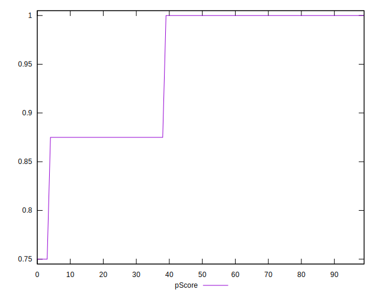
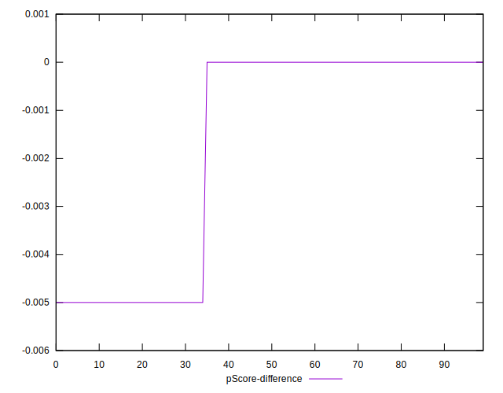

# //unminified-javascript/samples/pages+cached+noadtech+nomedia+nocss

[→ Parent](../..)


## Raw


```yaml
p90min: 0
p90max: 300
p90range: 300
p90mean: 59.04255319148936
median: 0
p90stdev: 76.47929978503252
mad: 0
stdevBySn: 0
lfitCenter: 51.633128167527474
lfitStdev: 87.38183417337041
mfitCenter: 35.27092373236294
mfitConfidence: 8.73818341733704
p90skewness: 0.6751666067760114
p90eccentricity: 0.9999999999999989
p90discretization: 31.333333333333332
outlandishness: 1.193408619430241

```


## Score


```yaml
p90min: 0.75
p90max: 1
p90range: 0.25
p90mean: 0.9526595744680849
median: 1
p90stdev: 0.061526253381284875
mad: 0
stdevBySn: 0
lfitCenter: 0.9584997498625606
lfitStdev: 0.07023335800800436
mfitCenter: 0.9717335758028796
mfitConfidence: 0.007023335800800436
p90skewness: -0.7123617183421871
p90eccentricity: 1.0000000000000016
p90discretization: 31.333333333333332
outlandishness: 0.990241678521025

```


## Raw Estimate


## Score Estimate


## P Score


```yaml
p90min: 0.75
p90max: 1
p90range: 0.25
p90mean: 0.9507978723404256
median: 1
p90stdev: 0.06373274982086037
mad: 0
stdevBySn: 0
lfitCenter: 0.9569723931937273
lfitStdev: 0.07281819514447527
mfitCenter: 0.9706075635563637
mfitConfidence: 0.007281819514447526
p90skewness: -0.6751666067760141
p90eccentricity: 1
p90discretization: 31.333333333333332
outlandishness: 0.9904564455963616

```


## Score Difference


```yaml
p90min: 0
p90max: 0
p90range: 0
p90mean: 0
median: 0
p90stdev: 0
mad: 0
stdevBySn: 0
lfitCenter: 0
lfitStdev: 0
mfitCenter: 0
mfitConfidence: 0
p90skewness: .nan
p90eccentricity: .nan
p90discretization: 94
outlandishness: .nan

```


## P Score Difference


```yaml
p90min: -0.0050000000000000044
p90max: 0
p90range: 0.0050000000000000044
p90mean: -0.0017021276595744696
median: 0
p90stdev: 0.002369261430991501
mad: 0
stdevBySn: 0
lfitCenter: -0.0013631487561619712
lfitStdev: 0.00248535665329026
mfitCenter: -0.0007908040354984296
mfitConfidence: 0.000248535665329026
p90skewness: -0.6735198826004055
p90eccentricity: 0.9999999999999997
p90discretization: 47
outlandishness: 1.0570410156249999

```

