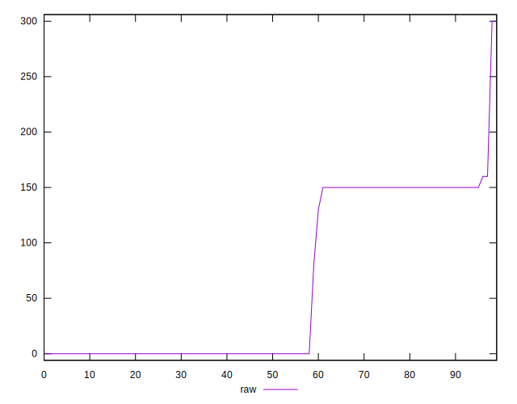

# //unminified-javascript/samples/pages+cached

[→ Parent](../..)


## Raw


```yaml
p90min: 0
p90max: 160
p90range: 160
p90mean: 59.787234042553195
median: 0
p90stdev: 72.96135268734058
mad: 0
stdevBySn: 0
lfitCenter: 53.20483946734369
lfitStdev: 86.26525807934172
mfitCenter: 39.68803403151237
mfitConfidence: 8.626525807934172
p90skewness: 0.41330014406417953
p90eccentricity: 1.0000000000000013
p90discretization: 18.8
outlandishness: 1.1387396258912623

```


## Score


```yaml
p90min: 0.87
p90max: 1
p90range: 0.13
p90mean: 0.952021276595745
median: 1
p90stdev: 0.05848403650595503
mad: 0
stdevBySn: 0
lfitCenter: 0.9571520287843697
lfitStdev: 0.06947283991640055
mfitCenter: 0.9679935662104246
mfitConfidence: 0.006947283991640055
p90skewness: -0.40903945744621456
p90eccentricity: 0.9999999999999992
p90discretization: 18.8
outlandishness: 0.9928255194228908

```


## Raw Estimate


## Score Estimate


## P Score


```yaml
p90min: 0.8666666666666667
p90max: 1
p90range: 0.1333333333333333
p90mean: 0.950177304964539
median: 1
p90stdev: 0.06080112723945043
mad: 0
stdevBySn: 0
lfitCenter: 0.9556626337772138
lfitStdev: 0.07188771506611798
mfitCenter: 0.9669266383070735
mfitConfidence: 0.007188771506611798
p90skewness: -0.4133001440641795
p90eccentricity: 1.0000000000000042
p90discretization: 18.8
outlandishness: 0.9929737589566948

```


## Score Difference


```yaml
p90min: 0
p90max: 0
p90range: 0
p90mean: 0
median: 0
p90stdev: 0
mad: 0
stdevBySn: 0
lfitCenter: 0
lfitStdev: 0
mfitCenter: 0
mfitConfidence: 0
p90skewness: .nan
p90eccentricity: .nan
p90discretization: 94
outlandishness: .nan

```


## P Score Difference


```yaml
p90min: -0.0050000000000000044
p90max: 0
p90range: 0.0050000000000000044
p90mean: -0.0017730496453900717
median: 0
p90stdev: 0.0023671374848622194
mad: 0
stdevBySn: 0
lfitCenter: -0.001424302286559083
lfitStdev: 0.0025650548418738855
mfitCenter: -0.0009004234369165868
mfitConfidence: 0.00025650548418738856
p90skewness: -0.6002973193595796
p90eccentricity: 0.9999999999999983
p90discretization: 31.333333333333332
outlandishness: 0.9928129600000012

```

