# //unused-css-rules/samples/pages+cached

[→ Parent](../..)


## Raw


```yaml
p90min: 0
p90max: 160
p90range: 160
p90mean: 111.70212765957447
median: 150
p90stdev: 65.45484553479368
mad: 0
stdevBySn: 0
lfitCenter: 123.7162316516575
lfitStdev: 57.16476624276375
mfitCenter: 140.74417875567846
mfitConfidence: 5.716476624276375
p90skewness: -1.1173904593377042
p90eccentricity: 0.9999999999999992
p90discretization: 23.5
outlandishness: 1.016140801451247

```

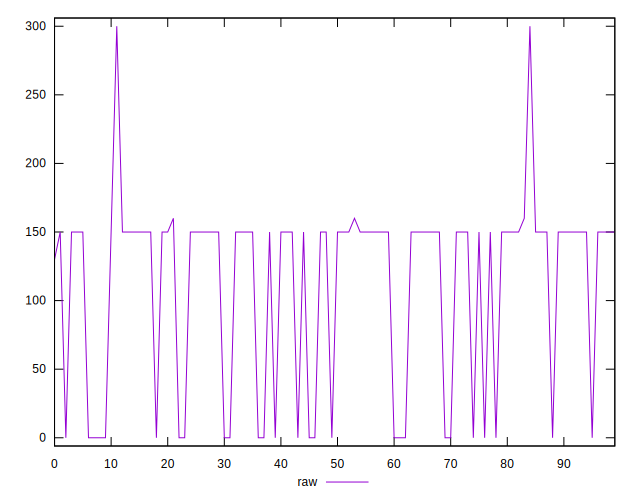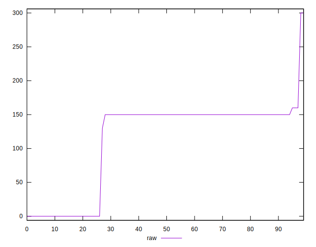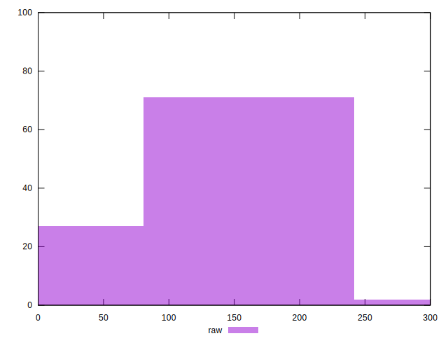
## Score


```yaml
p90min: 0.87
p90max: 1
p90range: 0.13
p90mean: 0.9105319148936167
median: 0.88
p90stdev: 0.05241745326674577
mad: 0
stdevBySn: 0
lfitCenter: 0.9008427321970208
lfitStdev: 0.0458169632194137
mfitCenter: 0.8872985421908105
mfitConfidence: 0.00458169632194137
p90skewness: 1.118245628068664
p90eccentricity: 1.000000000000003
p90discretization: 23.5
outlandishness: 0.9979540794158535

```

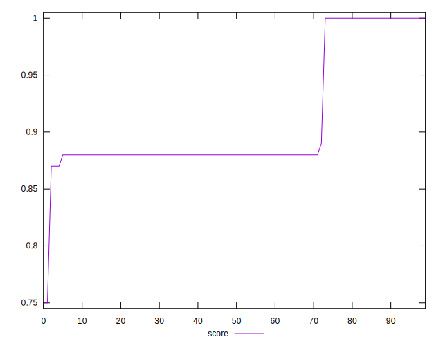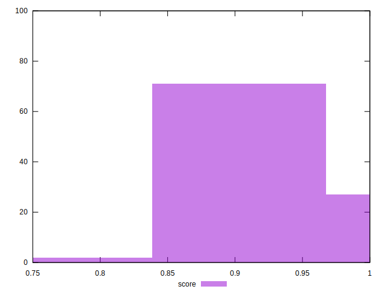
## Raw Estimate

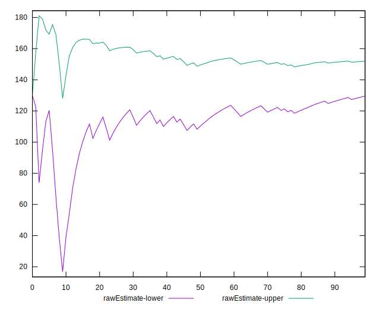
## Score Estimate

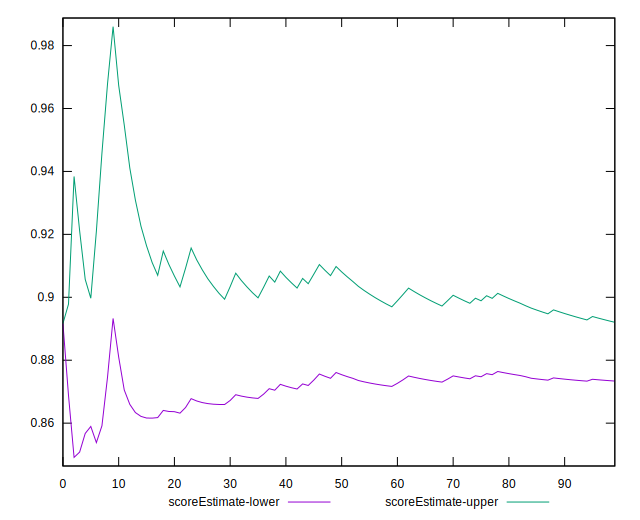
## P Score


```yaml
p90min: 0.8666666666666667
p90max: 1
p90range: 0.1333333333333333
p90mean: 0.9069148936170213
median: 0.875
p90stdev: 0.05454570461232805
mad: 0
stdevBySn: 0
lfitCenter: 0.8969031402902858
lfitStdev: 0.04763730520230342
mfitCenter: 0.8827131843702689
mfitConfidence: 0.004763730520230342
p90skewness: 1.1173904593377044
p90eccentricity: 1
p90discretization: 23.5
outlandishness: 0.9983506317894677

```

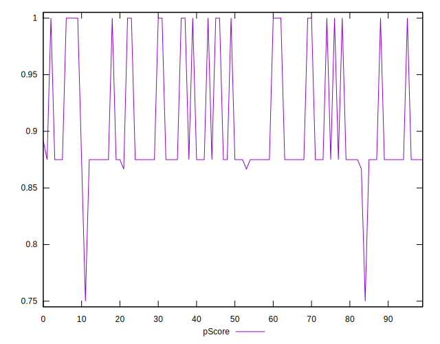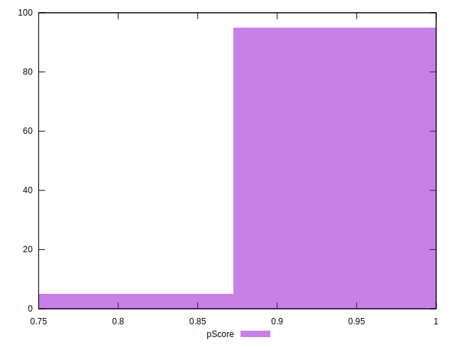
## Score Difference


```yaml
p90min: 0
p90max: 0
p90range: 0
p90mean: 0
median: 0
p90stdev: 0
mad: 0
stdevBySn: 0
lfitCenter: 0
lfitStdev: 0
mfitCenter: 0
mfitConfidence: 0
p90skewness: .nan
p90eccentricity: .nan
p90discretization: 94
outlandishness: .nan

```


## P Score Difference


```yaml
p90min: -0.0050000000000000044
p90max: 0
p90range: 0.0050000000000000044
p90mean: -0.003510638297872342
median: -0.0050000000000000044
p90stdev: 0.0022475109046086283
mad: 0
stdevBySn: 0
lfitCenter: -0.0038608945573748144
lfitStdev: 0.0021454069680362595
mfitCenter: -0.004451819295927804
mfitConfidence: 0.00021454069680362596
p90skewness: 0.896570976229682
p90eccentricity: 1.0000000000000002
p90discretization: 31.333333333333332
outlandishness: 0.9564444852566071

```

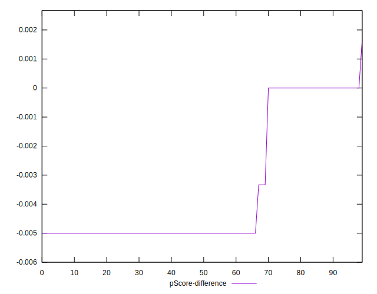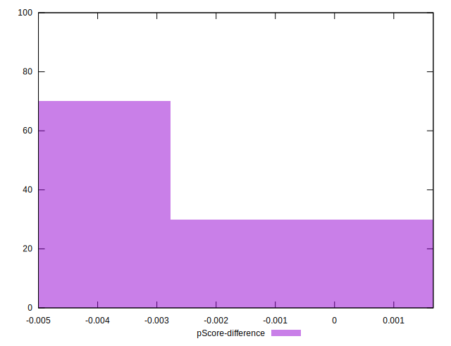