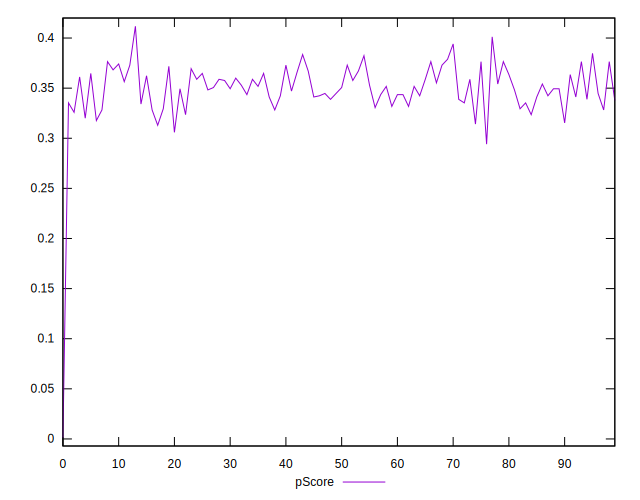
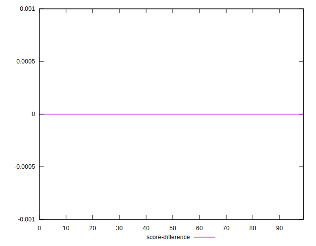

# //unused-javascript/samples/pages+cached

[→ Parent](../..)


## Raw


```yaml
p90min: 1730
p90max: 2340
p90range: 610
p90mean: 2019.8936170212767
median: 2025
p90stdev: 149.1215032287934
mad: 125
stdevBySn: 172.92700000000002
lfitCenter: 2031.7354218503049
lfitStdev: 144.6920727424513
mfitCenter: 2019.1992961447716
mfitConfidence: 14.46920727424513
p90skewness: 0.06823720065465312
p90eccentricity: 1
p90discretization: 2
outlandishness: 1.0250136080195622

```


## Score


```yaml
p90min: 0.31
p90max: 0.38
p90range: 0.07
p90mean: 0.35021276595744677
median: 0.35
p90stdev: 0.017683910429940546
mad: 0.010000000000000009
stdevBySn: 0.023851999999999957
lfitCenter: 0.34864861485106013
lfitStdev: 0.01736079136510663
mfitCenter: 0.3499468303959578
mfitConfidence: 0.001736079136510663
p90skewness: -0.03224918018289414
p90eccentricity: 1.0000000000000007
p90discretization: 11.75
outlandishness: 0.9828686596912289

```


## Raw Estimate


## Score Estimate


## P Score


```yaml
p90min: 0.3129411764705882
p90max: 0.3847058823529412
p90range: 0.07176470588235295
p90mean: 0.3506007509386732
median: 0.35
p90stdev: 0.017543706262210985
mad: 0.014705882352941124
stdevBySn: 0.02034435294117644
lfitCenter: 0.349207597429376
lfitStdev: 0.01702259679322954
mfitCenter: 0.3506824357476737
mfitConfidence: 0.0017022596793229538
p90skewness: -0.06823720065465232
p90eccentricity: 0.9999999999999999
p90discretization: 2
outlandishness: 0.983221654937176

```


## Score Difference


```yaml
p90min: 0
p90max: 5.551115123125783e-17
p90range: 5.551115123125783e-17
p90mean: 8.267618268485208e-18
median: 0
p90stdev: 1.9763387771098395e-17
mad: 0
stdevBySn: 0
lfitCenter: 5.5074079364642626e-18
lfitStdev: 1.2435391526441542e-17
mfitCenter: 5.5074079364642626e-18
mfitConfidence: 0
p90skewness: 1.9721272054017516
p90eccentricity: 0.9999999999999997
p90discretization: 47
outlandishness: 1.3028591836734695

```


## P Score Difference


```yaml
p90min: -0.004705882352941171
p90max: 0.004705882352941171
p90range: 0.009411764705882342
p90mean: 0.00047559449311638754
median: 0.000882352941176473
p90stdev: 0.0027123454887047526
mad: 0.0026470588235293635
stdevBySn: 0.0035076470588235173
lfitCenter: 0.0005120820420031633
lfitStdev: 0.0025295215088639404
mfitCenter: 0.0006502251807783817
mfitConfidence: 0.00025295215088639406
p90skewness: -0.15856612389611238
p90eccentricity: 0.9999999999999989
p90discretization: 3.76
outlandishness: 0.8836000000000068

```

