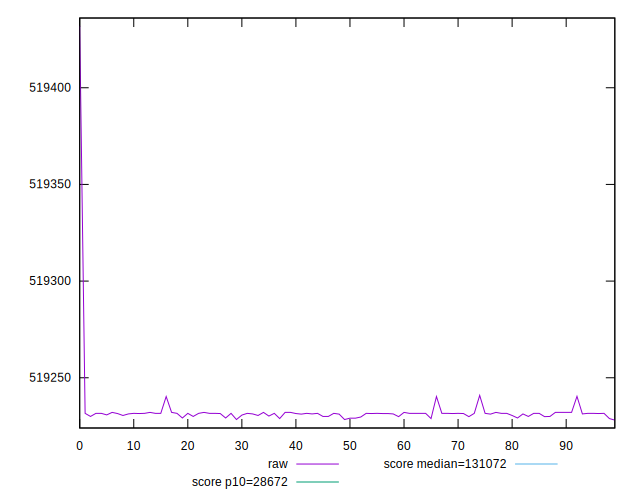
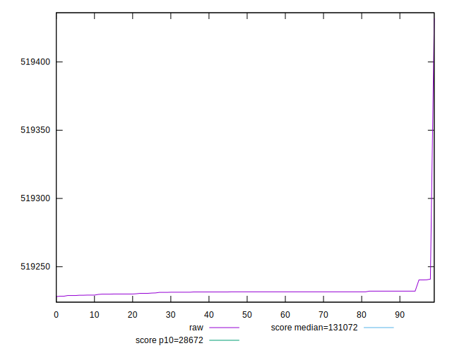
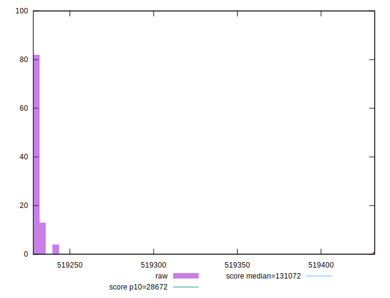
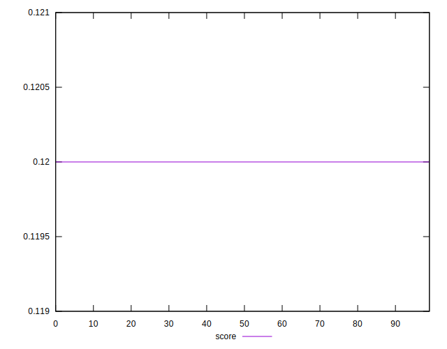
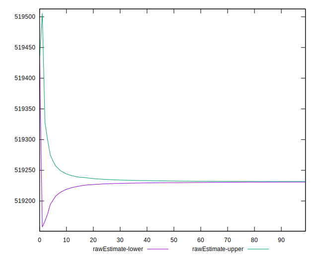
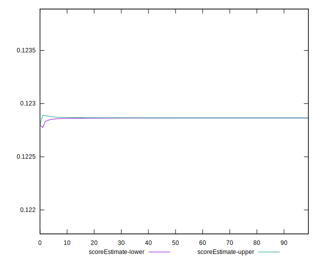
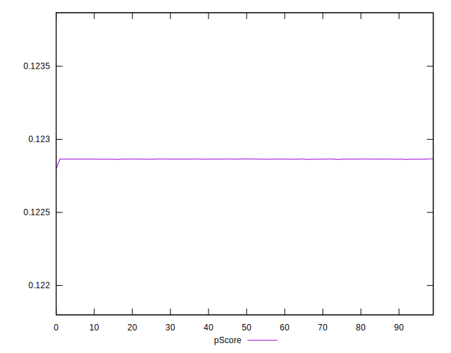
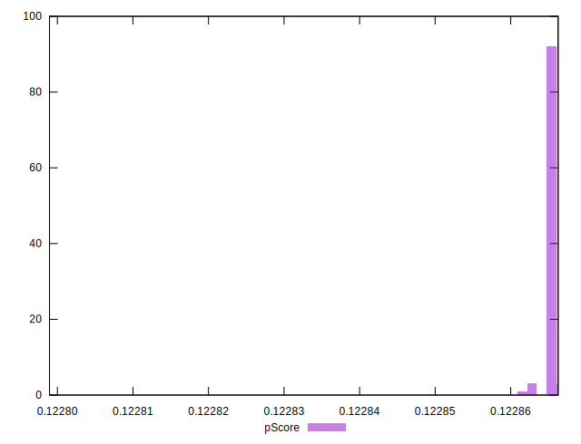
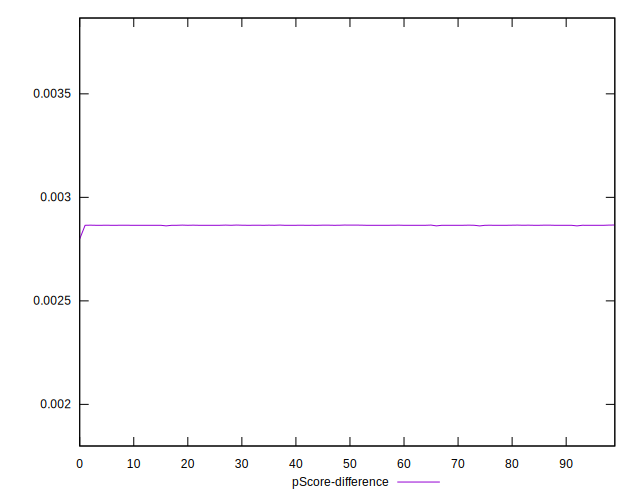
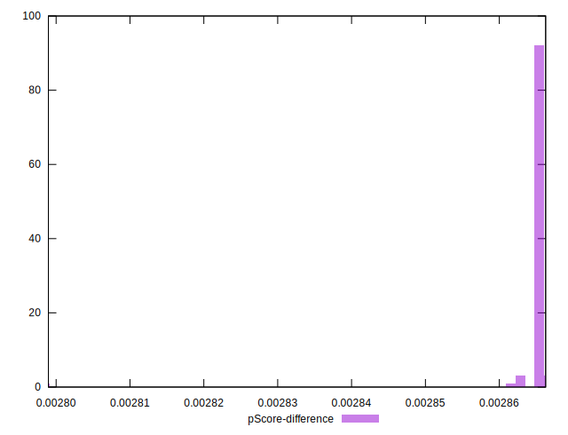

# //uses-long-cache-ttl/samples/pages+cached

[→ Parent](../..)


## Raw


```yaml
p90min: 519228.89203488524
p90max: 519240.29371086287
p90range: 11.401675977627747
p90mean: 519231.34440621495
median: 519231.5934315333
p90stdev: 1.5852914930797921
mad: 0.2991620111861266
stdevBySn: 0.35678061454057464
lfitCenter: 519232.3604805858
lfitStdev: 2.7327584437503356
mfitCenter: 519231.24476567144
mfitConfidence: 0.27327584437503355
p90skewness: 3.4990732863780236
p90eccentricity: 1.0000000000000018
p90discretization: 5.529411764705882
outlandishness: 1.00000809259601

```


## Score


```yaml
p90min: 0.12
p90max: 0.12
p90range: 0
p90mean: 0.11999999999999984
median: 0.12
p90stdev: 1.5265566588595902e-16
mad: 0
stdevBySn: 0
lfitCenter: 0.1199999999999998
lfitStdev: 0
mfitCenter: 0.1199999999999998
mfitConfidence: 0
p90skewness: 1
p90eccentricity: 1
p90discretization: 94
outlandishness: 0.9999999999999993

```


## Raw Estimate


## Score Estimate


## P Score


```yaml
p90min: 0.12286224839663179
p90max: 0.12286601427777455
p90range: 0.0000037658811427587757
p90mean: 0.12286520426717437
median: 0.1228651220135697
p90stdev: 5.23609876052915e-7
mad: 9.881197271521813e-8
stdevBySn: 1.1784315866016915e-7
lfitCenter: 0.12286486877962448
lfitStdev: 9.023283836404472e-7
mfitCenter: 0.12286523716982546
mfitConfidence: 9.023283836404472e-8
p90skewness: -3.4989933249799456
p90eccentricity: 1.0000000000000002
p90discretization: 5.529411764705882
outlandishness: 0.9999887082371476

```


## Score Difference


```yaml
p90min: 0
p90max: 0
p90range: 0
p90mean: 0
median: 0
p90stdev: 0
mad: 0
stdevBySn: 0
lfitCenter: 0
lfitStdev: 0
mfitCenter: 0
mfitConfidence: 0
p90skewness: .nan
p90eccentricity: .nan
p90discretization: 94
outlandishness: .nan

```


## P Score Difference


```yaml
p90min: 0.0028622483966317946
p90max: 0.0028660142777745534
p90range: 0.0000037658811427587757
p90mean: 0.002865204267174316
median: 0.0028651220135696986
p90stdev: 5.236098760529149e-7
mad: 9.881197271521813e-8
stdevBySn: 1.1784315866016915e-7
lfitCenter: 0.0028648687796244536
lfitStdev: 9.023283836750764e-7
mfitCenter: 0.002865237169825458
mfitConfidence: 9.023283836750764e-8
p90skewness: -3.4989933243190046
p90eccentricity: 1.0000000000000016
p90discretization: 5.529411764705882
outlandishness: 0.9995158457858059

```

