# //uses-long-cache-ttl/samples/pages

[→ Parent](../..)


## Raw


```yaml
p90min: 519068.3640519165
p90max: 520981.3684579609
p90range: 1913.004406044376
p90mean: 519982.9110669901
median: 520107.42944897583
p90stdev: 598.5966665726404
mad: 522.9182228739955
stdevBySn: 714.9836713491501
lfitCenter: 520004.1395163932
lfitStdev: 534.9175761704579
mfitCenter: 520064.0252188431
mfitConfidence: 53.49175761704579
p90skewness: -0.15431968165663526
p90eccentricity: 1.0000000000000009
p90discretization: 1
outlandishness: 1.0000176481528944

```

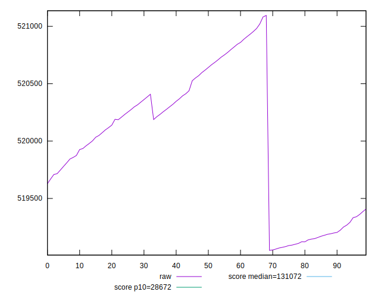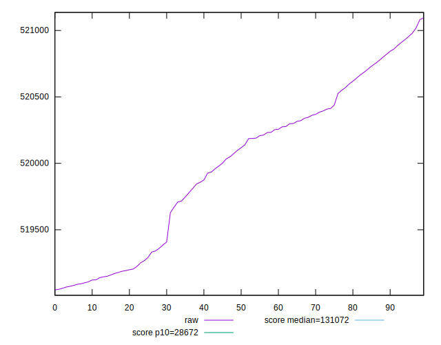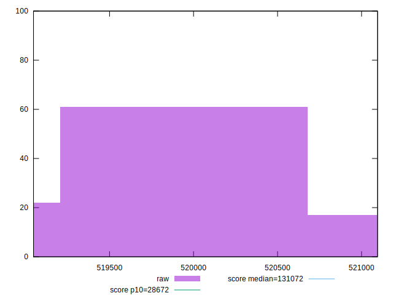
## Score


```yaml
p90min: 0.12
p90max: 0.12
p90range: 0
p90mean: 0.11999999999999984
median: 0.12
p90stdev: 1.5265566588595902e-16
mad: 0
stdevBySn: 0
lfitCenter: 0.1199999999999998
lfitStdev: 0
mfitCenter: 0.1199999999999998
mfitConfidence: 0
p90skewness: 1
p90eccentricity: 1
p90discretization: 94
outlandishness: 0.9999999999999993

```

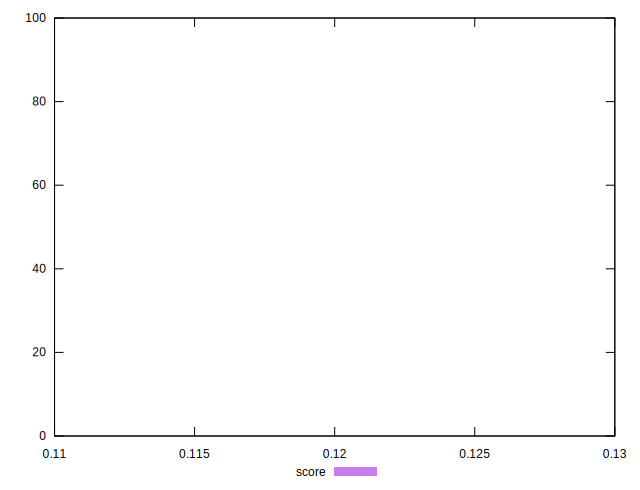
## Raw Estimate

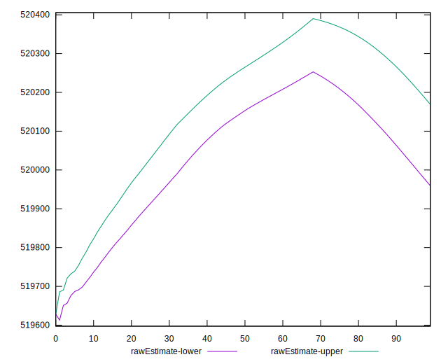
## Score Estimate

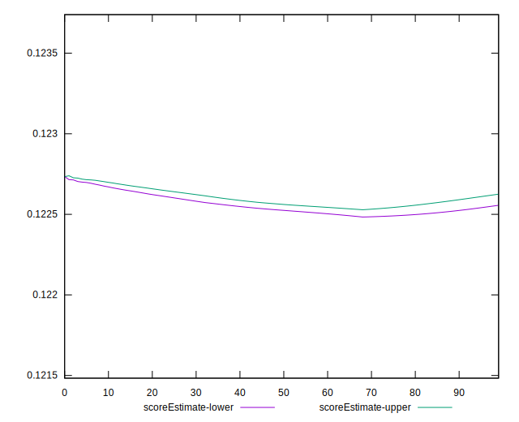
## P Score


```yaml
p90min: 0.12228910022356781
p90max: 0.12291905274430265
p90range: 0.0006299525207348333
p90mean: 0.12261754457522232
median: 0.12257631931088739
p90stdev: 0.00019718400123910524
mad: 0.00017197118350192886
stdevBySn: 0.00023544615727589966
lfitCenter: 0.12261050079614023
lfitStdev: 0.0001762186901764866
mfitCenter: 0.12259060864717396
mfitConfidence: 0.00001762186901764866
p90skewness: 0.1567431375443566
p90eccentricity: 0.9999999999999996
p90discretization: 1
outlandishness: 0.9999757572548335

```

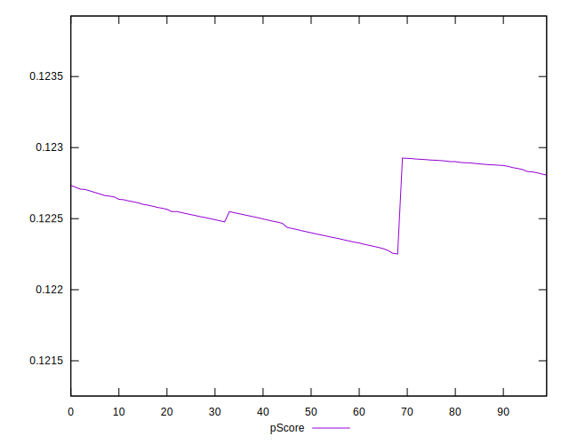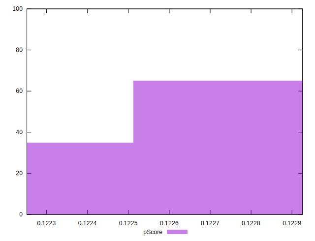
## Score Difference


```yaml
p90min: 0
p90max: 0
p90range: 0
p90mean: 0
median: 0
p90stdev: 0
mad: 0
stdevBySn: 0
lfitCenter: 0
lfitStdev: 0
mfitCenter: 0
mfitConfidence: 0
p90skewness: .nan
p90eccentricity: .nan
p90discretization: 94
outlandishness: .nan

```


## P Score Difference


```yaml
p90min: 0.0022891002235678193
p90max: 0.0029190527443026526
p90range: 0.0006299525207348333
p90mean: 0.002617544575222279
median: 0.0025763193108873927
p90stdev: 0.00019718400123910521
mad: 0.00017197118350192886
stdevBySn: 0.00023544615727589966
lfitCenter: 0.0026105007961402036
lfitStdev: 0.00017621869017648054
mfitCenter: 0.002590608647173996
mfitConfidence: 0.000017621869017648053
p90skewness: 0.1567431375442511
p90eccentricity: 1.0000000000000002
p90discretization: 1
outlandishness: 0.9988646764704832

```

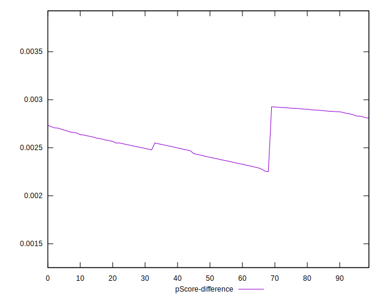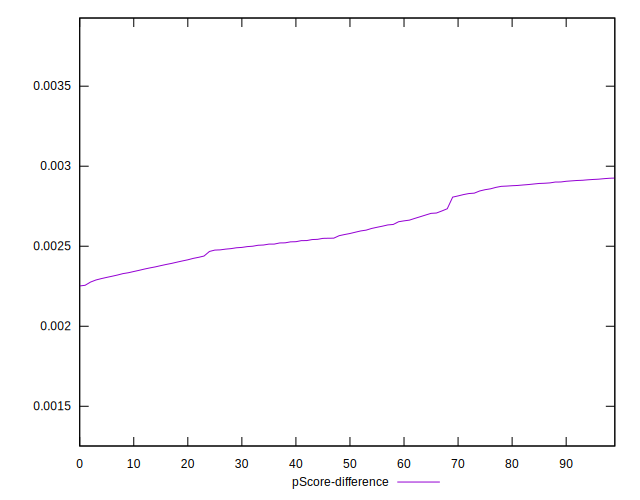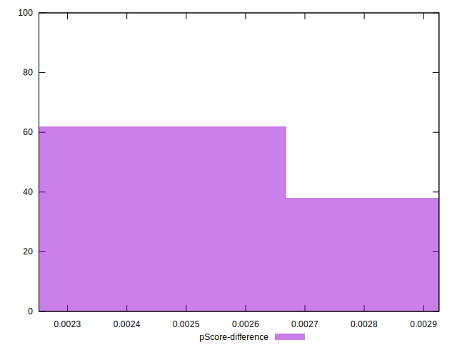