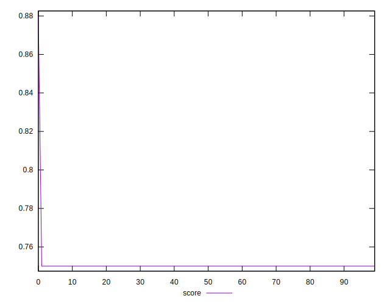

# //uses-optimized-images/samples/pages+cached

[→ Parent](../..)


## Raw


```yaml
p90min: 300
p90max: 300
p90range: 0
p90mean: 300
median: 300
p90stdev: 0
mad: 0
stdevBySn: 0
lfitCenter: 299.3019597971178
lfitStdev: 1.7415847777527882
mfitCenter: 299.9997237443245
mfitConfidence: 0.17415847777527882
p90skewness: .nan
p90eccentricity: .nan
p90discretization: 94
outlandishness: 0.990025

```


## Score


```yaml
p90min: 0.75
p90max: 0.75
p90range: 0
p90mean: 0.75
median: 0.75
p90stdev: 0
mad: 0
stdevBySn: 0
lfitCenter: 0.7506049681758317
lfitStdev: 0.0015093734740529183
mfitCenter: 0.7500002394215849
mfitConfidence: 0.00015093734740529184
p90skewness: .nan
p90eccentricity: .nan
p90discretization: 94
outlandishness: 1.003469671111111

```


## Raw Estimate


## Score Estimate


## P Score


```yaml
p90min: 0.75
p90max: 0.75
p90range: 0
p90mean: 0.75
median: 0.75
p90stdev: 0
mad: 0
stdevBySn: 0
lfitCenter: 0.7505817001690689
lfitStdev: 0.0014513206481277794
mfitCenter: 0.7500002302130613
mfitConfidence: 0.00014513206481277794
p90skewness: .nan
p90eccentricity: .nan
p90discretization: 94
outlandishness: 1.0033361111111112

```


## Score Difference


```yaml
p90min: 0
p90max: 0
p90range: 0
p90mean: 0
median: 0
p90stdev: 0
mad: 0
stdevBySn: 0
lfitCenter: 0
lfitStdev: 0
mfitCenter: 0
mfitConfidence: 0
p90skewness: .nan
p90eccentricity: .nan
p90discretization: 94
outlandishness: .nan

```


## P Score Difference


```yaml
p90min: 0
p90max: 0
p90range: 0
p90mean: 0
median: 0
p90stdev: 0
mad: 0
stdevBySn: 0
lfitCenter: -0.000023268006762742938
lfitStdev: 0.000058052825925095554
mfitCenter: -9.20852253702838e-9
mfitConfidence: 0.000005805282592509555
p90skewness: .nan
p90eccentricity: .nan
p90discretization: 94
outlandishness: .inf

```

