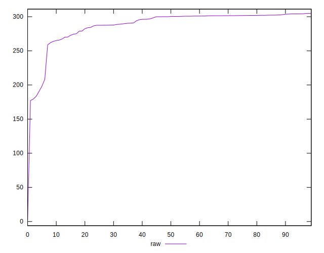
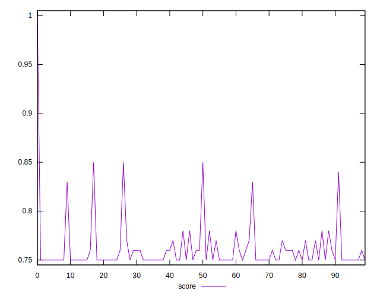

# //uses-rel-preconnect/samples/pages+cached

[→ Parent](../..)


## Raw


```yaml
p90min: 183.3889999985695
p90max: 304.17199999999997
p90range: 120.78300000143048
p90mean: 289.6003510634037
median: 300.17600000000004
p90stdev: 23.0355158082216
mad: 3.798999999046316
stdevBySn: 4.701229199999975
lfitCenter: 290.77516512816175
lfitStdev: 16.95608528049456
mfitCenter: 296.4630200109579
mfitConfidence: 1.695608528049456
p90skewness: -3.0501681800842495
p90eccentricity: 0.9999999999999999
p90discretization: 1.032967032967033
outlandishness: 0.9680436809620713

```


## Score


```yaml
p90min: 0.75
p90max: 0.85
p90range: 0.09999999999999998
p90mean: 0.7590425531914896
median: 0.75
p90stdev: 0.01879730339058795
mad: 0
stdevBySn: 0
lfitCenter: 0.7579531502498298
lfitStdev: 0.013730659157841042
mfitCenter: 0.7535771454943535
mfitConfidence: 0.001373065915784104
p90skewness: 3.2330378519733816
p90eccentricity: 1.0000000000000002
p90discretization: 13.428571428571429
outlandishness: 1.0104546532510217

```


## Raw Estimate


## Score Estimate


## P Score


```yaml
p90min: 0.7476822222222222
p90max: 0.8471758333345254
p90range: 0.09949361111230315
p90mean: 0.7589206146575295
median: 0.7499022222222222
p90stdev: 0.019056575631985248
mad: 0.002161111111111169
stdevBySn: 0.002693950888888928
lfitCenter: 0.7579046195824838
lfitStdev: 0.013967951367695212
mfitCenter: 0.7532514287022606
mfitConfidence: 0.0013967951367695212
p90skewness: 3.0896650434390884
p90eccentricity: 1
p90discretization: 1.032967032967033
outlandishness: 1.0103369040102372

```


## Score Difference


```yaml
p90min: 0
p90max: 0
p90range: 0
p90mean: 0
median: 0
p90stdev: 0
mad: 0
stdevBySn: 0
lfitCenter: 1.0470608452365924e-18
lfitStdev: 2.5998395675404994e-18
mfitCenter: 1.0470608452365924e-18
mfitConfidence: 0
p90skewness: .nan
p90eccentricity: .nan
p90discretization: 94
outlandishness: .inf

```


## P Score Difference


```yaml
p90min: -0.0027583333104849173
p90max: 0.0047625000278155305
p90range: 0.007520833338300448
p90mean: -0.00023668439752243814
median: -0.0006244444444444275
p90stdev: 0.0016993036773025286
mad: 0.0008044444439477827
stdevBySn: 0.001294964833333343
lfitCenter: -0.0003371716641641623
lfitStdev: 0.0012334609089499858
mfitCenter: -0.0006298162113213364
mfitConfidence: 0.0001233460908949986
p90skewness: 1.1193196397167702
p90eccentricity: 1.0000000000000002
p90discretization: 1.0444444444444445
outlandishness: 0.4979935299571957

```

