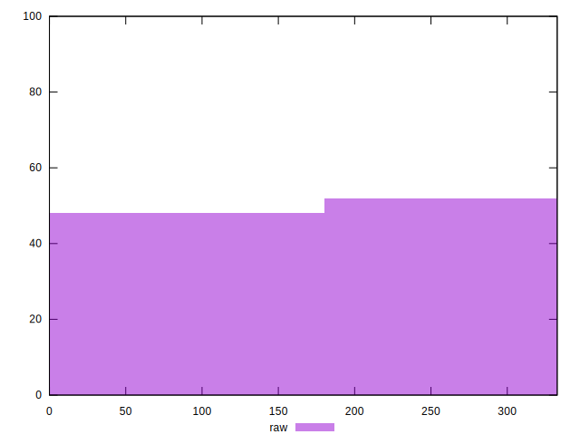
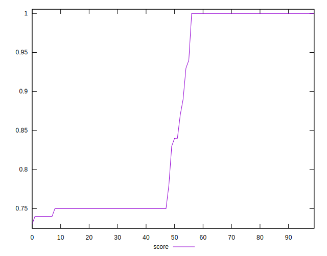
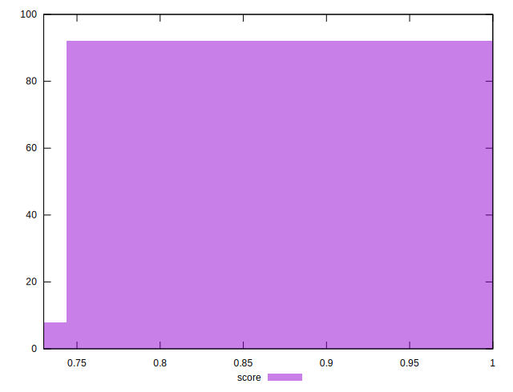
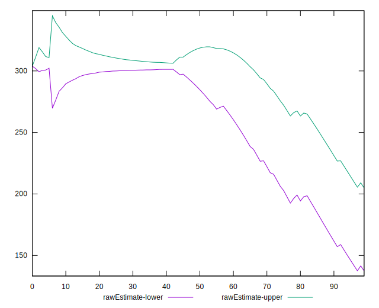
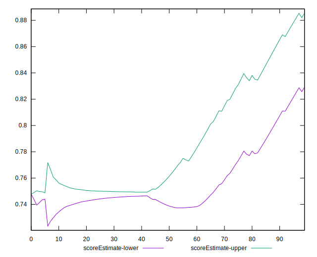
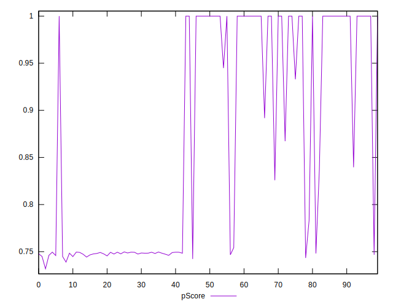
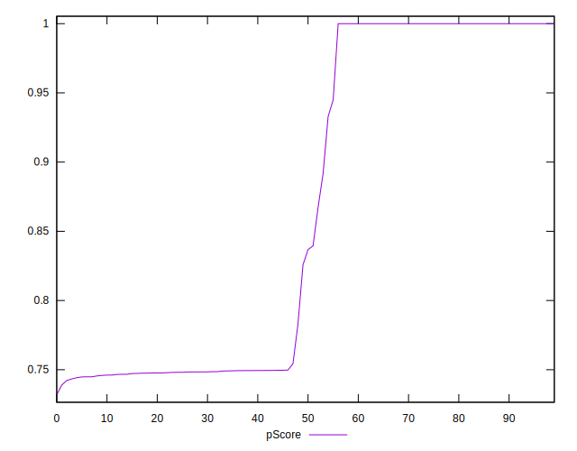
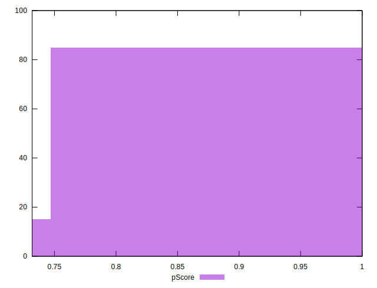
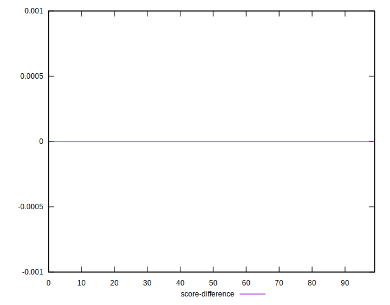
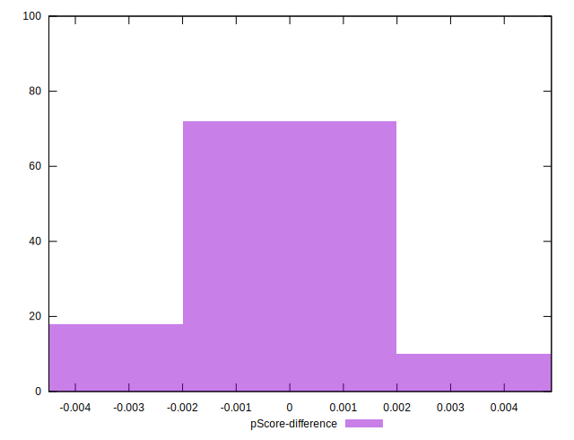

# //uses-rel-preconnect/samples/pages

[→ Parent](../..)


## Raw


```yaml
p90min: 0
p90max: 312.03
p90range: 312.03
p90mean: 159.2161595748409
median: 202.48100000619888
p90stdev: 146.29581231098143
mad: 108.68999999380111
stdevBySn: 139.98738799886266
lfitCenter: 163.39149752424552
lfitStdev: 172.06055998970626
mfitCenter: 171.17748586275778
mfitConfidence: 17.206055998970626
p90skewness: -0.09936353652529567
p90eccentricity: 0.9999999999999991
p90discretization: 1.7407407407407407
outlandishness: 1.0014246140431626

```


## Score


```yaml
p90min: 0.74
p90max: 1
p90range: 0.26
p90mean: 0.8682978723404255
median: 0.835
p90stdev: 0.12088009091017342
mad: 0.09499999999999997
stdevBySn: 0.11627850000000005
lfitCenter: 0.864674291112612
lfitStdev: 0.1421462231725906
mfitCenter: 0.8584590419540559
mfitConfidence: 0.014214622317259059
p90skewness: 0.10062040385038812
p90eccentricity: 1.000000000000001
p90discretization: 9.4
outlandishness: 1.000004900765622

```


## Raw Estimate


## Score Estimate


## P Score


```yaml
p90min: 0.7433166666666667
p90max: 1
p90range: 0.25668333333333326
p90mean: 0.8678448729311312
median: 0.8312658333281676
p90stdev: 0.12138717444761252
mad: 0.08747194443927869
stdevBySn: 0.11206928455283063
lfitCenter: 0.8643006360486952
lfitStdev: 0.14284788973196078
mfitCenter: 0.8579323226015897
mfitConfidence: 0.014284788973196077
p90skewness: 0.10071461321658763
p90eccentricity: 1.0000000000000002
p90discretization: 1.7407407407407407
outlandishness: 1.000136247273471

```


## Score Difference


```yaml
p90min: 0
p90max: 0
p90range: 0
p90mean: 0
median: 0
p90stdev: 0
mad: 0
stdevBySn: 0
lfitCenter: 1.0470608452365924e-18
lfitStdev: 2.5998395675404994e-18
mfitCenter: 1.0470608452365924e-18
mfitConfidence: 0
p90skewness: .nan
p90eccentricity: .nan
p90discretization: 94
outlandishness: .inf

```


## P Score Difference


```yaml
p90min: -0.0038966666666666594
p90max: 0.004778888888888888
p90range: 0.008675555555555547
p90mean: -0.0004404078015051007
median: 0
p90stdev: 0.0016180413305513306
mad: 0.000547222222222199
stdevBySn: 0.0006589114999999804
lfitCenter: -0.00036030796869862937
lfitStdev: 0.0011142575543743268
mfitCenter: -0.0003485242205048078
mfitConfidence: 0.00011142575543743269
p90skewness: 0.6337162029546974
p90eccentricity: 1.0000000000000004
p90discretization: 1.8431372549019607
outlandishness: 0.8085346631483815

```

