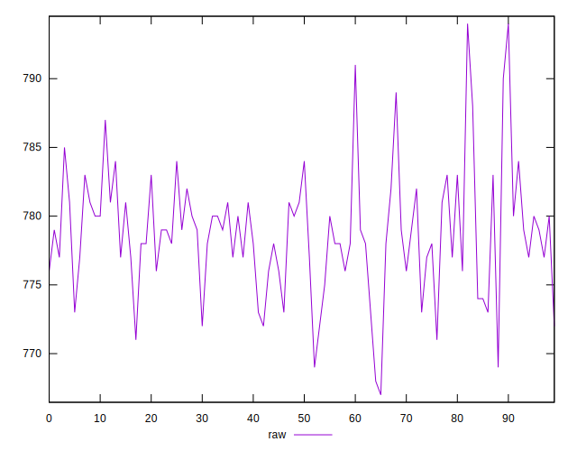
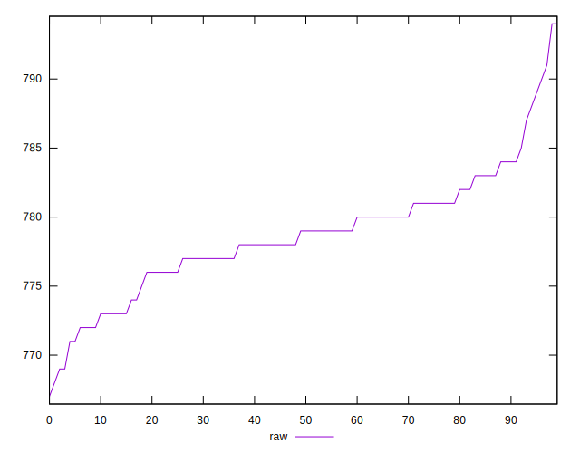
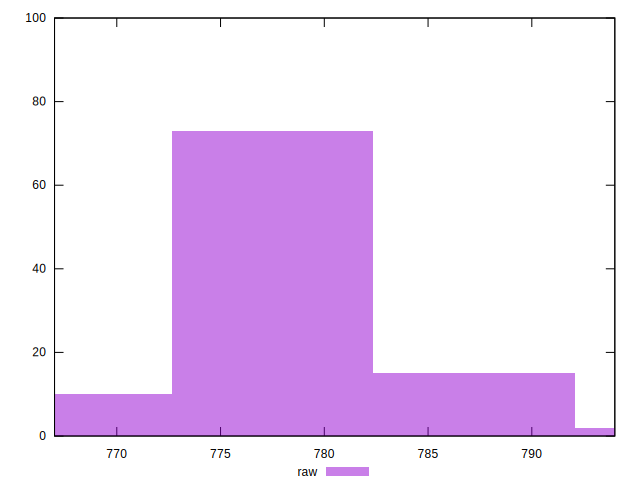
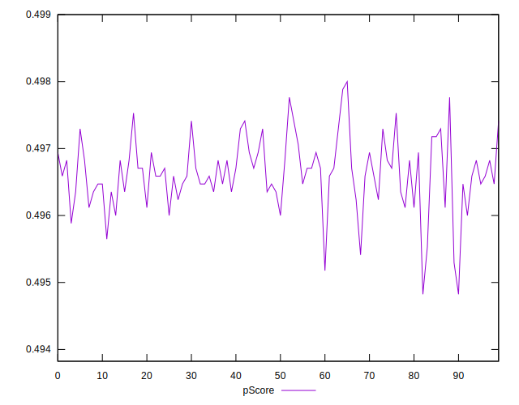
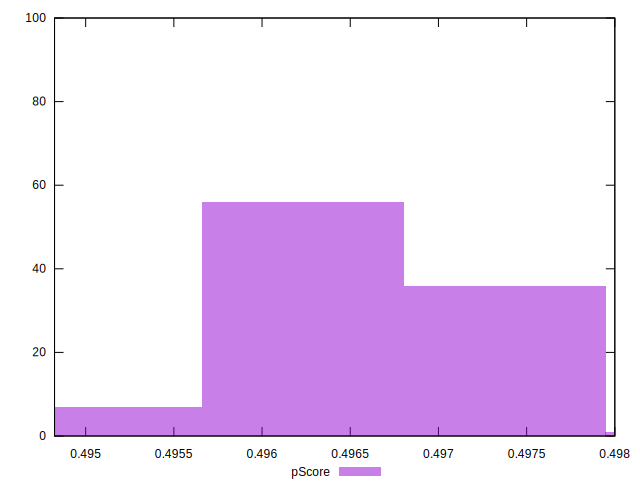

# //uses-rel-preload/samples/pages+cached+noadtech

[→ Parent](../..)


## Raw


```yaml
p90min: 769
p90max: 790
p90range: 21
p90mean: 778.6063829787234
median: 779
p90stdev: 3.949732242759942
mad: 2
stdevBySn: 3.5778000000000003
lfitCenter: 778.6547622025664
lfitStdev: 3.09978737629602
mfitCenter: 778.5948476193695
mfitConfidence: 0.30997873762960204
p90skewness: 0.20966314678729217
p90eccentricity: 1.0000000000000022
p90discretization: 4.7
outlandishness: 1.0002918684291862

```


## Score


```yaml
p90min: 0.5
p90max: 0.5
p90range: 0
p90mean: 0.5
median: 0.5
p90stdev: 0
mad: 0
stdevBySn: 0
lfitCenter: 0.49990568914335115
lfitStdev: 0.00023417273015198693
mfitCenter: 0.4999998487151922
mfitConfidence: 0.000023417273015198695
p90skewness: .nan
p90eccentricity: .nan
p90discretization: 94
outlandishness: 0.9992001600000001

```


## Raw Estimate


## Score Estimate


## P Score


```yaml
p90min: 0.49529411764705883
p90max: 0.49776470588235294
p90range: 0.0024705882352941133
p90mean: 0.4966345431789738
median: 0.49658823529411766
p90stdev: 0.00046467438150116745
mad: 0.00023529411764705577
stdevBySn: 0.0004209176470588512
lfitCenter: 0.4966288515055805
lfitStdev: 0.0003646808677995282
mfitCenter: 0.4966359002800735
mfitConfidence: 0.000036468086779952816
p90skewness: -0.2096631467876426
p90eccentricity: 1
p90discretization: 4.7
outlandishness: 0.9999461715714727

```


## Score Difference


```yaml
p90min: 0
p90max: 0
p90range: 0
p90mean: 0
median: 0
p90stdev: 0
mad: 0
stdevBySn: 0
lfitCenter: 0
lfitStdev: 0
mfitCenter: 0
mfitConfidence: 0
p90skewness: .nan
p90eccentricity: .nan
p90discretization: 94
outlandishness: .nan

```


## P Score Difference


```yaml
p90min: -0.004470588235294115
p90max: -0.0021176470588235574
p90range: 0.0023529411764705577
p90mean: -0.003312891113892364
median: -0.0032941176470588363
p90stdev: 0.000456388774873278
mad: 0.00023529411764705577
stdevBySn: 0.0004209176470588512
lfitCenter: -0.00326163938922797
lfitStdev: 0.0004526877232885595
mfitCenter: -0.0033529601169596016
mfitConfidence: 0.00004526877232885595
p90skewness: 0.2847441127060325
p90eccentricity: 0.9999999999999997
p90discretization: 4.947368421052632
outlandishness: 0.9207007861292104

```

