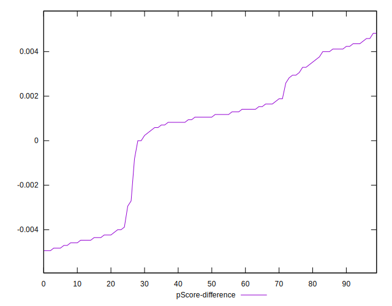

# //uses-rel-preload/samples/pages+cached

[→ Parent](../..)


## Raw


```yaml
p90min: 1246
p90max: 1414
p90range: 168
p90mean: 1332.0212765957447
median: 1381.5
p90stdev: 68.92101225522735
mad: 23.5
stdevBySn: 31.007600000000004
lfitCenter: 1330.982421107111
lfitStdev: 89.30269940551351
mfitCenter: 1346.105376132449
mfitConfidence: 8.930269940551351
p90skewness: -0.2878270022276563
p90eccentricity: 0.9999999999999999
p90discretization: 2.238095238095238
outlandishness: 0.980603880735223

```


## Score


```yaml
p90min: 0.42
p90max: 0.44
p90range: 0.020000000000000018
p90mean: 0.43117021276595763
median: 0.43
p90stdev: 0.008487335117782222
mad: 0.010000000000000009
stdevBySn: 0.011926000000000011
lfitCenter: 0.4341126496924975
lfitStdev: 0.012304333728322042
mfitCenter: 0.4314732819732804
mfitConfidence: 0.0012304333728322043
p90skewness: -0.22484975914010752
p90eccentricity: 0.9999999999999994
p90discretization: 31.333333333333332
outlandishness: 1.0262844747509998

```


## Raw Estimate


## Score Estimate


## P Score


```yaml
p90min: 0.4218823529411765
p90max: 0.4416470588235294
p90range: 0.019764705882352906
p90mean: 0.43152690863579474
median: 0.42570588235294116
p90stdev: 0.008108354382967923
mad: 0.0027647058823528914
stdevBySn: 0.0036479529411764236
lfitCenter: 0.4335653157208014
lfitStdev: 0.013469698787478248
mfitCenter: 0.4304737717395081
mfitConfidence: 0.0013469698787478249
p90skewness: 0.2878270022277215
p90eccentricity: 1.0000000000000002
p90discretization: 2.238095238095238
outlandishness: 1.0263333594332134

```


## Score Difference


```yaml
p90min: 0
p90max: 0
p90range: 0
p90mean: 0
median: 0
p90stdev: 0
mad: 0
stdevBySn: 0
lfitCenter: 0
lfitStdev: 0
mfitCenter: 0
mfitConfidence: 0
p90skewness: .nan
p90eccentricity: .nan
p90discretization: 94
outlandishness: .nan

```


## P Score Difference


```yaml
p90min: -0.0048235294117647265
p90max: 0.004588235294117671
p90range: 0.009411764705882397
p90mean: 0.00040175219023780295
median: 0.0010588235294117787
p90stdev: 0.003019649486735117
mad: 0.0021176470588235297
stdevBySn: 0.003227035294117655
lfitCenter: 0.0005923607784568446
lfitStdev: 0.0023276478584810917
mfitCenter: 0.001179180761467746
mfitConfidence: 0.00023276478584810918
p90skewness: -0.5774017937951275
p90eccentricity: 1.0000000000000004
p90discretization: 2.186046511627907
outlandishness: 0.856287900932643

```

