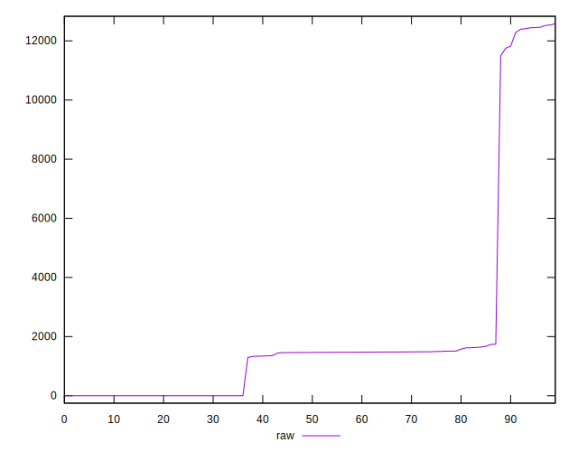
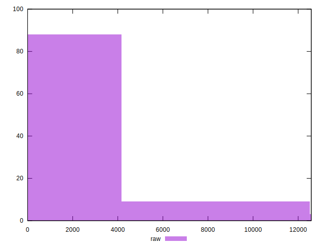
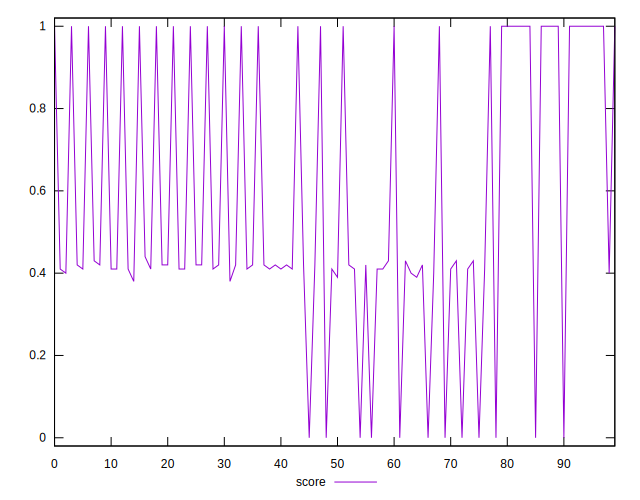
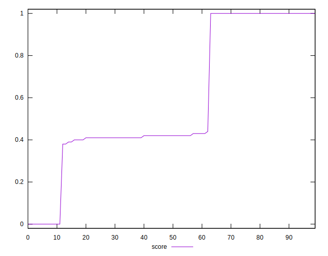
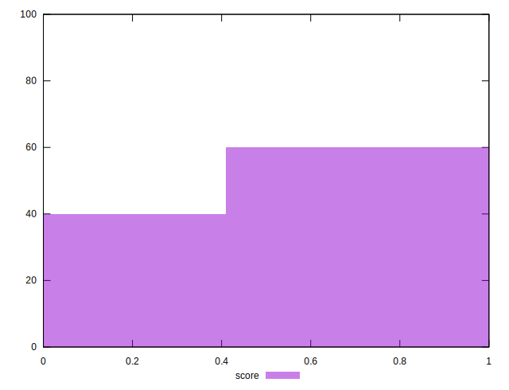
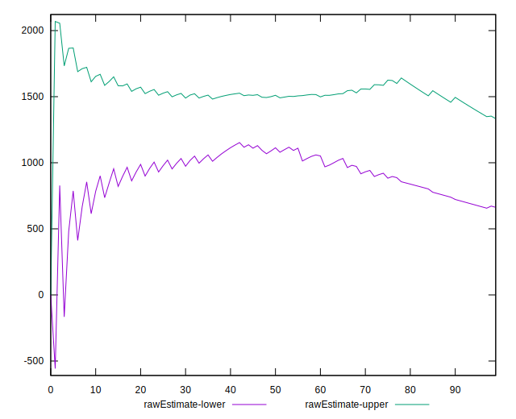
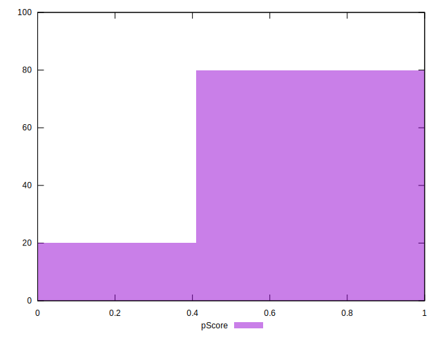
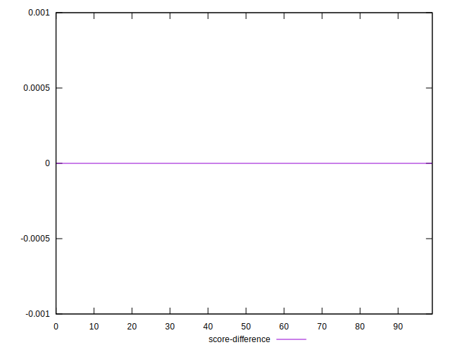
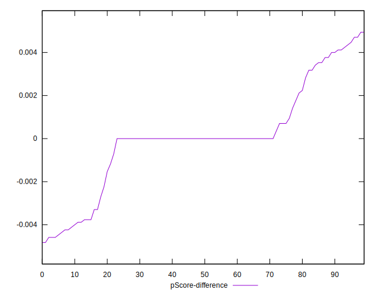
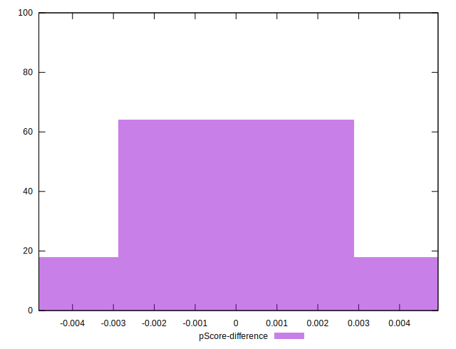

# //uses-rel-preload/samples/pages

[→ Parent](../..)


## Raw


```yaml
p90min: 0
p90max: 12462
p90range: 12462
p90mean: 1972.0851063829787
median: 1463.5
p90stdev: 3391.4059648306356
mad: 276
stdevBySn: 520.86805
lfitCenter: 1732.3056229468905
lfitStdev: 1711.8140843171602
mfitCenter: 998.2775806794043
mfitConfidence: 171.18140843171602
p90skewness: 2.537280377144178
p90eccentricity: 1
p90discretization: 1.9183673469387754
outlandishness: 1.2788418584635202

```


## Score


```yaml
p90min: 0
p90max: 1
p90range: 1
p90mean: 0.5858510638297872
median: 0.42
p90stdev: 0.33340732730868944
mad: 0.03999999999999998
stdevBySn: 0.0685745
lfitCenter: 0.5628113584201143
lfitStdev: 0.3265889788675829
mfitCenter: 0.508533041377309
mfitConfidence: 0.03265889788675829
p90skewness: 0.0973056400793353
p90eccentricity: 0.9999999999999992
p90discretization: 10.444444444444445
outlandishness: 0.9824924151505808

```


## Raw Estimate


## Score Estimate


## P Score


```yaml
p90min: 0
p90max: 1
p90range: 1
p90mean: 0.5858923654568212
median: 0.41605882352941176
p90stdev: 0.3333620056350499
mad: 0.03247058823529411
stdevBySn: 0.061278594117647106
lfitCenter: 0.562481353163892
lfitStdev: 0.32683549963550873
mfitCenter: 0.5086214404161039
mfitConfidence: 0.03268354996355087
p90skewness: 0.09730069287809706
p90eccentricity: 1.0000000000000022
p90discretization: 2.292682926829268
outlandishness: 0.9824852590380464

```


## Score Difference


```yaml
p90min: 0
p90max: 5.551115123125783e-17
p90range: 5.551115123125783e-17
p90mean: 1.0039250754589182e-17
median: 0
p90stdev: 2.136594980741552e-17
mad: 0
stdevBySn: 0
lfitCenter: 6.783812900368703e-18
lfitStdev: 1.4926440398498827e-17
mfitCenter: 6.783812900368703e-18
mfitConfidence: 0
p90skewness: 1.6583699784683468
p90eccentricity: 1.0000000000000007
p90discretization: 47
outlandishness: 1.222975778546713

```


## P Score Difference


```yaml
p90min: -0.004588235294117615
p90max: 0.004705882352941171
p90range: 0.009294117647058786
p90mean: 0.00003754693366708632
median: 0
p90stdev: 0.0023422920949897528
mad: 0.0005294117647058894
stdevBySn: 0.0007366058823529399
lfitCenter: 0.00003790834617352119
lfitStdev: 0.0013326423884957419
mfitCenter: 0.00005556754480297435
mfitConfidence: 0.0001332642388495742
p90skewness: -0.1013943126443851
p90eccentricity: 0.9999999999999979
p90discretization: 2.6857142857142855
outlandishness: 1.0691560000000309

```

