# //uses-text-compression/samples/pages+cached+noadtech

[→ Parent](../..)


## Raw


```yaml
p90min: 300
p90max: 300
p90range: 0
p90mean: 300
median: 300
p90stdev: 0
mad: 0
stdevBySn: 0
lfitCenter: 302.15050191920614
lfitStdev: 5.313226922223898
mfitCenter: 300.00786156524026
mfitConfidence: 0.5313226922223898
p90skewness: .nan
p90eccentricity: .nan
p90discretization: 94
outlandishness: 1.0302249999999997

```

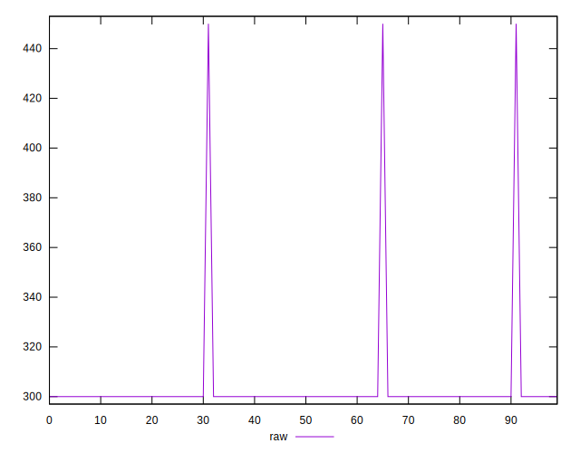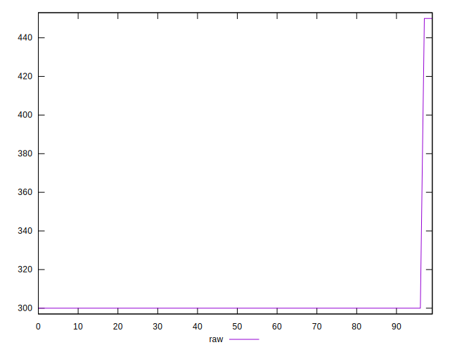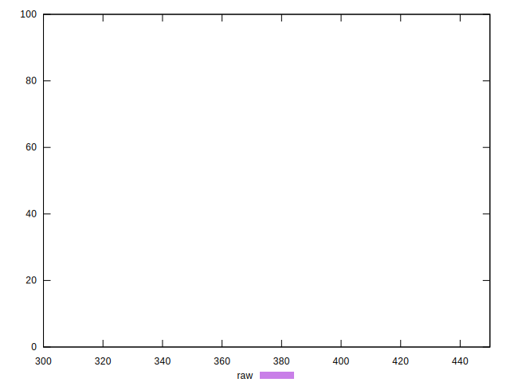
## Score


```yaml
p90min: 0.75
p90max: 0.75
p90range: 0
p90mean: 0.75
median: 0.75
p90stdev: 0
mad: 0
stdevBySn: 0
lfitCenter: 0.7488530656430904
lfitStdev: 0.002833721025185668
mfitCenter: 0.7499958071652044
mfitConfidence: 0.0002833721025185668
p90skewness: .nan
p90eccentricity: .nan
p90discretization: 94
outlandishness: 0.9936102400000001

```

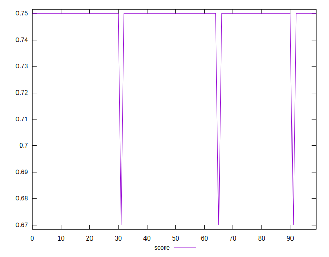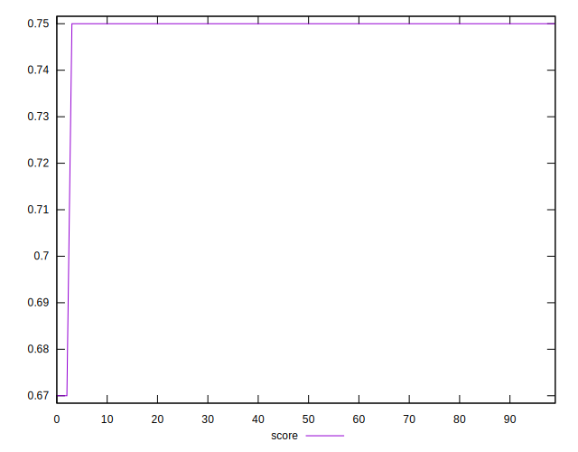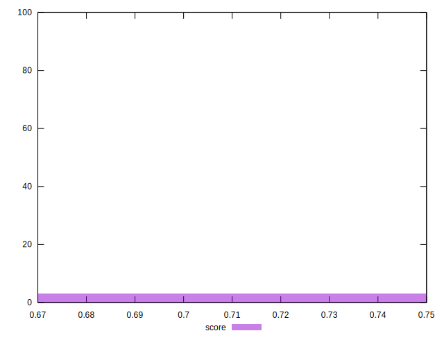
## Raw Estimate

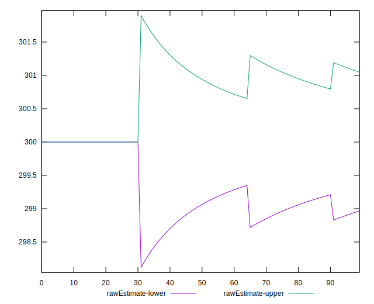
## Score Estimate

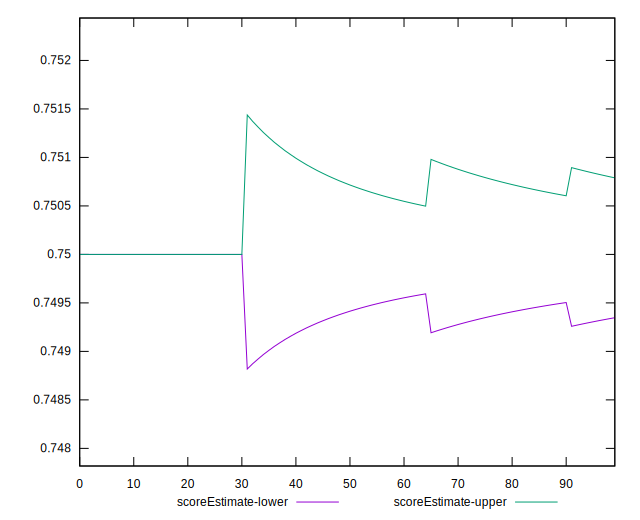
## P Score


```yaml
p90min: 0.75
p90max: 0.75
p90range: 0
p90mean: 0.75
median: 0.75
p90stdev: 0
mad: 0
stdevBySn: 0
lfitCenter: 0.7488052767115526
lfitStdev: 0.002951792734568264
mfitCenter: 0.7499956324637578
mfitConfidence: 0.00029517927345682637
p90skewness: .nan
p90eccentricity: .nan
p90discretization: 94
outlandishness: 0.9933444444444449

```

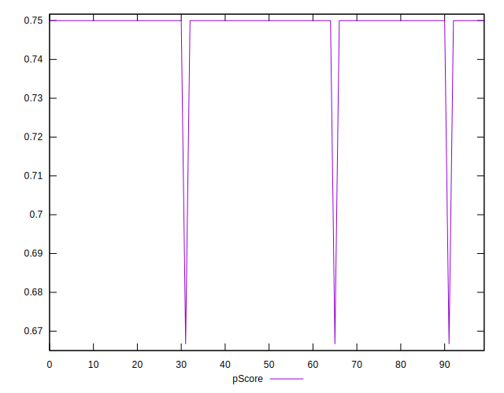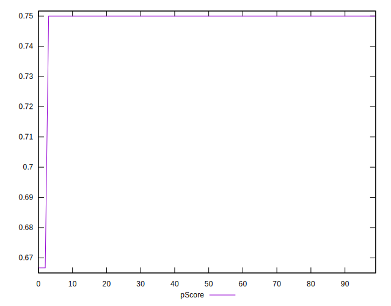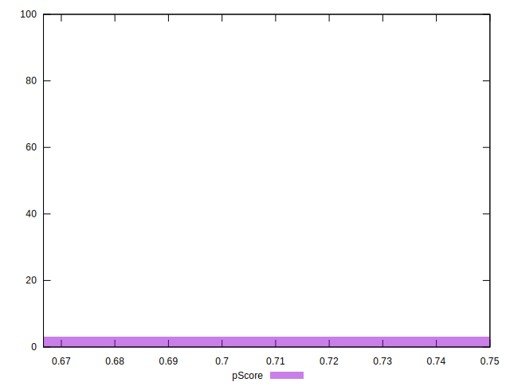
## Score Difference


```yaml
p90min: 0
p90max: 0
p90range: 0
p90mean: 0
median: 0
p90stdev: 0
mad: 0
stdevBySn: 0
lfitCenter: 0
lfitStdev: 0
mfitCenter: 0
mfitConfidence: 0
p90skewness: .nan
p90eccentricity: .nan
p90discretization: 94
outlandishness: .nan

```


## P Score Difference


```yaml
p90min: 0
p90max: 0
p90range: 0
p90mean: 0
median: 0
p90stdev: 0
mad: 0
stdevBySn: 0
lfitCenter: -0.00004778893153791418
lfitStdev: 0.00011807170938275469
mfitCenter: -1.7470144979319094e-7
mfitConfidence: 0.000011807170938275469
p90skewness: .nan
p90eccentricity: .nan
p90discretization: 94
outlandishness: .inf

```

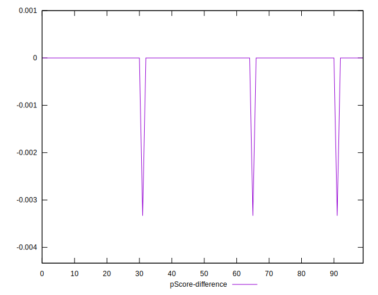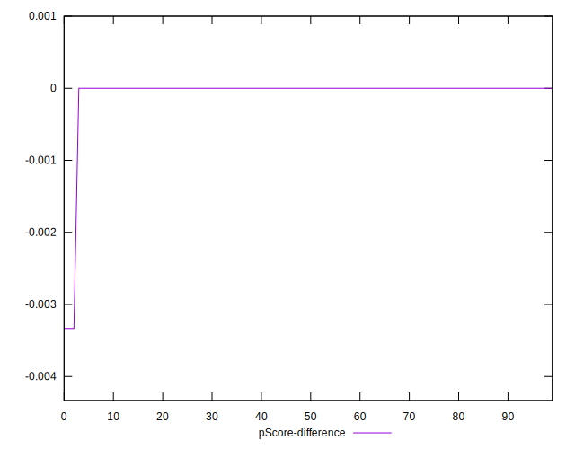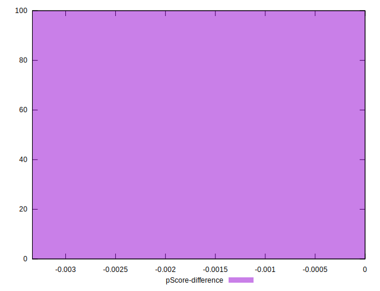