# //uses-webp-images/samples/pages

[→ Parent](../..)


## Raw


```yaml
p90min: 1350
p90max: 1650
p90range: 300
p90mean: 1545.531914893617
median: 1510
p90stdev: 99.41977436421314
mad: 140
stdevBySn: 166.96400000000003
lfitCenter: 1546.3137934041442
lfitStdev: 98.99938520377967
mfitCenter: 1543.8603024951717
mfitConfidence: 9.899938520377967
p90skewness: -0.4318719167920751
p90eccentricity: 0.9999999999999997
p90discretization: 15.666666666666666
outlandishness: 0.9993117924569779

```

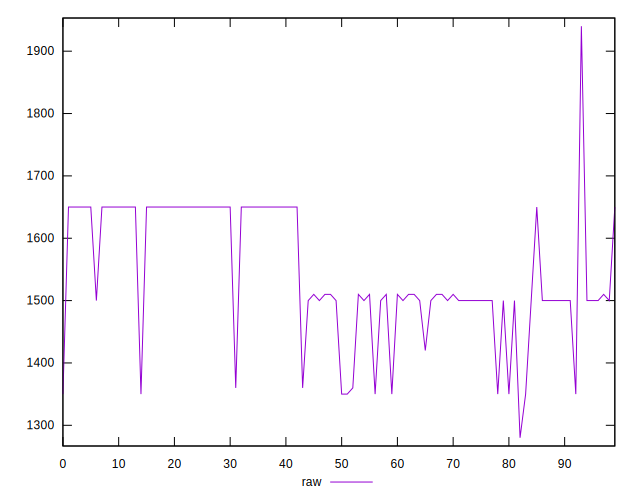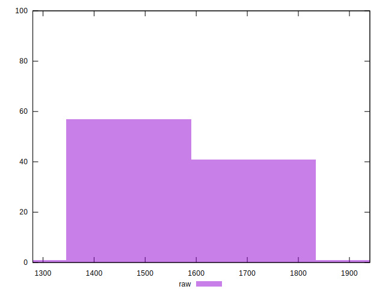
## Score


```yaml
p90min: 0.39
p90max: 0.43
p90range: 0.03999999999999998
p90mean: 0.4041489361702124
median: 0.41
p90stdev: 0.013401299910598132
mad: 0.019999999999999962
stdevBySn: 0.023851999999999957
lfitCenter: 0.40417976649179876
lfitStdev: 0.013426137642991755
mfitCenter: 0.40447384321613533
mfitConfidence: 0.0013426137642991755
p90skewness: 0.4073588547122427
p90eccentricity: 1.0000000000000018
p90discretization: 23.5
outlandishness: 1.0007477048621363

```

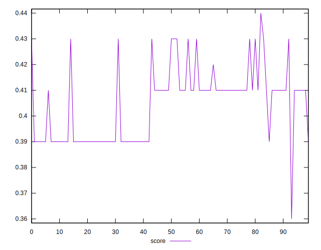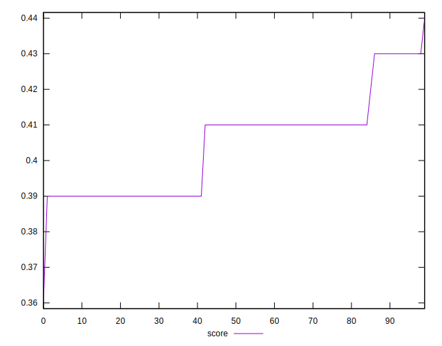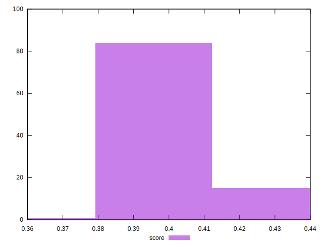
## Raw Estimate

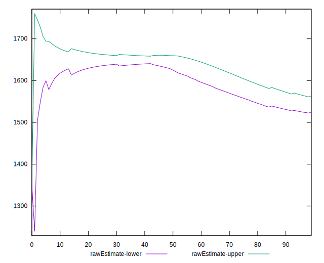
## Score Estimate

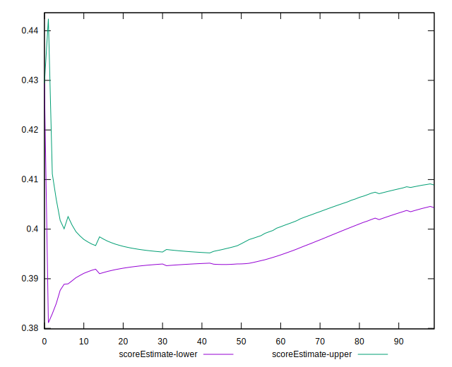
## P Score


```yaml
p90min: 0.3941176470588235
p90max: 0.4294117647058824
p90range: 0.035294117647058865
p90mean: 0.40640801001251575
median: 0.41058823529411764
p90stdev: 0.011696444042848609
mad: 0.016470588235294126
stdevBySn: 0.019642823529411775
lfitCenter: 0.40631602430539504
lfitStdev: 0.011646986494562224
mfitCenter: 0.40660467029468506
mfitConfidence: 0.0011646986494562223
p90skewness: 0.4318719167921727
p90eccentricity: 1.0000000000000002
p90discretization: 15.666666666666666
outlandishness: 1.0003079813345053

```

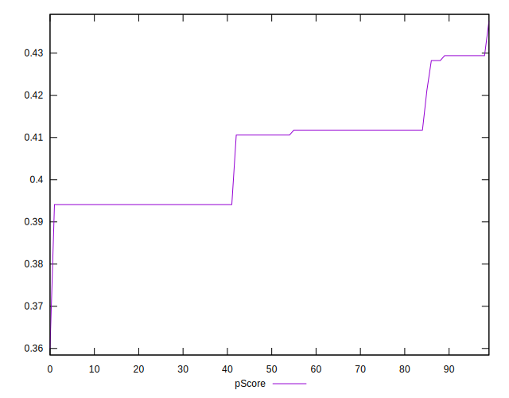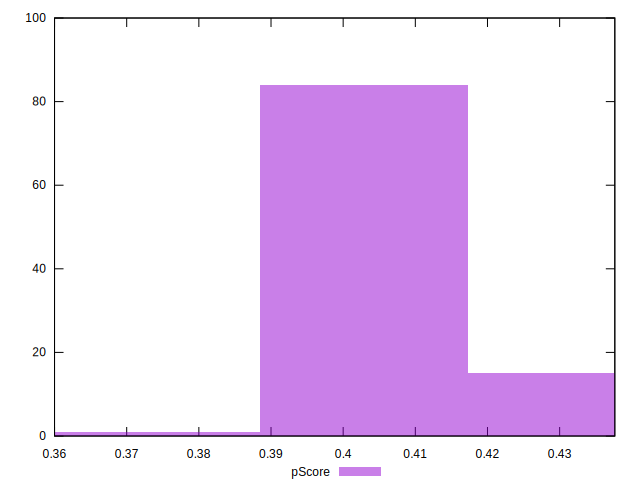
## Score Difference


```yaml
p90min: 0
p90max: 5.551115123125783e-17
p90range: 5.551115123125783e-17
p90mean: 2.362176648138631e-17
median: 0
p90stdev: 2.744601245712295e-17
mad: 0
stdevBySn: 0
lfitCenter: 2.1261451528065614e-17
lfitStdev: 3.288208738413138e-17
mfitCenter: 2.1261451528065614e-17
mfitConfidence: 0
p90skewness: 0.3012320380383538
p90eccentricity: 0.9999999999999983
p90discretization: 47
outlandishness: 1.02111025

```

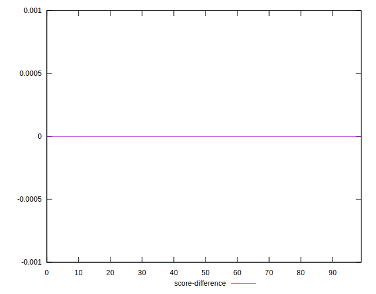
## P Score Difference


```yaml
p90min: -0.001764705882352946
p90max: 0.004117647058823504
p90range: 0.00588235294117645
p90mean: 0.002240300375469334
median: 0.001764705882352946
p90stdev: 0.0017209352596455427
mad: 0.0023529411764705577
stdevBySn: 0.0028061176470587875
lfitCenter: 0.002239614105723013
lfitStdev: 0.0016625255962895095
mfitCenter: 0.0021977396902614645
mfitConfidence: 0.00016625255962895096
p90skewness: -0.23670301798276666
p90eccentricity: 0.9999999999999991
p90discretization: 13.428571428571429
outlandishness: 0.9387336506351229

```

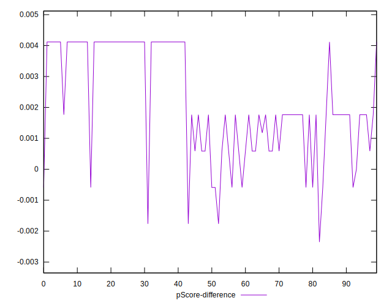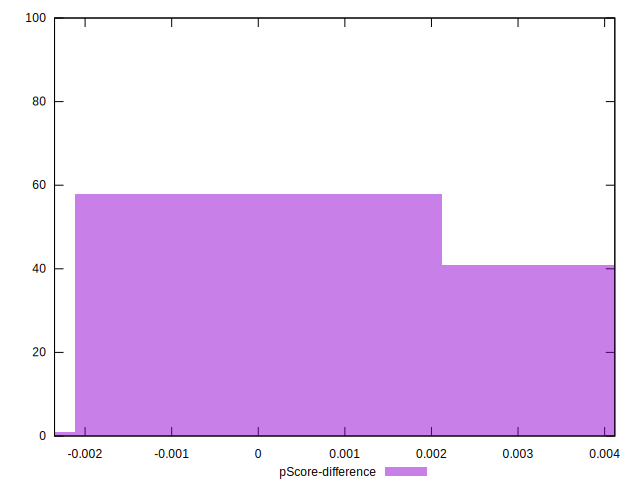