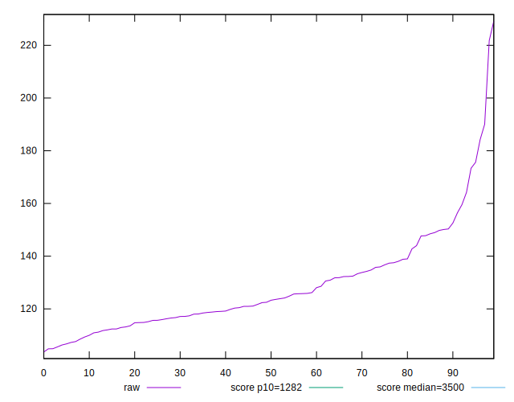
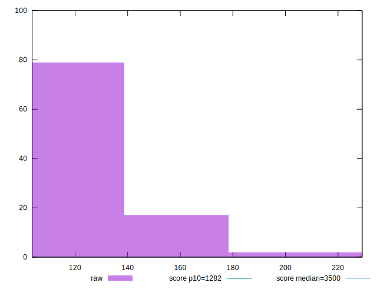
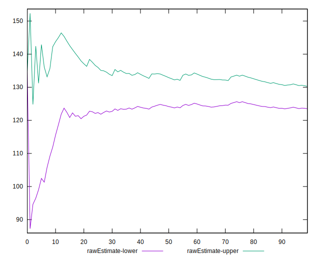
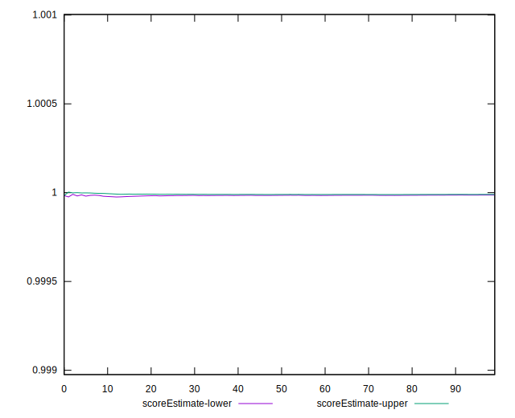
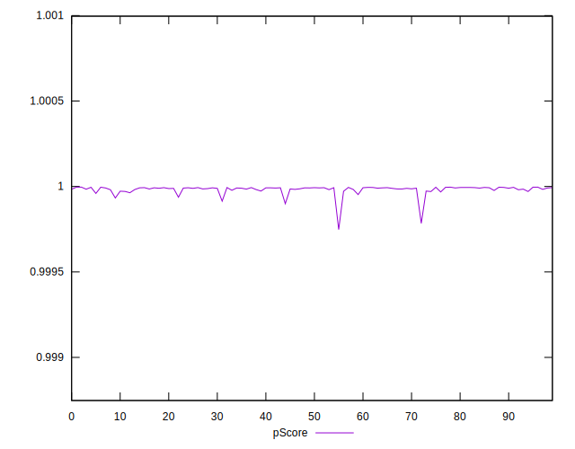
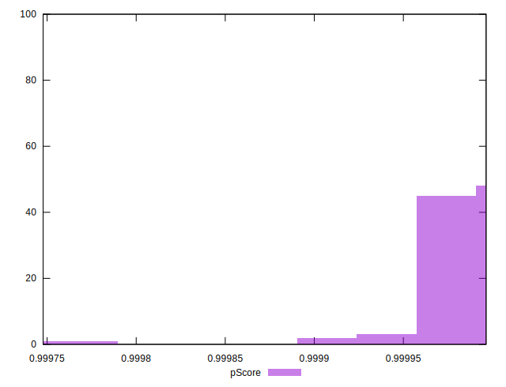
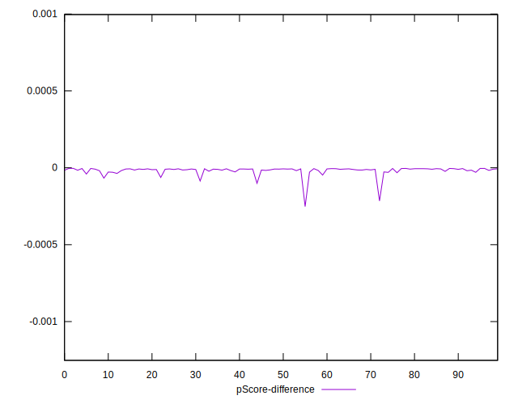
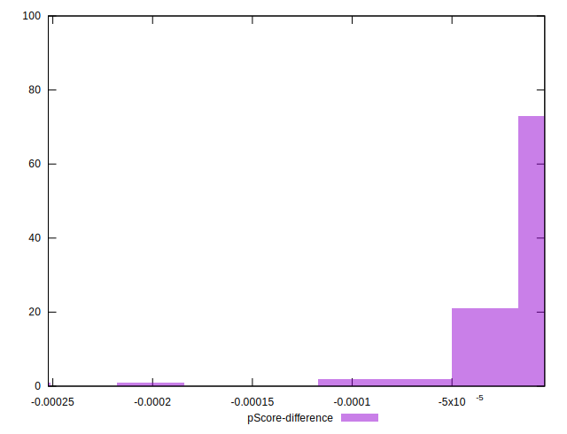

# //bootup-time/samples/pages+cached+noadtech+nomedia+nocss

[→ Parent](../..)


## Raw


```yaml
p90min: 105.58399999999997
p90max: 184.21599999999995
p90range: 78.63199999999998
p90mean: 127.42259574468085
median: 122.89599999999996
p90stdev: 16.108425565469755
mad: 9.638000000000005
stdevBySn: 14.125154400000003
lfitCenter: 126.88899122694157
lfitStdev: 13.760437494365984
mfitCenter: 126.88899122694157
mfitStdev: 17.24615086468898
mfitConfidence: 1.7246150864688978
p90skewness: 1.2277027294282572
p90eccentricity: 1.0000000000000002
p90discretization: 1
outlandishness: 1.0300316885517722

```


## Score


```yaml
p90min: 1
p90max: 1
p90range: 0
p90mean: 1
median: 1
p90stdev: 0
mad: 0
stdevBySn: 0
lfitCenter: 1
lfitStdev: 0
mfitCenter: 1
mfitStdev: 0
mfitConfidence: 0
p90skewness: .nan
p90eccentricity: .nan
p90discretization: 94
outlandishness: 1

```


## Raw Estimate


## Score Estimate


## P Score


```yaml
p90min: 0.999914026357885
p90max: 0.9999960364208397
p90range: 0.00008201006295471824
p90mean: 0.9999853971192733
median: 0.9999903746975496
p90stdev: 0.000013618491066126992
mad: 0.00000410393437205725
stdevBySn: 0.000005627612595466331
lfitCenter: 0.9999848569081645
lfitStdev: 0.000012157372865603924
mfitCenter: 0.9999848569081645
mfitStdev: 0.000015237007300409378
mfitConfidence: 0.0000015237007300409378
p90skewness: -2.885067375237039
p90eccentricity: 1.0000000000000004
p90discretization: 1
outlandishness: 0.9999901551397401

```


## Score Difference


```yaml
p90min: 0
p90max: 0
p90range: 0
p90mean: 0
median: 0
p90stdev: 0
mad: 0
stdevBySn: 0
lfitCenter: 0
lfitStdev: 0
mfitCenter: 0
mfitStdev: 0
mfitConfidence: 0
p90skewness: .nan
p90eccentricity: .nan
p90discretization: 94
outlandishness: .nan

```


## P Score Difference


```yaml
p90min: -0.00008597364211504477
p90max: -0.000003963579160326525
p90range: 0.00008201006295471824
p90mean: -0.00001460288072689398
median: -0.000009625302450411155
p90stdev: 0.000013618491066126997
mad: 0.00000410393437205725
stdevBySn: 0.000005627612595466331
lfitCenter: -0.000015143091835754673
lfitStdev: 0.000012157372865793358
mfitCenter: -0.000015143091835754673
mfitStdev: 0.000015237007300646798
mfitConfidence: 0.0000015237007300646799
p90skewness: -2.8850673752284464
p90eccentricity: 0.9999999999999996
p90discretization: 1
outlandishness: 1.7877886633411106

```

