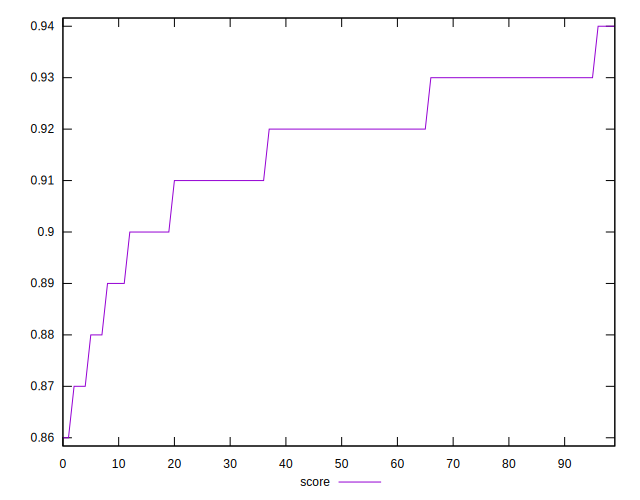
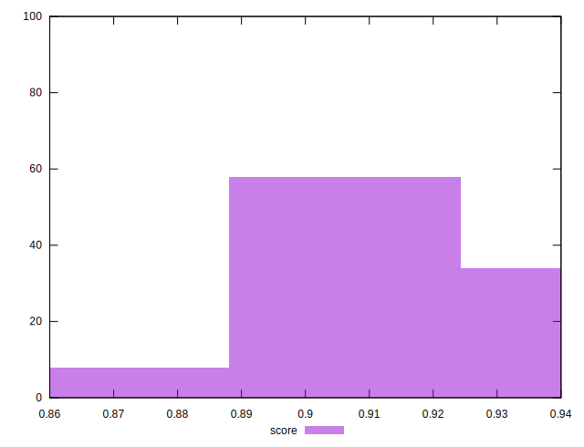
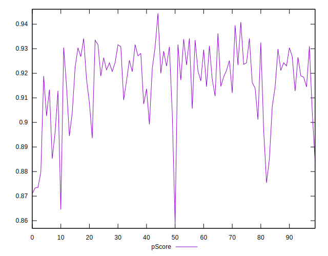

# //bootup-time/samples/pages

[→ Parent](../..)


## Raw


```yaml
p90min: 1060.1880000000008
p90max: 1429.7439999999988
p90range: 369.555999999998
p90mean: 1179.8417021276587
median: 1159.4519999999998
p90stdev: 86.98998787777288
mad: 56.8359999999999
stdevBySn: 80.41463279999947
lfitCenter: 1174.8818256098325
lfitStdev: 68.20855045120817
mfitCenter: 1174.8818256098325
mfitStdev: 85.48674065231714
mfitConfidence: 8.548674065231713
p90skewness: 1.10668117063858
p90eccentricity: 1.0000000000000002
p90discretization: 1
outlandishness: 1.0071411478844787

```


## Score


```yaml
p90min: 0.87
p90max: 0.94
p90range: 0.06999999999999995
p90mean: 0.9162765957446815
median: 0.92
p90stdev: 0.014730489624627509
mad: 0.010000000000000009
stdevBySn: 0.011926000000000011
lfitCenter: 0.9171965606712374
lfitStdev: 0.011947334265163156
mfitCenter: 0.9171965606712374
mfitStdev: 0.014973762952830113
mfitConfidence: 0.0014973762952830113
p90skewness: -1.1992179496573927
p90eccentricity: 1.000000000000001
p90discretization: 11.75
outlandishness: 0.9980875285212318

```


## Raw Estimate


## Score Estimate


## P Score


```yaml
p90min: 0.8733501935064204
p90max: 0.9362408765830815
p90range: 0.06289068307666112
p90mean: 0.9169746981830788
median: 0.920694280418805
p90stdev: 0.01470583617213986
mad: 0.009050335691446143
stdevBySn: 0.012806761112803445
lfitCenter: 0.917861133464731
lfitStdev: 0.011410860412110372
mfitCenter: 0.917861133464731
mfitStdev: 0.014301392687822373
mfitConfidence: 0.0014301392687822373
p90skewness: -1.222499862492578
p90eccentricity: 1.0000000000000007
p90discretization: 1
outlandishness: 0.9981916156335491

```


## Score Difference


```yaml
p90min: 0
p90max: 1.1102230246251565e-16
p90range: 1.1102230246251565e-16
p90mean: 1.1810883240693154e-18
median: 0
p90stdev: 1.139000331521095e-17
mad: 0
stdevBySn: 0
lfitCenter: 2.1510305028010703e-18
lfitStdev: 5.2873683940481196e-18
mfitCenter: 2.1510305028010703e-18
mfitStdev: 6.626733564123762e-18
mfitConfidence: 6.626733564123762e-19
p90skewness: 9.539955591519902
p90eccentricity: 1.0000000000000007
p90discretization: 47
outlandishness: 14.137600000000003

```


## P Score Difference


```yaml
p90min: -0.004717836454514068
p90max: 0.0045283148434364096
p90range: 0.009246151297950478
p90mean: 0.0007988281386063589
median: 0.0009932881862136922
p90stdev: 0.0027660116438180562
mad: 0.002536763280640175
stdevBySn: 0.0034769077204777174
lfitCenter: 0.0008842030973239594
lfitStdev: 0.002377737936056009
mfitCenter: 0.0008842030973239594
mfitStdev: 0.0029800525730890306
mfitConfidence: 0.0002980052573089031
p90skewness: -0.3414048558322583
p90eccentricity: 1.0000000000000002
p90discretization: 1
outlandishness: 0.8702437305700575

```

