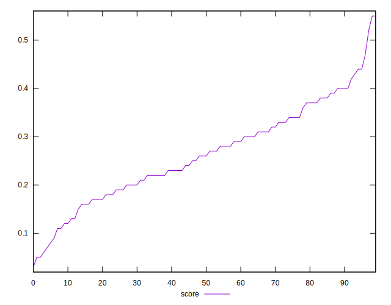
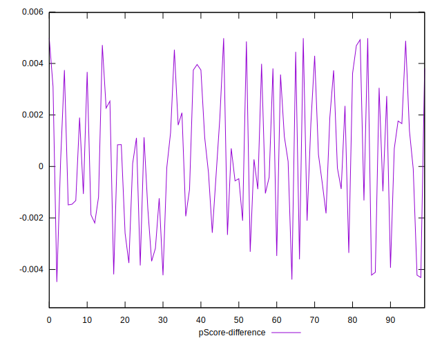

# //estimated-input-latency/samples/pages

[→ Parent](../..)


## Raw


```yaml
p90min: 103.2
p90max: 196.86666666666667
p90range: 93.66666666666667
p90mean: 134.0184397163121
median: 131.60000000000025
p90stdev: 18.785637600875397
mad: 12.46666666666691
stdevBySn: 20.55247333333225
lfitCenter: 133.48266313811035
lfitStdev: 15.521291853673148
mfitCenter: 133.48266313811035
mfitStdev: 19.453054529182953
mfitConfidence: 1.9453054529182954
p90skewness: 0.8962653249726421
p90eccentricity: 1.0000000000000002
p90discretization: 1.010752688172043
outlandishness: 1.0153131983258703

```


## Score


```yaml
p90min: 0.06
p90max: 0.47
p90range: 0.41
p90mean: 0.26255319148936174
median: 0.26
p90stdev: 0.09472172199381709
mad: 0.07500000000000001
stdevBySn: 0.11926000000000002
lfitCenter: 0.26280669989388245
lfitStdev: 0.08280091091572808
mfitCenter: 0.26280669989388245
mfitStdev: 0.1037755523377067
mfitConfidence: 0.01037755523377067
p90skewness: 0.01292384228999703
p90eccentricity: 1
p90discretization: 2.611111111111111
outlandishness: 1.013350585451642

```


## Raw Estimate


## Score Estimate


## P Score


```yaml
p90min: 0.05551487587135129
p90max: 0.47046323393931444
p90range: 0.41494835806796315
p90mean: 0.26294046407942456
median: 0.2591309444163719
p90stdev: 0.09474516563851973
mad: 0.07453090117064476
stdevBySn: 0.11669070613980062
lfitCenter: 0.2633298862657138
lfitStdev: 0.08216354633693465
mfitCenter: 0.2633298862657138
mfitStdev: 0.10297673429967695
mfitConfidence: 0.010297673429967695
p90skewness: -0.0033322141043318613
p90eccentricity: 1
p90discretization: 1.010752688172043
outlandishness: 1.0131526374478323

```


## Score Difference


```yaml
p90min: 0
p90max: 0
p90range: 0
p90mean: 0
median: 0
p90stdev: 0
mad: 0
stdevBySn: 0
lfitCenter: 2.583267684513104e-19
lfitStdev: 6.445158398659724e-19
mfitCenter: 2.583267684513104e-19
mfitStdev: 8.077808146406197e-19
mfitConfidence: 8.077808146406197e-20
p90skewness: .nan
p90eccentricity: .nan
p90discretization: 94
outlandishness: .inf

```


## P Score Difference


```yaml
p90min: -0.004223104538718936
p90max: 0.004980020375017602
p90range: 0.009203124913736538
p90mean: 0.00036853146279123823
median: 0.00021598533195735237
p90stdev: 0.0027135796983351864
mad: 0.002235261628036611
stdevBySn: 0.003060997545081011
lfitCenter: 0.0003495524221986951
lfitStdev: 0.0023449804047793836
mfitCenter: 0.0003495524221986951
mfitStdev: 0.0029389970959951693
mfitConfidence: 0.0002938997095995169
p90skewness: 0.01592976125178232
p90eccentricity: 0.9999999999999997
p90discretization: 1.010752688172043
outlandishness: 0.9755358400415831

```

