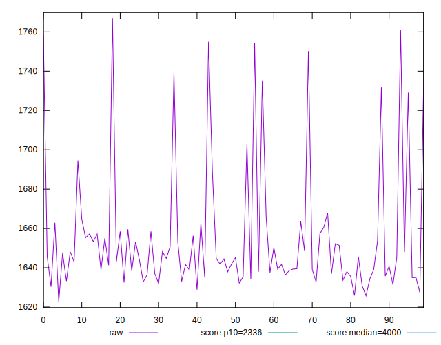
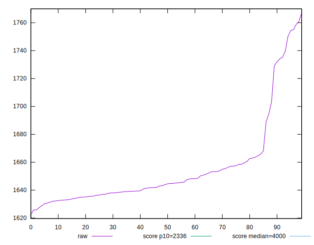
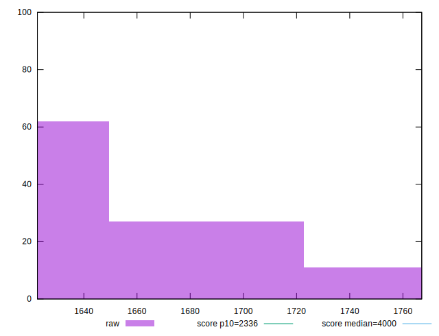
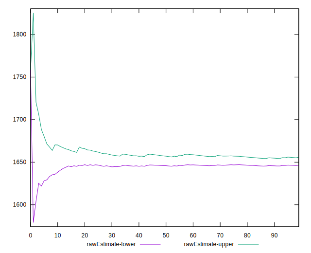
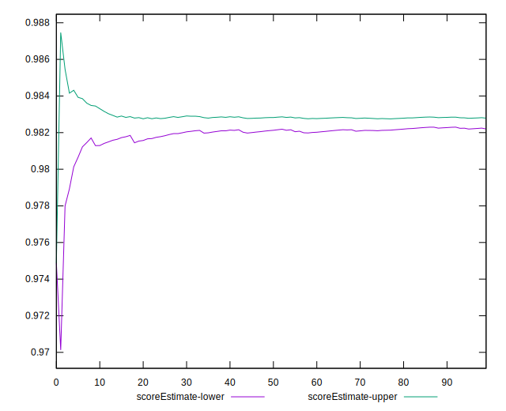
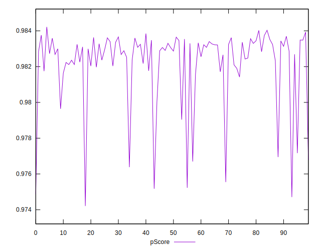
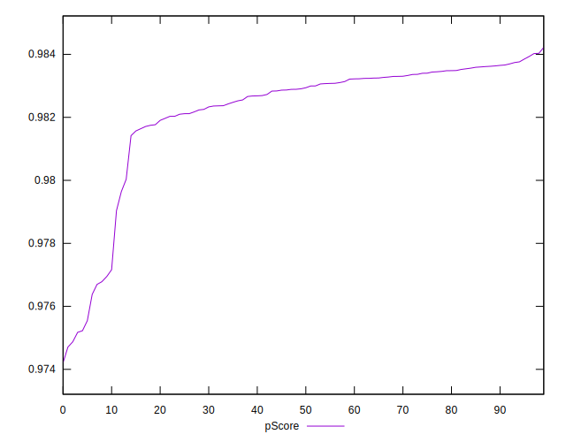
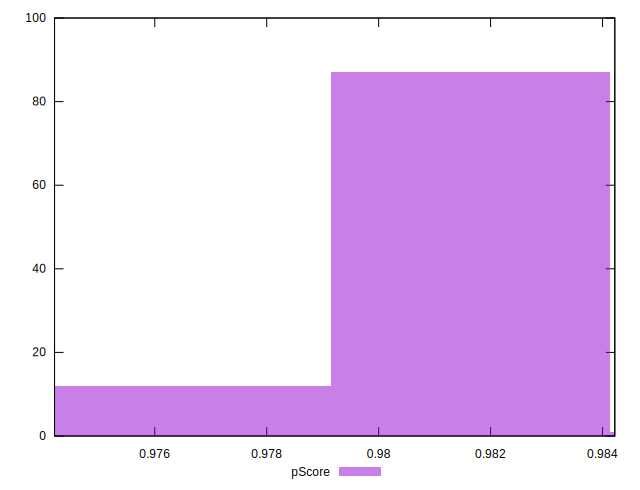
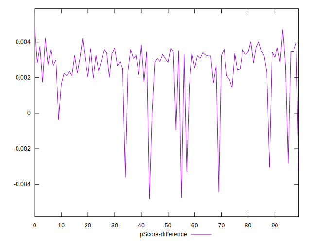
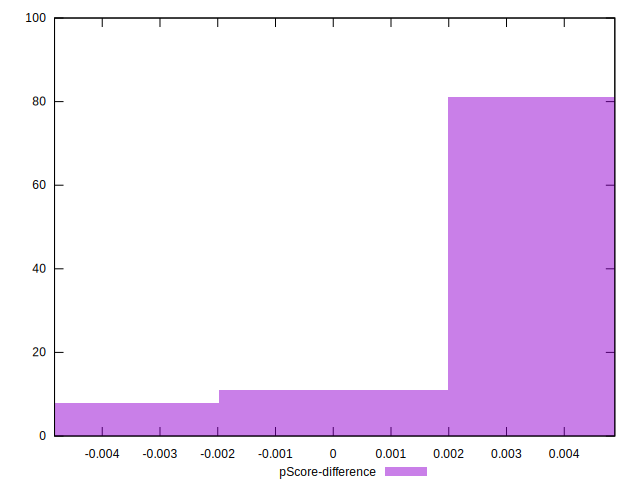

# //first-meaningful-paint/samples/pages+cached+noadtech+nomedia+nocss

[→ Parent](../..)


## Raw


```yaml
p90min: 1627.4473
p90max: 1754.9934999999998
p90range: 127.54619999999977
p90mean: 1653.9876824468092
median: 1644.2542249999997
p90stdev: 29.79130545303258
mad: 9.255224999999882
stdevBySn: 13.668955084999942
lfitCenter: 1651.173401490484
lfitStdev: 19.32154300716
mfitCenter: 1651.173401490484
mfitStdev: 24.215963029990203
mfitConfidence: 2.42159630299902
p90skewness: 2.1939110005845923
p90eccentricity: 1.0000000000000009
p90discretization: 1
outlandishness: 1.0028670904404469

```


## Score


```yaml
p90min: 0.98
p90max: 0.98
p90range: 0
p90mean: 0.9800000000000002
median: 0.98
p90stdev: 2.220446049250313e-16
mad: 0
stdevBySn: 0
lfitCenter: 0.9798566332053862
lfitStdev: 0.0003542151281483269
mfitCenter: 0.9798566332053862
mfitStdev: 0.0004439428282060339
mfitConfidence: 0.000044394282820603385
p90skewness: -1
p90eccentricity: 1
p90discretization: 94
outlandishness: 0.9993878488129951

```


## Raw Estimate


## Score Estimate


## P Score


```yaml
p90min: 0.9751739172059535
p90max: 0.9839326098944163
p90range: 0.008758692688462855
p90mean: 0.9822499276584714
median: 0.9829230265628255
p90stdev: 0.0020250848085261097
mad: 0.0005635383735937971
stdevBySn: 0.0008265512428413603
lfitCenter: 0.982441204090592
lfitStdev: 0.001282859046904714
mfitCenter: 0.982441204090592
mfitStdev: 0.0016078253812866286
mfitConfidence: 0.00016078253812866285
p90skewness: -2.3092287529333695
p90eccentricity: 0.9999999999999996
p90discretization: 1
outlandishness: 0.999645117543606

```


## Score Difference


```yaml
p90min: 0
p90max: 0
p90range: 0
p90mean: 0
median: 0
p90stdev: 0
mad: 0
stdevBySn: 0
lfitCenter: 0
lfitStdev: 0
mfitCenter: 0
mfitStdev: 0
mfitConfidence: 0
p90skewness: .nan
p90eccentricity: .nan
p90discretization: 94
outlandishness: .nan

```


## P Score Difference


```yaml
p90min: -0.0036204202408127717
p90max: 0.004209079654852399
p90range: 0.00782949989566517
p90mean: 0.0025299243394106817
median: 0.003028963228477788
p90stdev: 0.0016109768062239362
mad: 0.0005561554845627814
stdevBySn: 0.000794651013207911
lfitCenter: 0.0026464436893470803
lfitStdev: 0.001055254247881644
mfitCenter: 0.0026464436893470803
mfitStdev: 0.001322565068663121
mfitConfidence: 0.00013225650686631208
p90skewness: -2.51633325371916
p90eccentricity: 1.0000000000000002
p90discretization: 1
outlandishness: 0.88173703718757

```

