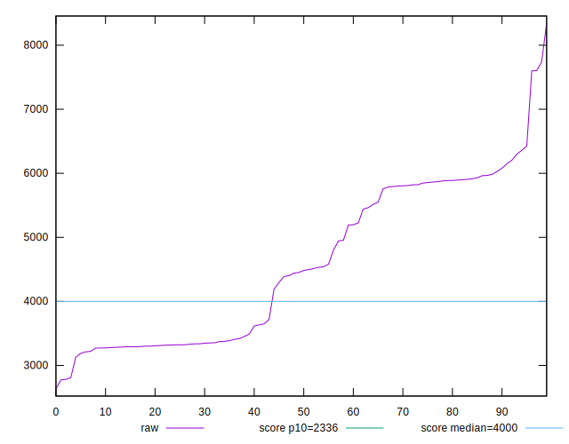
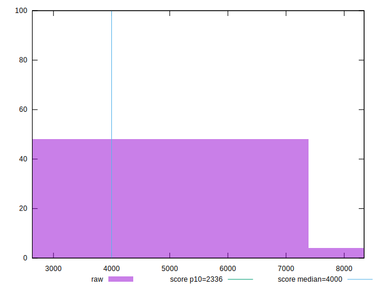
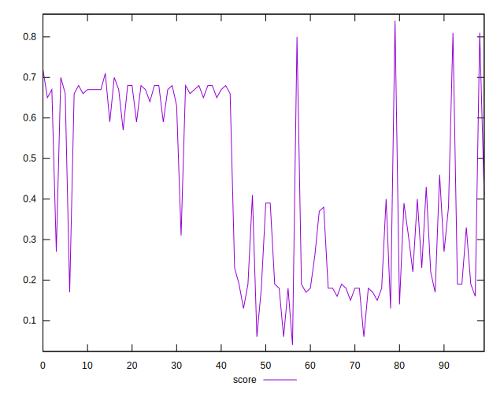
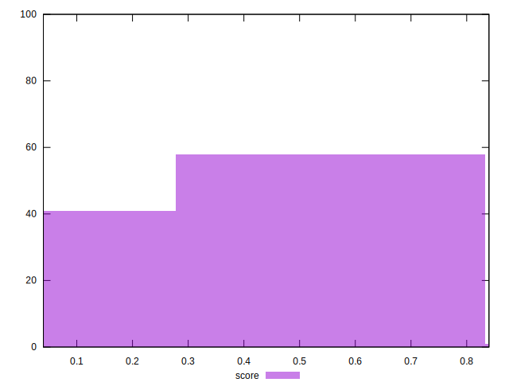
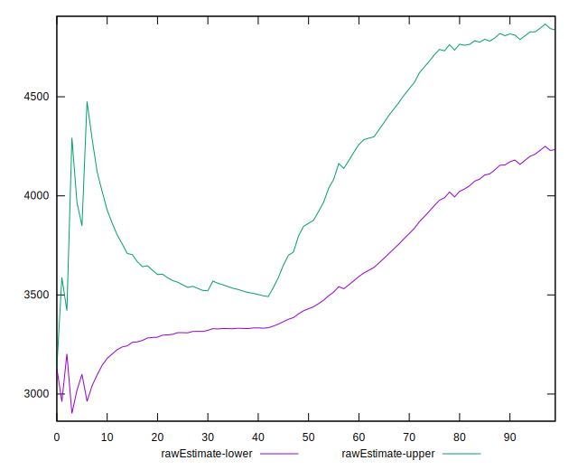
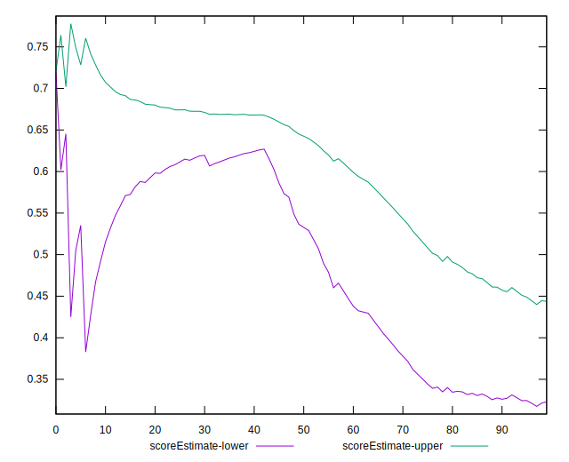
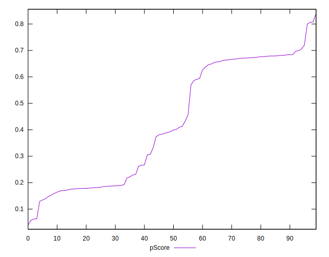
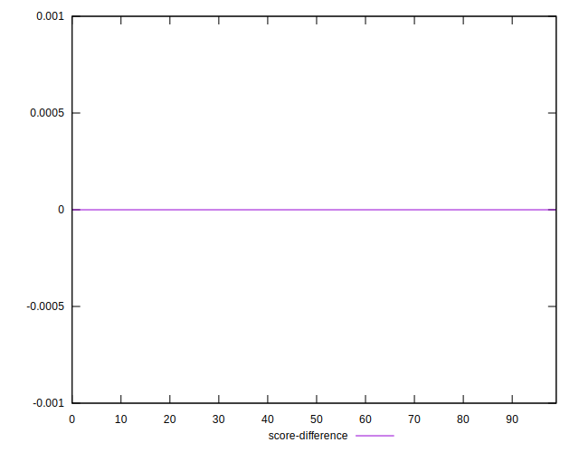
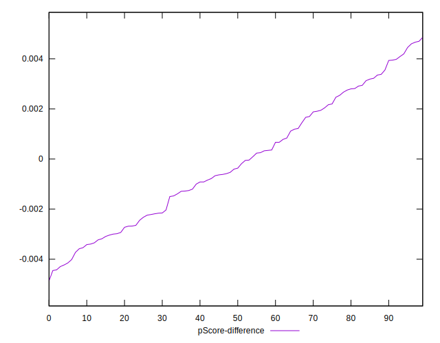
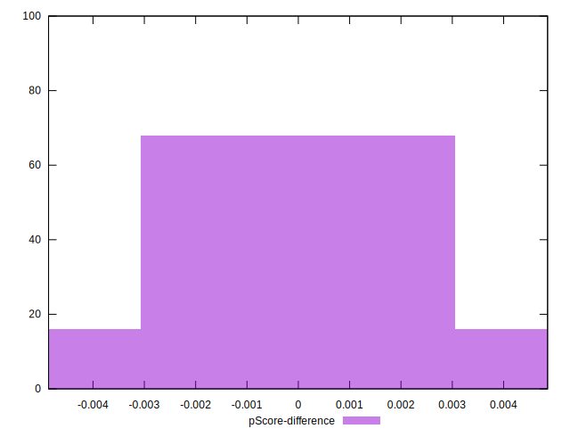

# //first-meaningful-paint/samples/pages

[→ Parent](../..)


## Raw


```yaml
p90min: 2808.6949999999997
p90max: 7598.957999999999
p90range: 4790.262999999999
p90mean: 4558.093356382977
median: 4466.62575
p90stdev: 1201.553680615317
mad: 1175.9947500000003
stdevBySn: 1439.3973893749999
lfitCenter: 4534.8450296159435
lfitStdev: 1228.1070379337132
mfitCenter: 4534.8450296159435
mfitStdev: 1539.2039143277984
mfitConfidence: 153.92039143277984
p90skewness: 0.23906116769508695
p90eccentricity: 1.0000000000000007
p90discretization: 1
outlandishness: 1.0199742949310193

```


## Score


```yaml
p90min: 0.06
p90max: 0.8
p90range: 0.74
p90mean: 0.4262765957446807
median: 0.395
p90stdev: 0.22565264231591822
mad: 0.235
stdevBySn: 0.286224
lfitCenter: 0.42605013208993486
lfitStdev: 0.23773092765699785
mfitCenter: 0.42605013208993486
mfitStdev: 0.29795153280945536
mfitConfidence: 0.029795153280945536
p90skewness: 0.02108665995158549
p90eccentricity: 1.0000000000000002
p90discretization: 2.8484848484848486
outlandishness: 1.0029270201903353

```


## Raw Estimate


## Score Estimate


## P Score


```yaml
p90min: 0.06312903658369978
p90max: 0.8002363977261187
p90range: 0.7371073611424188
p90mean: 0.42622733403795243
median: 0.39632016742566767
p90stdev: 0.22584468830291313
mad: 0.2315632378199983
stdevBySn: 0.28584254752689375
lfitCenter: 0.42593910393238604
lfitStdev: 0.23774944402643444
mfitCenter: 0.42593910393238604
mfitStdev: 0.29797473963706533
mfitConfidence: 0.029797473963706533
p90skewness: 0.02154153950411257
p90eccentricity: 1.0000000000000002
p90discretization: 1
outlandishness: 1.0027335103313002

```


## Score Difference


```yaml
p90min: 0
p90max: 5.551115123125783e-17
p90range: 5.551115123125783e-17
p90mean: 1.1810883240693154e-18
median: 0
p90stdev: 8.010530753054493e-18
mad: 0
stdevBySn: 0
lfitCenter: 2.158636612376596e-18
lfitStdev: 5.278062741850255e-18
mfitCenter: 2.158636612376596e-18
mfitStdev: 6.615070658655501e-18
mfitConfidence: 6.615070658655501e-19
p90skewness: 6.634888026970372
p90eccentricity: 0.9999999999999989
p90discretization: 47
outlandishness: 14.137600000000003

```


## P Score Difference


```yaml
p90min: -0.00429222163703441
p90max: 0.0045988017379345325
p90range: 0.008891023374968943
p90mean: -0.00010136286763122087
median: -0.00038333098052889536
p90stdev: 0.0024896015025122208
mad: 0.002294752044127324
stdevBySn: 0.0029871423606484715
lfitCenter: -0.00014466775407115197
lfitStdev: 0.002198955413244775
mfitCenter: -0.00014466775407115197
mfitStdev: 0.002755981909519311
mfitConfidence: 0.0002755981909519311
p90skewness: 0.1418641648083414
p90eccentricity: 1.0000000000000002
p90discretization: 1
outlandishness: 0.7974149598745107

```

