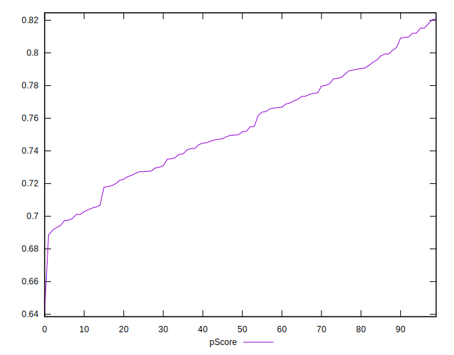
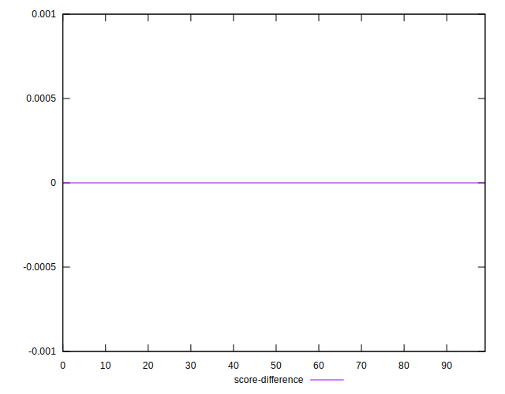
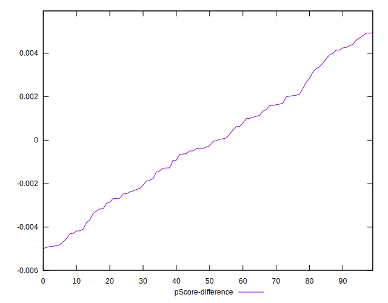

# //largest-contentful-paint/samples/pages+cached+noadtech+nomedia+nocss

[→ Parent](../..)


## Raw


```yaml
p90min: 2878.644
p90max: 3324.0681
p90range: 445.4241000000002
p90mean: 3104.087852127658
median: 3120.4355
p90stdev: 122.49608764626865
mad: 101.50035000000048
stdevBySn: 140.9472222950014
lfitCenter: 3105.777919607393
lfitStdev: 108.94833424307973
mfitCenter: 3105.777919607393
mfitStdev: 136.54648768122513
mfitConfidence: 13.654648768122513
p90skewness: -0.043061595368129445
p90eccentricity: 1
p90discretization: 1
outlandishness: 1.0008201660715004

```


## Score


```yaml
p90min: 0.69
p90max: 0.82
p90range: 0.13
p90mean: 0.7548936170212766
median: 0.75
p90stdev: 0.03357255340655975
mad: 0.030000000000000027
stdevBySn: 0.03577800000000003
lfitCenter: 0.7544943649767002
lfitStdev: 0.02964383140655831
mfitCenter: 0.7544943649767002
mfitStdev: 0.037153033023421725
mfitConfidence: 0.0037153033023421727
p90skewness: -0.002371788790663689
p90eccentricity: 1.000000000000001
p90discretization: 6.714285714285714
outlandishness: 0.9986926485410582

```


## Raw Estimate


## Score Estimate


## P Score


```yaml
p90min: 0.693123269597258
p90max: 0.8151435152296584
p90range: 0.12202024563240044
p90mean: 0.7547547610477671
median: 0.7508268874706858
p90stdev: 0.033648895165659234
mad: 0.02847771698659962
stdevBySn: 0.03963468458052914
lfitCenter: 0.7544172321923285
lfitStdev: 0.029933205967042097
mfitCenter: 0.7544172321923285
mfitStdev: 0.037515710251420455
mfitConfidence: 0.0037515710251420455
p90skewness: -0.009406669332154402
p90eccentricity: 1.0000000000000002
p90discretization: 1
outlandishness: 0.9987434335928764

```


## Score Difference


```yaml
p90min: 0
p90max: 1.1102230246251565e-16
p90range: 1.1102230246251565e-16
p90mean: 1.5354148212901102e-17
median: 0
p90stdev: 3.832627061955375e-17
mad: 0
stdevBySn: 0
lfitCenter: 1.0211785505183114e-17
lfitStdev: 2.3242734999181492e-17
mfitCenter: 1.0211785505183114e-17
mfitStdev: 2.913044839366423e-17
mfitConfidence: 2.913044839366423e-18
p90skewness: 2.095534074628639
p90eccentricity: 0.9999999999999979
p90discretization: 47
outlandishness: 1.3384710059171598

```


## P Score Difference


```yaml
p90min: -0.004875759976188276
p90max: 0.004804136864466013
p90range: 0.00967989684065429
p90mean: -0.00012702331524690457
median: -0.0002871803195277911
p90stdev: 0.0027290680263481557
mad: 0.0022952238278332038
stdevBySn: 0.0030466548805040765
lfitCenter: -0.00014245109649483606
lfitStdev: 0.0023149337294891014
mfitCenter: -0.00014245109649483606
mfitStdev: 0.0029013391730366377
mfitConfidence: 0.0002901339173036638
p90skewness: 0.06578069620921663
p90eccentricity: 1
p90discretization: 1
outlandishness: 0.8863525729146015

```

