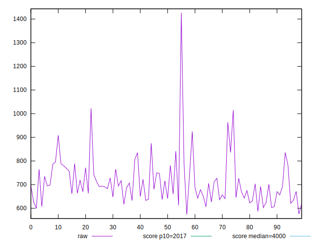
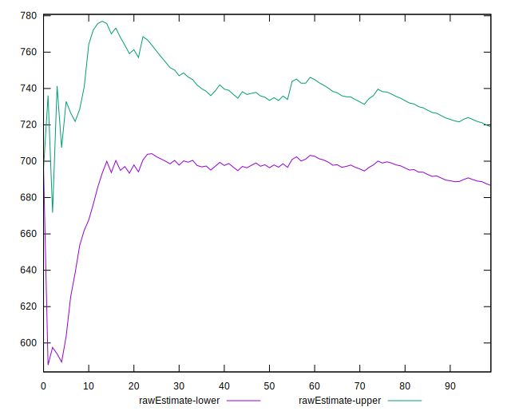
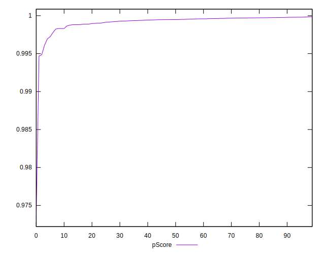

# //mainthread-work-breakdown/samples/pages+cached+noadtech+nomedia+nocss

[→ Parent](../..)


## Raw


```yaml
p90min: 599.1960000000001
p90max: 964.0280000000007
p90range: 364.83200000000056
p90mean: 703.5737021276593
median: 691.8860000000001
p90stdev: 76.43342341302451
mad: 54.60599999999994
stdevBySn: 76.79866960000012
lfitCenter: 702.7701389497357
lfitStdev: 65.51433953456862
mfitCenter: 702.7701389497357
mfitStdev: 82.11004801818527
mfitConfidence: 8.211004801818527
p90skewness: 1.0468610589442773
p90eccentricity: 0.9999999999999999
p90discretization: 1
outlandishness: 1.0280134525793838

```


## Score


```yaml
p90min: 1
p90max: 1
p90range: 0
p90mean: 1
median: 1
p90stdev: 0
mad: 0
stdevBySn: 0
lfitCenter: 0.9997635611783353
lfitStdev: 0.0005841673990188931
mfitCenter: 0.9997635611783353
mfitStdev: 0.0007321452604859193
mfitConfidence: 0.00007321452604859193
p90skewness: .nan
p90eccentricity: .nan
p90discretization: 94
outlandishness: 0.9990002499999997

```


## Raw Estimate


## Score Estimate


## P Score


```yaml
p90min: 0.9961317206386657
p90max: 0.9998098405333797
p90range: 0.003678119894714005
p90mean: 0.9992997429924128
median: 0.9994886062264604
p90stdev: 0.0006201725172578521
mad: 0.00022933882854758725
stdevBySn: 0.000336547635485421
lfitCenter: 0.999219196627978
lfitStdev: 0.0006706871246495414
mfitCenter: 0.999219196627978
mfitStdev: 0.0008405816558845824
mfitConfidence: 0.00008405816558845824
p90skewness: -2.6677420228024764
p90eccentricity: 1.0000000000000004
p90discretization: 1
outlandishness: 0.9993298318149482

```


## Score Difference


```yaml
p90min: 0
p90max: 0
p90range: 0
p90mean: 0
median: 0
p90stdev: 0
mad: 0
stdevBySn: 0
lfitCenter: 0
lfitStdev: 0
mfitCenter: 0
mfitStdev: 0
mfitConfidence: 0
p90skewness: .nan
p90eccentricity: .nan
p90discretization: 94
outlandishness: .nan

```


## P Score Difference


```yaml
p90min: -0.0022257788706512294
p90max: -0.0001391852705816543
p90range: 0.002086593600069575
p90mean: -0.0006018366430473646
median: -0.0004895955286459142
p90stdev: 0.0004160447267918599
mad: 0.0002160497929515337
stdevBySn: 0.000336547635485421
lfitCenter: -0.0005236462211141537
lfitStdev: 0.0004006405612705997
mfitCenter: -0.0005236462211141537
mfitStdev: 0.0005021284799277226
mfitConfidence: 0.00005021284799277226
p90skewness: -1.5395423914654742
p90eccentricity: 0.9999999999999992
p90discretization: 1
outlandishness: 0.7907045122635176

```

