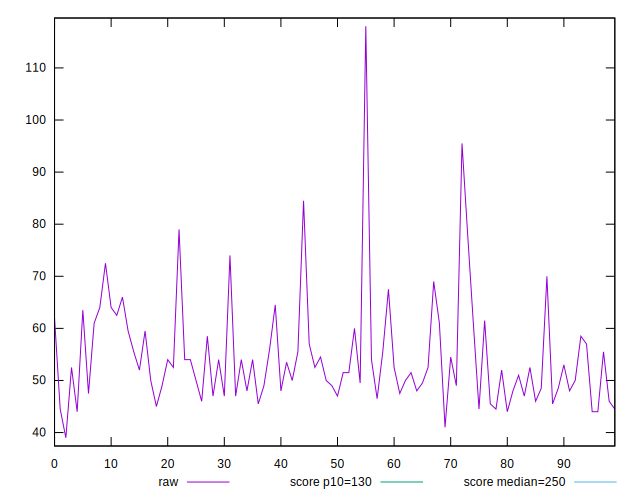
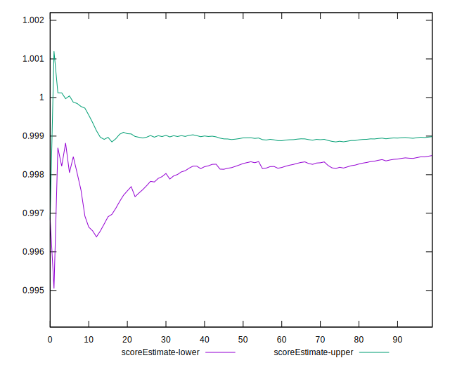

# //max-potential-fid/samples/pages+cached+noadtech+nomedia+nocss

[→ Parent](../..)


## Raw


```yaml
p90min: 44
p90max: 79
p90range: 35
p90mean: 53.670212765957444
median: 52.24999999999994
p90stdev: 7.795782135467036
mad: 4.750000000000114
stdevBySn: 7.7518999999999325
lfitCenter: 53.47677406091467
lfitStdev: 6.551670618337429
mfitCenter: 53.47677406091467
mfitStdev: 8.211301417259445
mfitConfidence: 0.8211301417259446
p90skewness: 1.1828945651430915
p90eccentricity: 1.0000000000000002
p90discretization: 1.8076923076923077
outlandishness: 1.0376037050254352

```


## Score


```yaml
p90min: 0.99
p90max: 1
p90range: 0.010000000000000009
p90mean: 0.9992553191489361
median: 1
p90stdev: 0.00262531120835172
mad: 0
stdevBySn: 0
lfitCenter: 0.9990496727902968
lfitStdev: 0.0022566972821735387
mfitCenter: 0.9990496727902968
mfitStdev: 0.0028283506102355694
mfitConfidence: 0.0002828350610235569
p90skewness: -3.2417635938922977
p90eccentricity: 0.9999999999999994
p90discretization: 47
outlandishness: 0.9976889764842177

```


## Raw Estimate


## Score Estimate


## P Score


```yaml
p90min: 0.9880175836752019
p90max: 0.9996687264701117
p90range: 0.011651142794909863
p90mean: 0.9982077725853277
median: 0.9989216089069106
p90stdev: 0.0021290802618286844
mad: 0.0005507786643033086
stdevBySn: 0.0008577451945509227
lfitCenter: 0.9979979331928834
lfitStdev: 0.0021945222905985664
mfitCenter: 0.9979979331928834
mfitStdev: 0.0027504258142287733
mfitConfidence: 0.0002750425814228773
p90skewness: -2.8392936325091953
p90eccentricity: 1.0000000000000007
p90discretization: 2.0434782608695654
outlandishness: 0.9978589255107396

```


## Score Difference


```yaml
p90min: 0
p90max: 0
p90range: 0
p90mean: 0
median: 0
p90stdev: 0
mad: 0
stdevBySn: 0
lfitCenter: 0
lfitStdev: 0
mfitCenter: 0
mfitStdev: 0
mfitConfidence: 0
p90skewness: .nan
p90eccentricity: .nan
p90discretization: 94
outlandishness: .nan

```


## P Score Difference


```yaml
p90min: -0.003788635213870517
p90max: 0.003239727129882408
p90range: 0.007028362343752925
p90mean: -0.00102762537713036
median: -0.000804916819314494
p90stdev: 0.0010420397313914919
mad: 0.0004457485960480678
stdevBySn: 0.000800125375804046
lfitCenter: -0.0009473754150547625
lfitStdev: 0.0007653522166526641
mfitCenter: -0.0009473754150547625
mfitStdev: 0.0009592267541217543
mfitConfidence: 0.00009592267541217543
p90skewness: 0.3817954071551582
p90eccentricity: 1.0000000000000007
p90discretization: 2.0434782608695654
outlandishness: 0.8752969609025981

```

