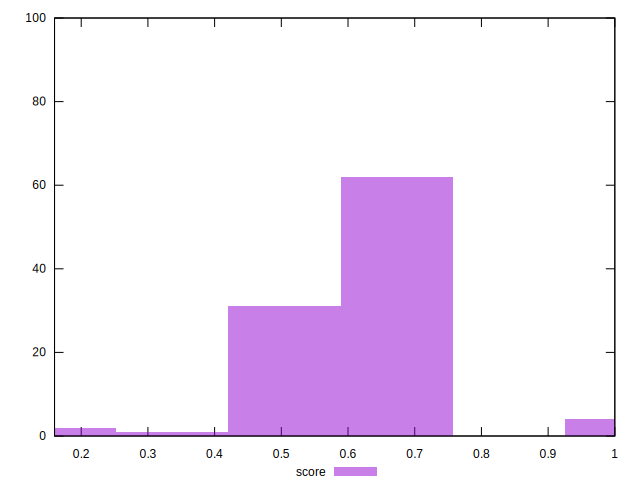

# //max-potential-fid/samples/pages+cached+noadtech+nomedia

[→ Parent](../..)


## Raw


```yaml
p90min: 40
p90max: 269
p90range: 229
p90mean: 216.6595744680851
median: 213.4999999999999
p90stdev: 24.530724630201057
mad: 10.499999999999886
stdevBySn: 16.696399999999866
lfitCenter: 215.33533520038435
lfitStdev: 18.843396743222193
mfitCenter: 215.33533520038435
mfitStdev: 23.616695557089354
mfitConfidence: 2.3616695557089353
p90skewness: -3.557722673312085
p90eccentricity: 0.9999999999999999
p90discretization: 1.3823529411764706
outlandishness: 0.9888654997663352

```


## Score


```yaml
p90min: 0.44
p90max: 1
p90range: 0.56
p90mean: 0.6089361702127658
median: 0.62
p90stdev: 0.06836180476911193
mad: 0.040000000000000036
stdevBySn: 0.05962999999999999
lfitCenter: 0.6129396825864
lfitStdev: 0.057398167679281596
mfitCenter: 0.6129396825864
mfitStdev: 0.07193793508083625
mfitConfidence: 0.007193793508083625
p90skewness: 1.370591888162968
p90eccentricity: 1.000000000000001
p90discretization: 4.086956521739131
outlandishness: 1.0041552509789962

```


## Raw Estimate


## Score Estimate


## P Score


```yaml
p90min: 0.44292601842693125
p90max: 0.999835543946386
p90range: 0.5569095255194547
p90mean: 0.6092340668992688
median: 0.6214542143787616
p90stdev: 0.06817559080677896
mad: 0.03695798785565052
stdevBySn: 0.05848581186687048
lfitCenter: 0.6131835189361305
lfitStdev: 0.05713058109388374
mfitCenter: 0.6131835189361305
mfitStdev: 0.07160256503006367
mfitConfidence: 0.007160256503006367
p90skewness: 1.3802221305030171
p90eccentricity: 1.0000000000000007
p90discretization: 1.3823529411764706
outlandishness: 1.004255660026966

```


## Score Difference


```yaml
p90min: 0
p90max: 5.551115123125783e-17
p90range: 5.551115123125783e-17
p90mean: 1.1810883240693154e-18
median: 0
p90stdev: 8.010530753054493e-18
mad: 0
stdevBySn: 0
lfitCenter: 2.158636612376596e-18
lfitStdev: 5.278062741850255e-18
mfitCenter: 2.158636612376596e-18
mfitStdev: 6.615070658655501e-18
mfitConfidence: 6.615070658655501e-19
p90skewness: 6.634888026970376
p90eccentricity: 0.9999999999999984
p90discretization: 47
outlandishness: 14.137600000000003

```


## P Score Difference


```yaml
p90min: -0.004589242775370428
p90max: 0.004870350682723568
p90range: 0.009459593458093996
p90mean: 0.000351915514653011
median: 0.00047210883487386335
p90stdev: 0.002658633715196206
mad: 0.002139283345568288
stdevBySn: 0.003227515566454118
lfitCenter: 0.00039975720569661576
lfitStdev: 0.002316793599660919
mfitCenter: 0.00039975720569661576
mfitStdev: 0.0029036701746188937
mfitConfidence: 0.0002903670174618894
p90skewness: -0.17307200592610159
p90eccentricity: 1.0000000000000002
p90discretization: 1.4029850746268657
outlandishness: 0.8742045434084762

```

