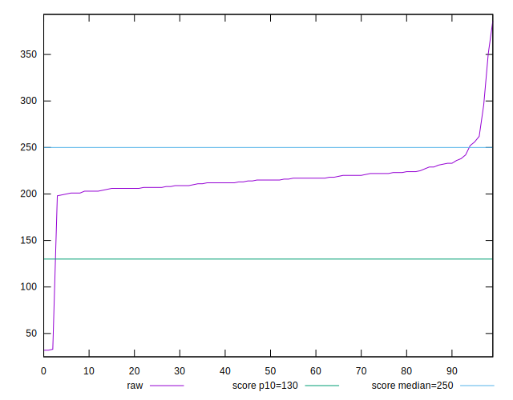
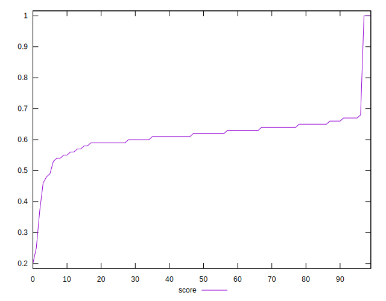
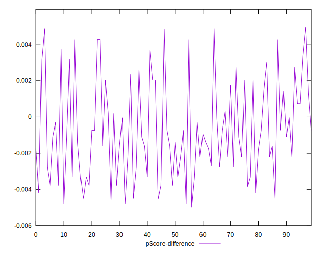

# //max-potential-fid/samples/pages+cached+noadtech

[→ Parent](../..)


## Raw


```yaml
p90min: 198
p90max: 261.9999999999998
p90range: 63.99999999999977
p90mean: 216.27659574468086
median: 215
p90stdev: 11.74045946337048
mad: 7.5
stdevBySn: 11.031549999999797
lfitCenter: 214.78319206618127
lfitStdev: 13.15085691724954
mfitCenter: 214.78319206618127
mfitStdev: 16.48215490878723
mfitConfidence: 1.648215490878723
p90skewness: 1.383855899540504
p90eccentricity: 0.9999999999999999
p90discretization: 1.6206896551724137
outlandishness: 0.9845559138939421

```


## Score


```yaml
p90min: 0.46
p90max: 0.68
p90range: 0.22000000000000003
p90mean: 0.6130851063829789
median: 0.62
p90stdev: 0.040423992131929515
mad: 0.025000000000000022
stdevBySn: 0.03875950000000004
lfitCenter: 0.6160762241614655
lfitStdev: 0.03969195912636342
mfitCenter: 0.6160762241614655
mfitStdev: 0.0497464935608773
mfitConfidence: 0.00497464935608773
p90skewness: -1.287645090045163
p90eccentricity: 1.0000000000000002
p90discretization: 4.947368421052632
outlandishness: 1.004620977630217

```


## Raw Estimate


## Score Estimate


## P Score


```yaml
p90min: 0.46339604048793526
p90max: 0.6761675307336696
p90range: 0.21277149024573438
p90mean: 0.6123432629260767
median: 0.6162243471391701
p90stdev: 0.03979334657826491
mad: 0.026064911205607888
stdevBySn: 0.03866100378434096
lfitCenter: 0.6152071074128597
lfitStdev: 0.039151132802057155
mfitCenter: 0.6152071074128597
mfitStdev: 0.049068668282109824
mfitConfidence: 0.004906866828210983
p90skewness: -1.248494528113249
p90eccentricity: 0.9999999999999996
p90discretization: 1.6206896551724137
outlandishness: 1.004790609448443

```


## Score Difference


```yaml
p90min: 0
p90max: 0
p90range: 0
p90mean: 0
median: 0
p90stdev: 0
mad: 0
stdevBySn: 0
lfitCenter: 1.0470608452365924e-18
lfitStdev: 2.5998395675404994e-18
mfitCenter: 1.0470608452365924e-18
mfitStdev: 3.2584156880294808e-18
mfitConfidence: 3.258415688029481e-19
p90skewness: .nan
p90eccentricity: .nan
p90discretization: 94
outlandishness: .inf

```


## P Score Difference


```yaml
p90min: -0.004800701338998903
p90max: 0.0048703506827229015
p90range: 0.009671052021721804
p90mean: -0.0007373593001743571
median: -0.0010906657645478601
p90stdev: 0.0026085919017221036
mad: 0.002212374299644937
stdevBySn: 0.002864545677785382
lfitCenter: -0.0008466276044966983
lfitStdev: 0.002140032842162847
mfitCenter: -0.0008466276044966983
mfitStdev: 0.002682133418101043
mfitConfidence: 0.0002682133418101043
p90skewness: 0.4430309049434086
p90eccentricity: 0.9999999999999992
p90discretization: 1.6206896551724137
outlandishness: 0.8800928410224602

```

