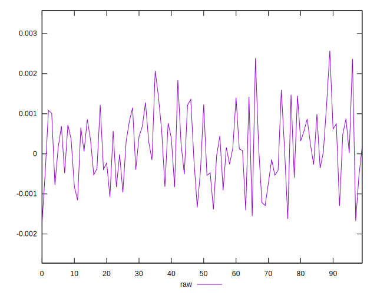
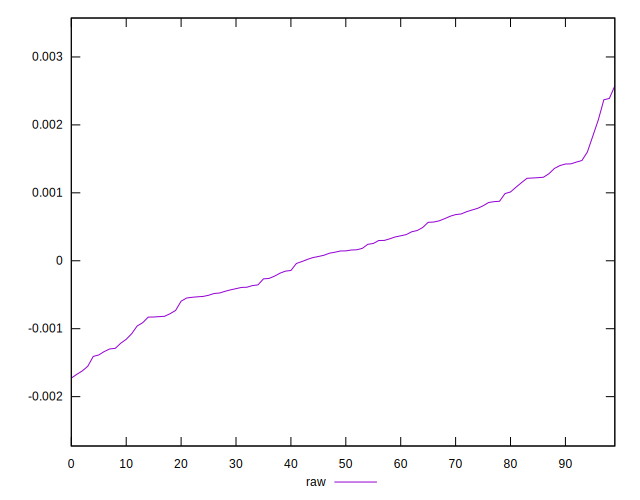
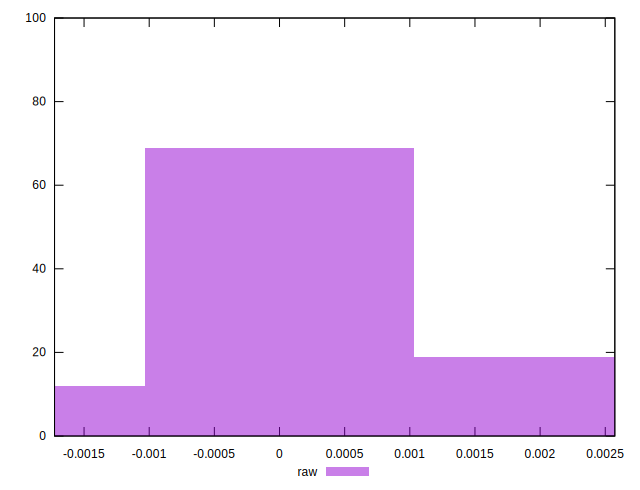

# //meta/pScore-difference/samples/pages+cached

[→ Parent](../..)


## Raw


```yaml
p90min: -0.001552692379710246
p90max: 0.002075500451500831
p90range: 0.003628192831211077
p90mean: 0.00013762578614948253
median: 0.00014471367093067162
p90stdev: 0.0008397615002294958
mad: 0.0006586802309473364
stdevBySn: 0.000961494117208357
lfitCenter: 0.00014190852934919403
lfitStdev: 0.0007111559719125118
mfitCenter: 0.00014190852934919403
mfitStdev: 0.0008913018343311617
mfitConfidence: 0.00008913018343311617
p90skewness: 0.04143143097772185
p90eccentricity: 1.0000000000000004
p90discretization: 1
outlandishness: 1.2277934306480238

```

