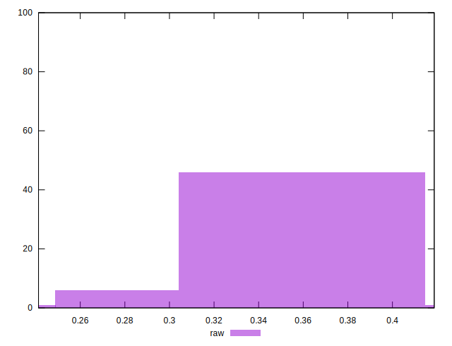

# //meta/pScore/samples/pages+cached

[→ Parent](../..)


## Raw


```yaml
p90min: 0.2826722404683409
p90max: 0.39007192112001926
p90range: 0.10739968065167838
p90mean: 0.3563605002819912
median: 0.3583031663082161
p90stdev: 0.022475468169639832
mad: 0.015495653003102267
stdevBySn: 0.021795442127207153
lfitCenter: 0.3565847001078495
lfitStdev: 0.017745212487498406
mfitCenter: 0.3565847001078495
mfitStdev: 0.022240325702628468
mfitConfidence: 0.002224032570262847
p90skewness: -0.968229560851647
p90eccentricity: 1
p90discretization: 1
outlandishness: 0.9923650557559346

```

