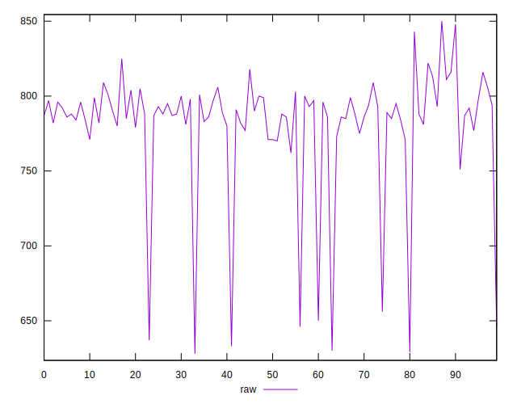
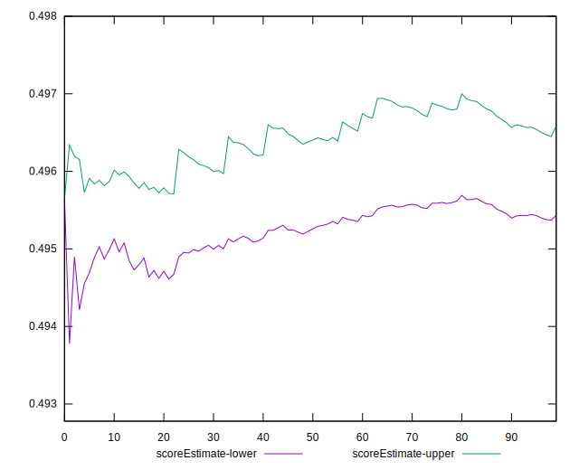

# //render-blocking-resources/samples/pages+cached+noadtech+nomedia

[→ Parent](../..)


## Raw


```yaml
p90min: 633
p90max: 825
p90range: 192
p90mean: 781.6382978723404
median: 788
p90stdev: 37.90493457569696
mad: 9
stdevBySn: 14.311200000000001
lfitCenter: 783.9136744506973
lfitStdev: 19.95024860322346
mfitCenter: 783.9136744506973
mfitStdev: 25.003928642538792
mfitConfidence: 2.5003928642538793
p90skewness: -2.9442830975195426
p90eccentricity: 1.0000000000000002
p90discretization: 2.0434782608695654
outlandishness: 0.9933117081149706

```


## Score


```yaml
p90min: 0.49
p90max: 0.56
p90range: 0.07000000000000006
p90mean: 0.4996808510638299
median: 0.5
p90stdev: 0.016075098203569838
mad: 0.0050000000000000044
stdevBySn: 0.008944500000000008
lfitCenter: 0.4993570225127593
lfitStdev: 0.008283288856480085
mfitCenter: 0.4993570225127593
mfitStdev: 0.010381563037740803
mfitConfidence: 0.0010381563037740803
p90skewness: 3.048267143410444
p90eccentricity: 1.0000000000000016
p90discretization: 23.5
outlandishness: 1.007294497472986

```


## Raw Estimate


## Score Estimate


## P Score


```yaml
p90min: 0.49117647058823527
p90max: 0.565
p90range: 0.07382352941176468
p90mean: 0.499222083159505
median: 0.4955294117647059
p90stdev: 0.015589345510872085
mad: 0.0010588235294117787
stdevBySn: 0.0016836705882353055
lfitCenter: 0.4982583360745772
lfitStdev: 0.00738247938514199
mfitCenter: 0.4982583360745772
mfitStdev: 0.009252565791149024
mfitConfidence: 0.0009252565791149024
p90skewness: 3.544345051903106
p90eccentricity: 0.9999999999999999
p90discretization: 2.0434782608695654
outlandishness: 1.006906566081735

```


## Score Difference


```yaml
p90min: 0
p90max: 0
p90range: 0
p90mean: 0
median: 0
p90stdev: 0
mad: 0
stdevBySn: 0
lfitCenter: 1.5916911634687915e-18
lfitStdev: 3.932577909407442e-18
mfitCenter: 1.5916911634687915e-18
mfitStdev: 4.928755494914505e-18
mfitConfidence: 4.928755494914504e-19
p90skewness: .nan
p90eccentricity: .nan
p90discretization: 94
outlandishness: .inf

```


## P Score Difference


```yaml
p90min: -0.004705882352941171
p90max: 0.004941176470588227
p90range: 0.009647058823529397
p90mean: -0.0005943540536782069
median: -0.0024117647058823632
p90stdev: 0.003702034769716685
mad: 0.002058823529411752
stdevBySn: 0.0027359647058823344
lfitCenter: -0.0008586247765809752
lfitStdev: 0.003864320599665456
mfitCenter: -0.0008586247765809752
mfitStdev: 0.004843207643553669
mfitConfidence: 0.0004843207643553669
p90skewness: 0.3433037911845632
p90eccentricity: 0.9999999999999999
p90discretization: 1.9583333333333333
outlandishness: 0.8780268783520729

```

