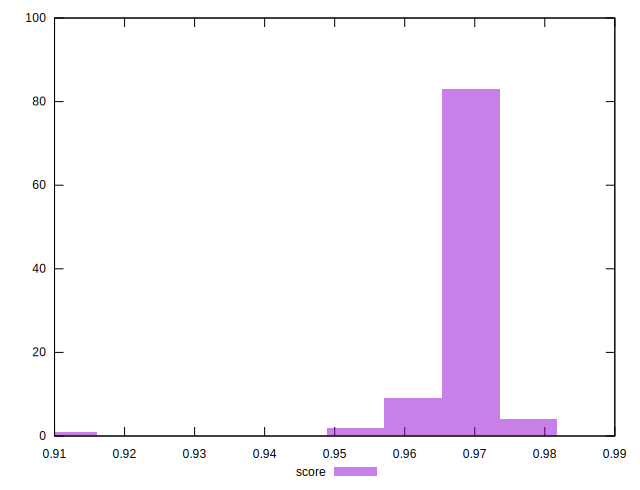
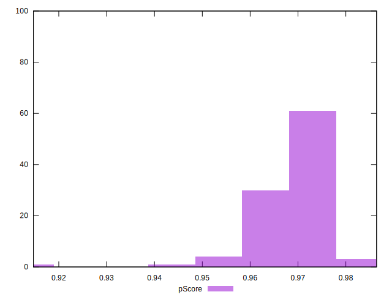
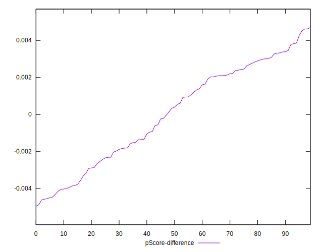

# //speed-index/samples/pages+cached+noadtech

[→ Parent](../..)


## Raw


```yaml
p90min: 2537.6774080632877
p90max: 2835.9589195295052
p90range: 298.2815114662176
p90mean: 2643.362024527387
median: 2635.838131333121
p90stdev: 61.45576442522408
mad: 42.84250140071663
stdevBySn: 69.15571691114181
lfitCenter: 2641.9712091730335
lfitStdev: 57.201939474651304
mfitCenter: 2641.9712091730335
mfitStdev: 71.6919994975856
mfitConfidence: 7.16919994975856
p90skewness: 0.9976580611607618
p90eccentricity: 1.0000000000000002
p90discretization: 1
outlandishness: 1.0031719379472879

```


## Score


```yaml
p90min: 0.96
p90max: 0.98
p90range: 0.020000000000000018
p90mean: 0.9692553191489353
median: 0.97
p90stdev: 0.00333879889925005
mad: 0
stdevBySn: 0
lfitCenter: 0.9693122552555332
lfitStdev: 0.0023438415442953303
mfitCenter: 0.9693122552555332
mfitStdev: 0.002937569746048639
mfitConfidence: 0.00029375697460486393
p90skewness: -1.3205693389380595
p90eccentricity: 1.0000000000000009
p90discretization: 31.333333333333332
outlandishness: 0.9988544606206256

```


## Raw Estimate


## Score Estimate


## P Score


```yaml
p90min: 0.9558645684787825
p90max: 0.9755438238231187
p90range: 0.019679255344336122
p90mean: 0.9692519237898728
median: 0.9698733027027953
p90stdev: 0.003994532345063737
mad: 0.002569812603005428
stdevBySn: 0.004200586868582216
lfitCenter: 0.9692586626326468
lfitStdev: 0.0037020666966977077
mfitCenter: 0.9692586626326468
mfitStdev: 0.004639852532924948
mfitConfidence: 0.0004639852532924948
p90skewness: -1.2653702260937292
p90eccentricity: 1.0000000000000002
p90discretization: 1
outlandishness: 0.9988731066421845

```


## Score Difference


```yaml
p90min: 0
p90max: 0
p90range: 0
p90mean: 0
median: 0
p90stdev: 0
mad: 0
stdevBySn: 0
lfitCenter: 1.0470608452365924e-18
lfitStdev: 2.5998395675404994e-18
mfitCenter: 1.0470608452365924e-18
mfitStdev: 3.2584156880294808e-18
mfitConfidence: 3.258415688029481e-19
p90skewness: .nan
p90eccentricity: .nan
p90discretization: 94
outlandishness: .inf

```


## P Score Difference


```yaml
p90min: -0.004574463783591609
p90max: 0.004520470191626158
p90range: 0.009094933975217767
p90mean: 0.00001136903539102329
median: 0.00036588828117933847
p90stdev: 0.002675862713696631
mad: 0.0023956149077332123
stdevBySn: 0.0032414070698909294
lfitCenter: 0.00008383581511505046
lfitStdev: 0.0025433809330948653
mfitCenter: 0.00008383581511505046
mfitStdev: 0.0031876552832340375
mfitConfidence: 0.00031876552832340373
p90skewness: -0.18161402402308743
p90eccentricity: 1
p90discretization: 1
outlandishness: 0.24680443742024571

```

