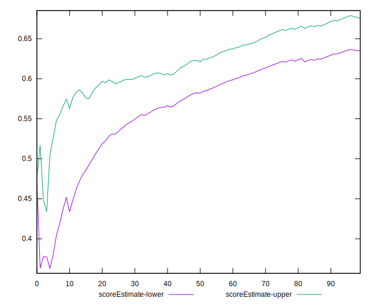
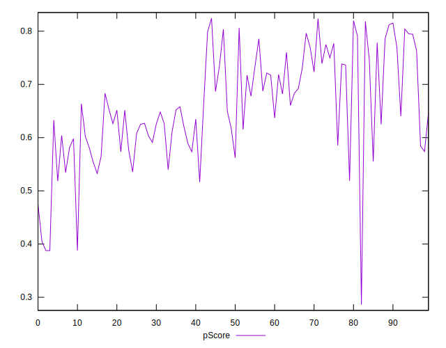

# //total-blocking-time/samples/pages

[→ Parent](../..)


## Raw


```yaml
p90min: 355.5
p90max: 706.9999999999991
p90range: 351.4999999999991
p90mean: 474.5461276595745
median: 479.5
p90stdev: 73.29803892589901
mad: 58.75
stdevBySn: 76.77362499999892
lfitCenter: 476.5632598745301
lfitStdev: 61.797538850987344
mfitCenter: 476.5632598745301
mfitStdev: 77.45172917118154
mfitConfidence: 7.745172917118154
p90skewness: 0.4347596033667885
p90eccentricity: 1.0000000000000004
p90discretization: 1.032967032967033
outlandishness: 1.0192350990085104

```


## Score


```yaml
p90min: 0.39
p90max: 0.82
p90range: 0.42999999999999994
p90mean: 0.66031914893617
median: 0.65
p90stdev: 0.09519802572219316
mad: 0.07999999999999996
stdevBySn: 0.10733399999999997
lfitCenter: 0.6576032031915329
lfitStdev: 0.08106330305415918
mfitCenter: 0.6576032031915329
mfitStdev: 0.10159778383750048
mfitConfidence: 0.010159778383750049
p90skewness: -0.24210921879786576
p90eccentricity: 1.0000000000000002
p90discretization: 3.032258064516129
outlandishness: 0.9869607805195801

```


## Raw Estimate


## Score Estimate


## P Score


```yaml
p90min: 0.3877538903178612
p90max: 0.818478821112369
p90range: 0.4307249307945078
p90mean: 0.6604347246856215
median: 0.6515818101203705
p90stdev: 0.09507146755079117
mad: 0.07799510730398773
stdevBySn: 0.10325546277994702
lfitCenter: 0.6577543387163678
lfitStdev: 0.0811489022100184
mfitCenter: 0.6577543387163678
mfitStdev: 0.10170506646978907
mfitConfidence: 0.010170506646978907
p90skewness: -0.24985463221533363
p90eccentricity: 0.9999999999999994
p90discretization: 1.032967032967033
outlandishness: 0.9869182430294905

```


## Score Difference


```yaml
p90min: 0
p90max: 1.1102230246251565e-16
p90range: 1.1102230246251565e-16
p90mean: 9.448706592554524e-18
median: 0
p90stdev: 3.097965630742169e-17
mad: 0
stdevBySn: 0
lfitCenter: 6.522785637084289e-18
lfitStdev: 1.5389591547209988e-17
mfitCenter: 6.522785637084289e-18
mfitStdev: 1.92879926730378e-17
mfitConfidence: 1.92879926730378e-18
p90skewness: 2.9737221214857814
p90eccentricity: 0.9999999999999972
p90discretization: 47
outlandishness: 1.67055625

```


## P Score Difference


```yaml
p90min: -0.0047514142757782984
p90max: 0.004958489300692981
p90range: 0.00970990357647128
p90mean: 0.00010478190827437593
median: 0.0001097069253861993
p90stdev: 0.0029401171111102142
mad: 0.002850829951504985
stdevBySn: 0.003524042030390091
lfitCenter: 0.0000956658343365151
lfitStdev: 0.002737163861791208
mfitCenter: 0.0000956658343365151
mfitStdev: 0.0034305261675839525
mfitConfidence: 0.00034305261675839527
p90skewness: 0.008034954476038062
p90eccentricity: 0.9999999999999997
p90discretization: 1.0444444444444445
outlandishness: 0.9232477181600619

```

