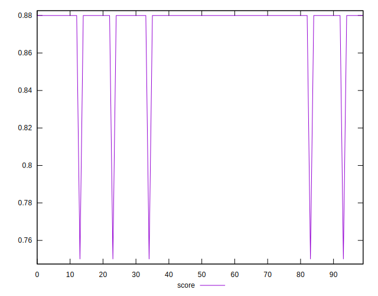
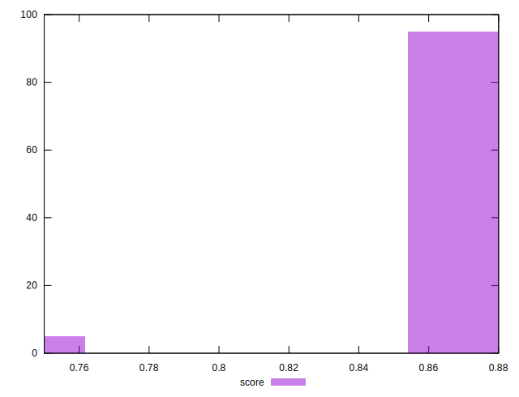

# //unused-css-rules/samples/pages+cached+noadtech+nomedia

[→ Parent](../..)


## Raw


```yaml
p90min: 150
p90max: 300
p90range: 150
p90mean: 153.19148936170214
median: 150
p90stdev: 21.645733988697724
mad: 0
stdevBySn: 0
lfitCenter: 153.68247910667048
lfitStdev: 9.003996160873278
mfitCenter: 153.68247910667048
mfitStdev: 11.28483569211225
mfitConfidence: 1.128483569211225
p90skewness: 6.634888026970315
p90eccentricity: 0.9999999999999942
p90discretization: 47
outlandishness: 1.0570410156249999

```


## Score


```yaml
p90min: 0.75
p90max: 0.88
p90range: 0.13
p90mean: 0.8772340425531914
median: 0.88
p90stdev: 0.018759636123537975
mad: 0
stdevBySn: 0
lfitCenter: 0.8768085181075522
lfitStdev: 0.007803463339423545
mfitCenter: 0.8768085181075522
mfitStdev: 0.009780190933163997
mfitConfidence: 0.0009780190933163996
p90skewness: -6.634888026970363
p90eccentricity: 0.9999999999999972
p90discretization: 47
outlandishness: 0.9915049001922391

```


## Raw Estimate


## Score Estimate


## P Score


```yaml
p90min: 0.75
p90max: 0.875
p90range: 0.125
p90mean: 0.8723404255319149
median: 0.875
p90stdev: 0.018038111657248057
mad: 0
stdevBySn: 0
lfitCenter: 0.8719312674111085
lfitStdev: 0.007503330134060401
mfitCenter: 0.8719312674111085
mfitStdev: 0.009404029743426042
mfitConfidence: 0.0009404029743426042
p90skewness: -6.634888026970383
p90eccentricity: 0.9999999999999991
p90discretization: 47
outlandishness: 0.9917852329342652

```


## Score Difference


```yaml
p90min: 0
p90max: 0
p90range: 0
p90mean: 0
median: 0
p90stdev: 0
mad: 0
stdevBySn: 0
lfitCenter: 0
lfitStdev: 0
mfitCenter: 0
mfitStdev: 0
mfitConfidence: 0
p90skewness: .nan
p90eccentricity: .nan
p90discretization: 94
outlandishness: .nan

```


## P Score Difference


```yaml
p90min: -0.0050000000000000044
p90max: 0
p90range: 0.0050000000000000044
p90mean: -0.0048936170212766
median: -0.0050000000000000044
p90stdev: 0.0007215244662899235
mad: 0
stdevBySn: 0
lfitCenter: -0.004877250696444323
lfitStdev: 0.0003001332053624413
mfitCenter: -0.004877250696444323
mfitStdev: 0.0003761611897370734
mfitConfidence: 0.00003761611897370734
p90skewness: 6.634888026970349
p90eccentricity: 0.9999999999999976
p90discretization: 47
outlandishness: 0.9421656427221174

```

