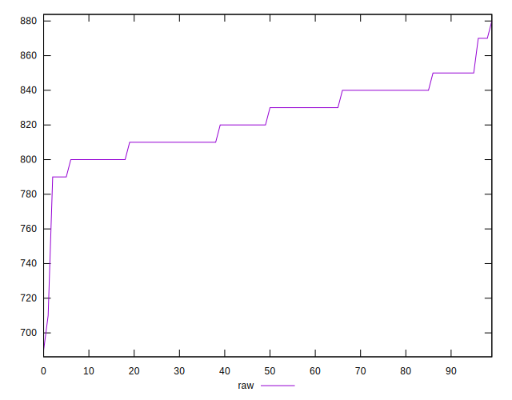
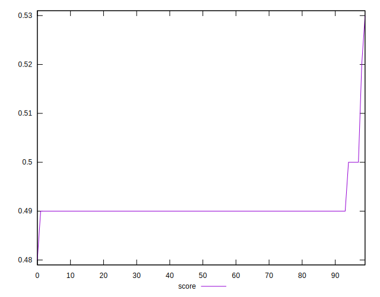
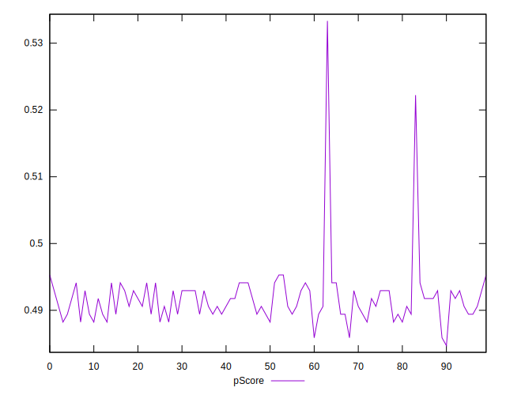
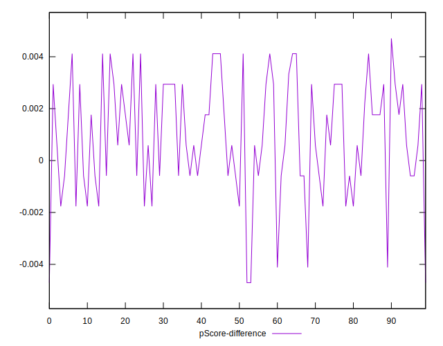

# //uses-http2/samples/pages+cached+noadtech

[→ Parent](../..)


## Raw


```yaml
p90min: 790
p90max: 870
p90range: 80
p90mean: 823.8297872340426
median: 825
p90stdev: 17.75161862435417
mad: 15
stdevBySn: 23.852000000000004
lfitCenter: 823.281941677437
lfitStdev: 17.994703019322735
mfitCenter: 823.281941677437
mfitStdev: 22.553015713604903
mfitConfidence: 2.2553015713604903
p90skewness: 0.0387775369143931
p90eccentricity: 1.0000000000000007
p90discretization: 11.75
outlandishness: 0.9967742997044367

```


## Score


```yaml
p90min: 0.49
p90max: 0.5
p90range: 0.010000000000000009
p90mean: 0.49031914893617035
median: 0.49
p90stdev: 0.00175773528104876
mad: 0
stdevBySn: 0
lfitCenter: 0.49048728842653094
lfitStdev: 0.0013016187624473685
mfitCenter: 0.49048728842653094
mfitStdev: 0.0016313371980119136
mfitConfidence: 0.00016313371980119135
p90skewness: 5.326002287485186
p90eccentricity: 0.9999999999999982
p90discretization: 47
outlandishness: 1.0027791032675846

```


## Raw Estimate


## Score Estimate


## P Score


```yaml
p90min: 0.4858823529411765
p90max: 0.49529411764705883
p90range: 0.009411764705882342
p90mean: 0.4913141426783479
median: 0.4911764705882353
p90stdev: 0.0020884257205122524
mad: 0.001764705882352946
stdevBySn: 0.0028061176470587875
lfitCenter: 0.49158455023006825
lfitStdev: 0.0023751503650986275
mfitCenter: 0.49158455023006825
mfitStdev: 0.002976809533823574
mfitConfidence: 0.00029768095338235736
p90skewness: -0.03877753691407703
p90eccentricity: 1
p90discretization: 11.75
outlandishness: 1.0024209095726082

```


## Score Difference


```yaml
p90min: 0
p90max: 0
p90range: 0
p90mean: 0
median: 0
p90stdev: 0
mad: 0
stdevBySn: 0
lfitCenter: 0
lfitStdev: 0
mfitCenter: 0
mfitStdev: 0
mfitConfidence: 0
p90skewness: .nan
p90eccentricity: .nan
p90discretization: 94
outlandishness: .nan

```


## P Score Difference


```yaml
p90min: -0.004705882352941171
p90max: 0.004117647058823559
p90range: 0.00882352941176473
p90mean: 0.000979001529689903
median: 0.0005882352941176672
p90stdev: 0.0021545011517471826
mad: 0.0023529411764705577
stdevBySn: 0.0028061176470587875
lfitCenter: 0.000976574187304515
lfitStdev: 0.001946235139432641
mfitCenter: 0.000976574187304515
mfitStdev: 0.0024392440172456035
mfitConfidence: 0.00024392440172456035
p90skewness: -0.37642488025568716
p90eccentricity: 1
p90discretization: 9.4
outlandishness: 0.861152363926913

```

