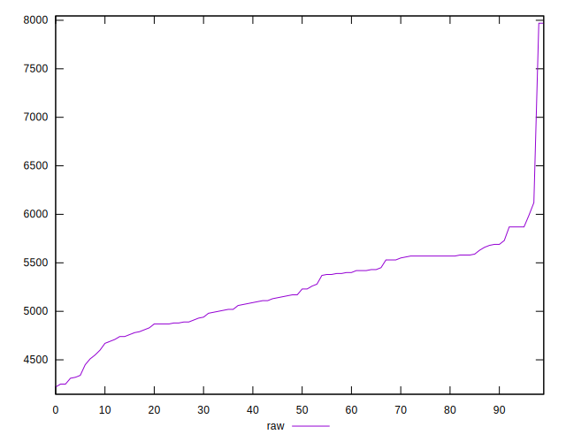
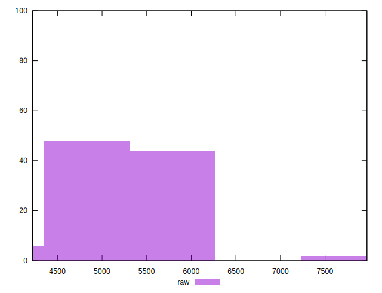
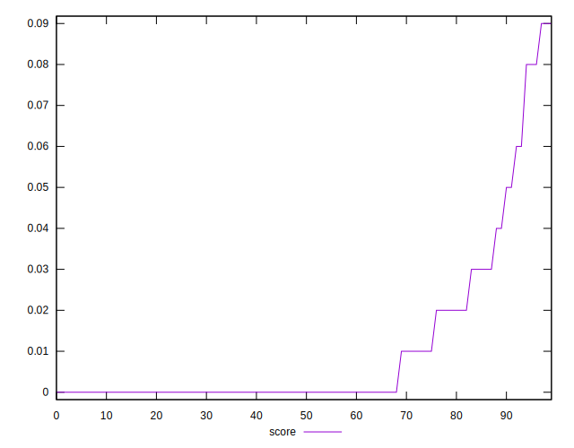
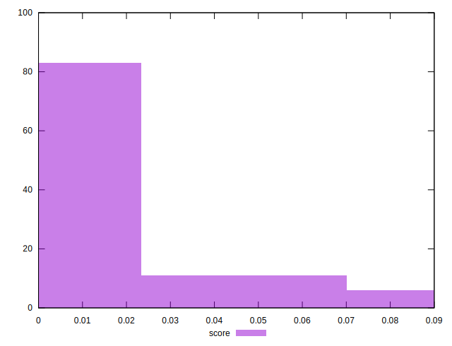
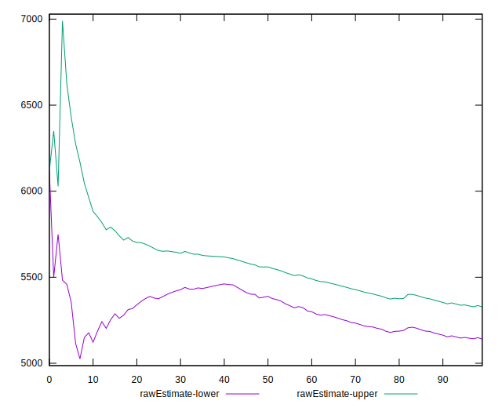
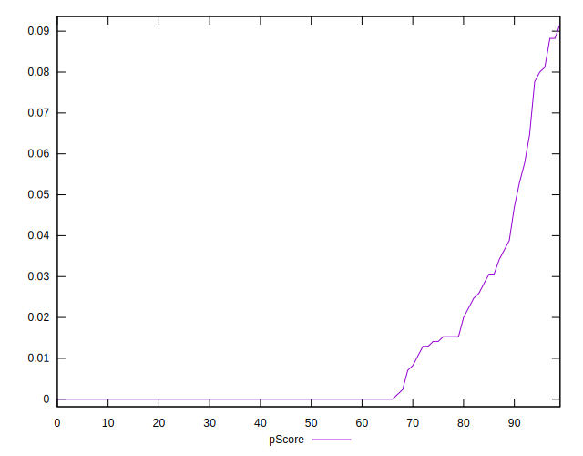
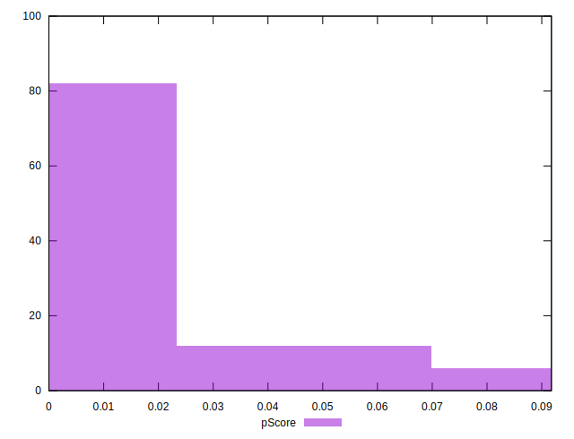
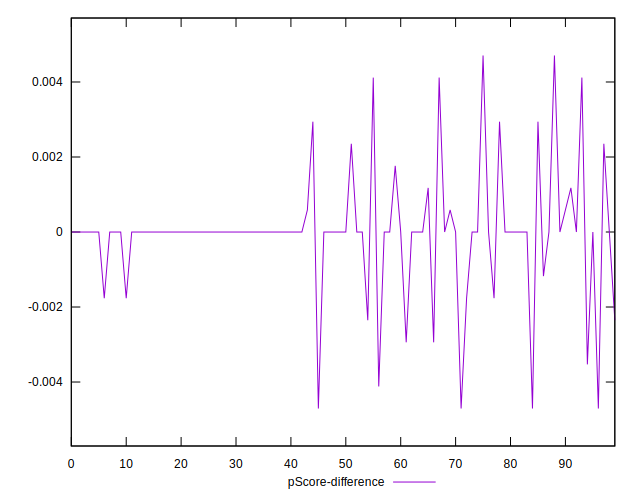
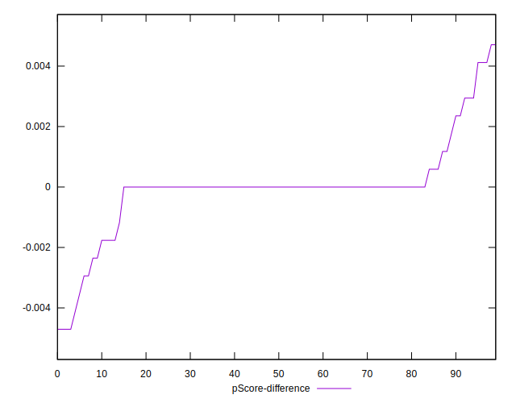

# //uses-http2/samples/pages

[→ Parent](../..)


## Raw


```yaml
p90min: 4310
p90max: 5990
p90range: 1680
p90mean: 5207.659574468085
median: 5200
p90stdev: 392.20171083614304
mad: 340
stdevBySn: 500.89200000000005
lfitCenter: 5233.914257615639
lfitStdev: 381.98004927357033
mfitCenter: 5233.914257615639
mfitStdev: 478.7409964087666
mfitConfidence: 47.87409964087666
p90skewness: -0.26477653159541137
p90eccentricity: 1.0000000000000002
p90discretization: 1.540983606557377
outlandishness: 1.0136185322109212

```


## Score


```yaml
p90min: 0
p90max: 0.08
p90range: 0.08
p90mean: 0.009574468085106385
median: 0
p90stdev: 0.01901370690446714
mad: 0
stdevBySn: 0
lfitCenter: 0.00714007022390234
lfitStdev: 0.013853549715648806
mfitCenter: 0.00714007022390234
mfitStdev: 0.017362849728097013
mfitConfidence: 0.0017362849728097013
p90skewness: 2.2988582324758795
p90eccentricity: 1.0000000000000009
p90discretization: 11.75
outlandishness: 1.4932840000000005

```


## Raw Estimate


## Score Estimate


## P Score


```yaml
p90min: 0
p90max: 0.0811764705882353
p90range: 0.0811764705882353
p90mean: 0.009549436795994987
median: 0
p90stdev: 0.018942720560651726
mad: 0
stdevBySn: 0
lfitCenter: 0.007122200119317764
lfitStdev: 0.01372077437066132
mfitCenter: 0.007122200119317764
mfitStdev: 0.017196440510969805
mfitConfidence: 0.0017196440510969806
p90skewness: 2.3264523697800334
p90eccentricity: 0.9999999999999999
p90discretization: 3.76
outlandishness: 1.4905753683208827

```


## Score Difference


```yaml
p90min: 0
p90max: 0
p90range: 0
p90mean: 0
median: 0
p90stdev: 0
mad: 0
stdevBySn: 0
lfitCenter: 0
lfitStdev: 0
mfitCenter: 0
mfitStdev: 0
mfitConfidence: 0
p90skewness: .nan
p90eccentricity: .nan
p90discretization: 94
outlandishness: .nan

```


## P Score Difference


```yaml
p90min: -0.004705882352941209
p90max: 0.004117647058823512
p90range: 0.008823529411764721
p90mean: -0.000037546933667088666
median: 0
p90stdev: 0.0013507042252589429
mad: 0
stdevBySn: 0
lfitCenter: -0.000024158863092873018
lfitStdev: 0.0006073707543291983
mfitCenter: -0.000024158863092873018
mfitStdev: 0.0007612263537587421
mfitConfidence: 0.0000761226353758742
p90skewness: -0.20655804941326145
p90eccentricity: 1.0000000000000004
p90discretization: 4.086956521739131
outlandishness: 1.2026777777777862

```

