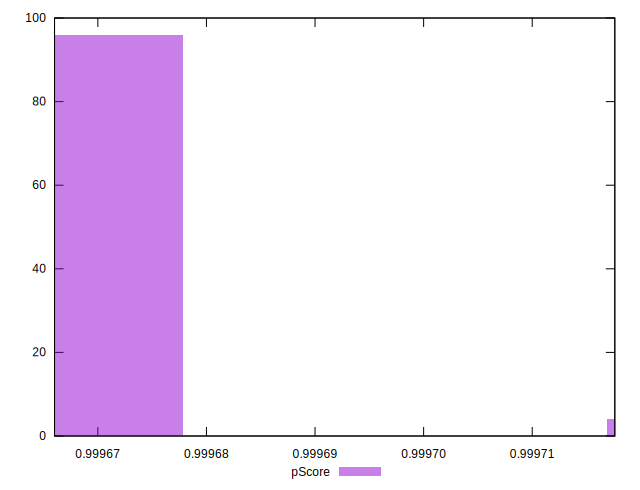

# //uses-long-cache-ttl/samples/pages+cached+noadtech+nomedia

[→ Parent](../..)


## Raw


```yaml
p90min: 2196
p90max: 2318
p90range: 122
p90mean: 2316.7021276595747
median: 2318
p90stdev: 12.5162275834164
mad: 0
stdevBySn: 0
lfitCenter: 2315.636279238307
lfitStdev: 5.810174440324853
mfitCenter: 2315.636279238307
mfitStdev: 7.281973773655744
mfitConfidence: 0.7281973773655743
p90skewness: -9.539955591519922
p90eccentricity: 0.9999999999999951
p90discretization: 47
outlandishness: 0.9969099538168206

```


## Score


```yaml
p90min: 1
p90max: 1
p90range: 0
p90mean: 1
median: 1
p90stdev: 0
mad: 0
stdevBySn: 0
lfitCenter: 1
lfitStdev: 0
mfitCenter: 1
mfitStdev: 0
mfitConfidence: 0
p90skewness: .nan
p90eccentricity: .nan
p90discretization: 94
outlandishness: 1

```


## Raw Estimate


## Score Estimate


## P Score


```yaml
p90min: 0.9996660123158774
p90max: 0.9997176059617163
p90range: 0.000051593645838954316
p90mean: 0.9996665611844482
median: 0.9996660123158774
p90stdev: 0.000005293096829332259
mad: 0
stdevBySn: 0
lfitCenter: 0.9996670119304009
lfitStdev: 0.0000024571154292330464
mfitCenter: 0.9996670119304009
mfitStdev: 0.000003079537507572582
mfitConfidence: 3.079537507572582e-7
p90skewness: 9.539955592682038
p90eccentricity: 1.000000000000002
p90discretization: 47
outlandishness: 1.0000030307673922

```


## Score Difference


```yaml
p90min: 0
p90max: 0
p90range: 0
p90mean: 0
median: 0
p90stdev: 0
mad: 0
stdevBySn: 0
lfitCenter: 0
lfitStdev: 0
mfitCenter: 0
mfitStdev: 0
mfitConfidence: 0
p90skewness: .nan
p90eccentricity: .nan
p90discretization: 94
outlandishness: .nan

```


## P Score Difference


```yaml
p90min: -0.00033398768412262747
p90max: -0.00028239403828367315
p90range: 0.000051593645838954316
p90mean: -0.0003334388155498726
median: -0.00033398768412262747
p90stdev: 0.000005293096829332256
mad: 0
stdevBySn: 0
lfitCenter: -0.0003329880695993405
lfitStdev: 0.0000024571154289894414
mfitCenter: -0.0003329880695993405
mfitStdev: 0.0000030795375072672687
mfitConfidence: 3.0795375072672685e-7
p90skewness: 9.539955591519943
p90eccentricity: 1.000000000000003
p90discretization: 47
outlandishness: 0.9909342524049508

```

