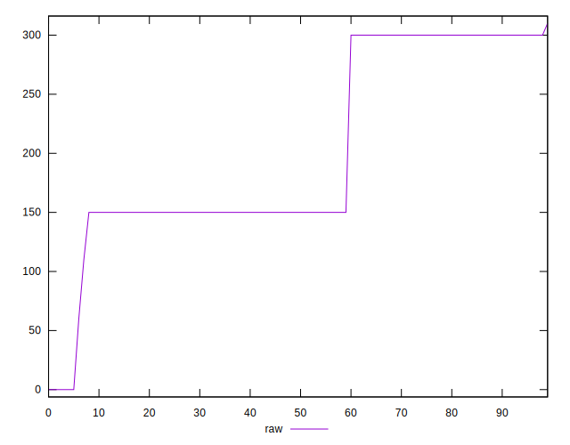

# //uses-optimized-images/samples/pages

[→ Parent](../..)


## Raw


```yaml
p90min: 0
p90max: 300
p90range: 300
p90mean: 202.87234042553192
median: 150
p90stdev: 82.95887651357602
mad: 0
stdevBySn: 0
lfitCenter: 195.6725675499673
lfitStdev: 88.7203367554575
mfitCenter: 195.6725675499673
mfitStdev: 111.19445243489547
mfitConfidence: 11.119445243489547
p90skewness: -0.047510312677561825
p90eccentricity: 1.000000000000001
p90discretization: 18.8
outlandishness: 0.9699409358450597

```


## Score


```yaml
p90min: 0.75
p90max: 1
p90range: 0.25
p90mean: 0.8337234042553192
median: 0.88
p90stdev: 0.07093575221002836
mad: 0
stdevBySn: 0
lfitCenter: 0.8400423265080842
lfitStdev: 0.07658821537537212
mfitCenter: 0.8400423265080842
mfitStdev: 0.09598909317830655
mfitConfidence: 0.009598909317830655
p90skewness: -0.022452273088403637
p90eccentricity: 0.9999999999999972
p90discretization: 18.8
outlandishness: 1.0057092869682454

```


## Raw Estimate


## Score Estimate


## P Score


```yaml
p90min: 0.75
p90max: 1
p90range: 0.25
p90mean: 0.8309397163120568
median: 0.875
p90stdev: 0.06913239709464661
mad: 0
stdevBySn: 0
lfitCenter: 0.8369524537121179
lfitStdev: 0.07391219002819686
mfitCenter: 0.8369524537121179
mfitStdev: 0.09263519277550233
mfitConfidence: 0.009263519277550234
p90skewness: 0.04751031267756081
p90eccentricity: 1.0000000000000027
p90discretization: 18.8
outlandishness: 1.0062389408734407

```


## Score Difference


```yaml
p90min: 0
p90max: 0
p90range: 0
p90mean: 0
median: 0
p90stdev: 0
mad: 0
stdevBySn: 0
lfitCenter: 5.166535369026208e-19
lfitStdev: 1.2890316797319448e-18
mfitCenter: 5.166535369026208e-19
mfitStdev: 1.6155616292812394e-18
mfitConfidence: 1.6155616292812395e-19
p90skewness: .nan
p90eccentricity: .nan
p90discretization: 94
outlandishness: .inf

```


## P Score Difference


```yaml
p90min: -0.0050000000000000044
p90max: 0
p90range: 0.0050000000000000044
p90mean: -0.0026241134751773076
median: -0.0050000000000000044
p90stdev: 0.0024850541624747524
mad: 0
stdevBySn: 0
lfitCenter: -0.0026850521712703033
lfitStdev: 0.003107021368833378
mfitCenter: -0.0026850521712703033
mfitStdev: 0.0038940738104186125
mfitConfidence: 0.00038940738104186124
p90skewness: 0.09620065861216762
p90eccentricity: 1.0000000000000002
p90discretization: 31.333333333333332
outlandishness: 0.9608414921678432

```

