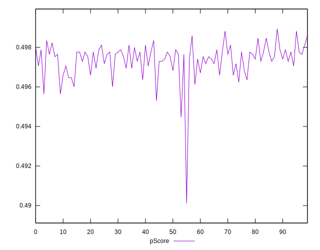
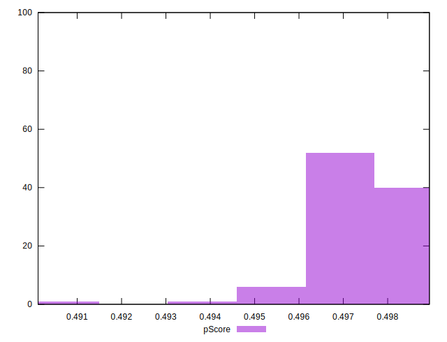
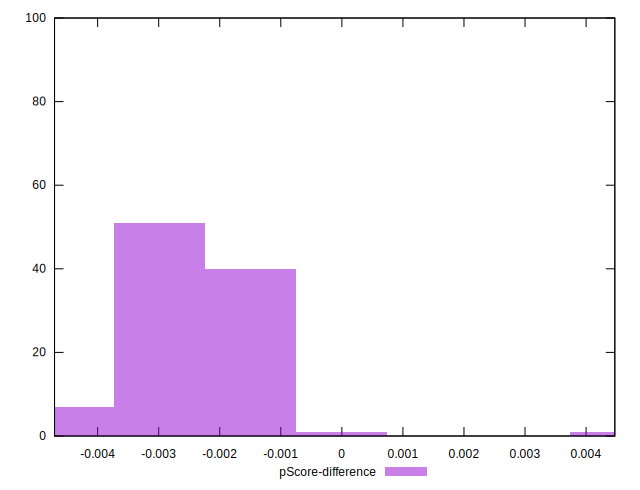

# //uses-rel-preload/samples/pages+cached+noadtech+nomedia+nocss

[→ Parent](../..)


## Raw


```yaml
p90min: 762
p90max: 787
p90range: 25
p90mean: 771.8936170212766
median: 771
p90stdev: 5.364318848128917
mad: 3
stdevBySn: 4.7704
lfitCenter: 771.8497313198128
lfitStdev: 4.674544903098239
mfitCenter: 771.8497313198128
mfitStdev: 5.858673218464384
mfitConfidence: 0.5858673218464384
p90skewness: 0.7543270163844256
p90eccentricity: 0.9999999999999988
p90discretization: 3.9166666666666665
outlandishness: 1.001779230029113

```


## Score


```yaml
p90min: 0.5
p90max: 0.5
p90range: 0
p90mean: 0.5
median: 0.5
p90stdev: 0
mad: 0
stdevBySn: 0
lfitCenter: 0.49990568914335115
lfitStdev: 0.00023417273015198693
mfitCenter: 0.49990568914335115
mfitStdev: 0.0002934919935685771
mfitConfidence: 0.00002934919935685771
p90skewness: .nan
p90eccentricity: .nan
p90discretization: 94
outlandishness: 0.9992001599999999

```


## Raw Estimate


## Score Estimate


## P Score


```yaml
p90min: 0.4956470588235294
p90max: 0.49858823529411767
p90range: 0.0029411764705882804
p90mean: 0.4974242803504382
median: 0.4975294117647059
p90stdev: 0.0006310963350739905
mad: 0.0003529411764705559
stdevBySn: 0.0005612235294117575
lfitCenter: 0.49742944337413963
lfitStdev: 0.0005499464591880351
mfitCenter: 0.49742944337413963
mfitStdev: 0.0006892556727605245
mfitConfidence: 0.00006892556727605245
p90skewness: -0.7543270163858015
p90eccentricity: 0.9999999999999997
p90discretization: 3.9166666666666665
outlandishness: 0.9996753500487053

```


## Score Difference


```yaml
p90min: 0
p90max: 0
p90range: 0
p90mean: 0
median: 0
p90stdev: 0
mad: 0
stdevBySn: 0
lfitCenter: 0
lfitStdev: 0
mfitCenter: 0
mfitStdev: 0
mfitConfidence: 0
p90skewness: .nan
p90eccentricity: .nan
p90discretization: 94
outlandishness: .nan

```


## P Score Difference


```yaml
p90min: -0.0040000000000000036
p90max: -0.0011764705882352788
p90range: 0.0028235294117647247
p90mean: -0.002508135168961204
median: -0.002352941176470613
p90stdev: 0.0006067700135619798
mad: 0.0003529411764705559
stdevBySn: 0.0005612235294117575
lfitCenter: -0.002456374464005016
lfitStdev: 0.0005152443864729081
mfitCenter: -0.002456374464005016
mfitStdev: 0.0006457630743887413
mfitConfidence: 0.00006457630743887414
p90skewness: -0.38871723996392976
p90eccentricity: 1.0000000000000002
p90discretization: 3.9166666666666665
outlandishness: 0.9592267058696978

```

