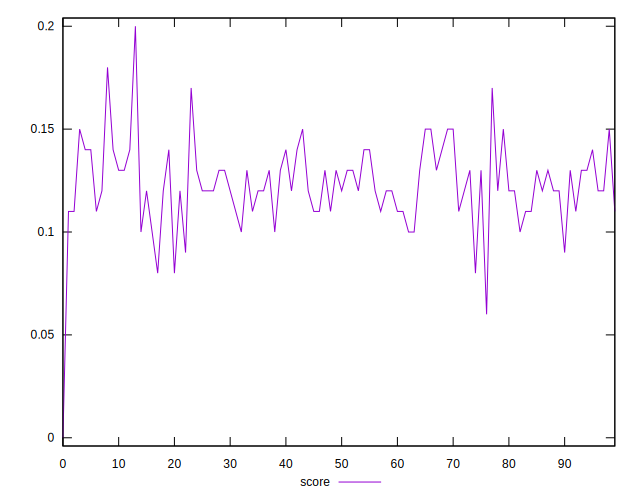
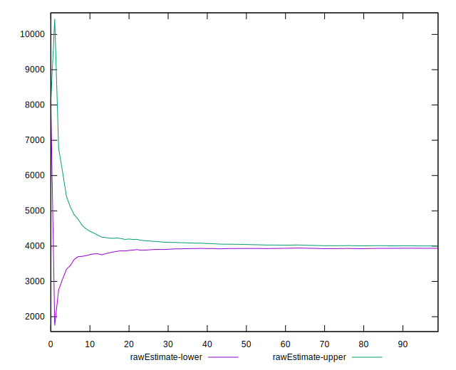
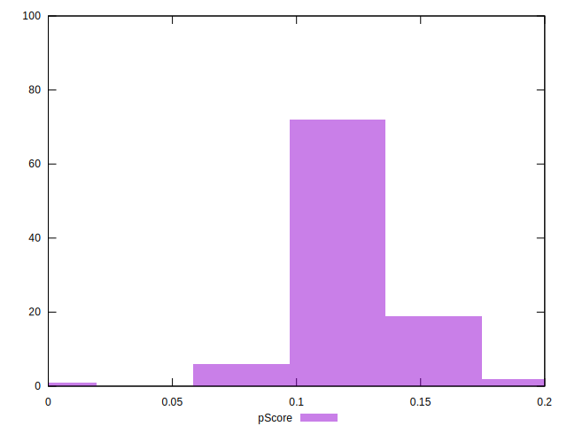
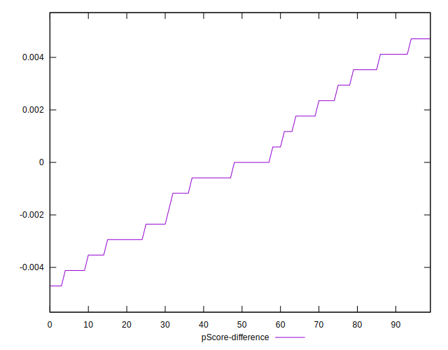
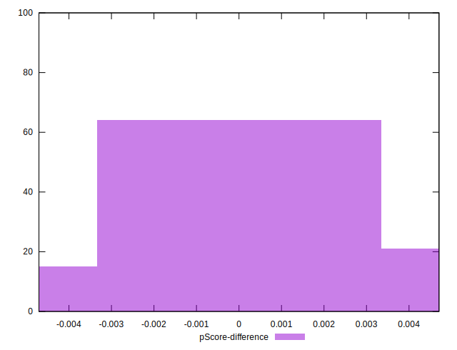

# //uses-text-compression/samples/pages+cached

[→ Parent](../..)


## Raw


```yaml
p90min: 3540
p90max: 4290
p90range: 750
p90mean: 3954.7872340425533
median: 3970
p90stdev: 134.18571382407717
mad: 80
stdevBySn: 143.11200000000002
lfitCenter: 3972.116139314464
lfitStdev: 133.18946360067784
mfitCenter: 3972.116139314464
mfitStdev: 166.92823784016807
mfitConfidence: 16.692823784016806
p90skewness: -0.0605645728025514
p90eccentricity: 1.0000000000000004
p90discretization: 2.1363636363636362
outlandishness: 1.0174277993597776

```


## Score


```yaml
p90min: 0.08
p90max: 0.17
p90range: 0.09000000000000001
p90mean: 0.12297872340425528
median: 0.12
p90stdev: 0.01623168606192396
mad: 0.010000000000000009
stdevBySn: 0.02385199999999999
lfitCenter: 0.12268453217624327
lfitStdev: 0.014070802415920064
mfitCenter: 0.12268453217624327
mfitStdev: 0.017635135608990934
mfitConfidence: 0.0017635135608990934
p90skewness: -0.06914840872580327
p90eccentricity: 0.9999999999999989
p90discretization: 10.444444444444445
outlandishness: 0.9922296862465734

```


## Raw Estimate


## Score Estimate


## P Score


```yaml
p90min: 0.08352941176470585
p90max: 0.17176470588235293
p90range: 0.08823529411764708
p90mean: 0.12296620775969959
median: 0.12117647058823527
p90stdev: 0.01578655456753849
mad: 0.009411764705882342
stdevBySn: 0.016836705882352924
lfitCenter: 0.1226192339841072
lfitStdev: 0.013625845029636784
mfitCenter: 0.1226192339841072
mfitStdev: 0.017077464225697992
mfitConfidence: 0.0017077464225697993
p90skewness: 0.06056457280255281
p90eccentricity: 0.9999999999999996
p90discretization: 2.1363636363636362
outlandishness: 0.9934803812406678

```


## Score Difference


```yaml
p90min: 0
p90max: 0
p90range: 0
p90mean: 0
median: 0
p90stdev: 0
mad: 0
stdevBySn: 0
lfitCenter: 0
lfitStdev: 0
mfitCenter: 0
mfitStdev: 0
mfitConfidence: 0
p90skewness: .nan
p90eccentricity: .nan
p90discretization: 94
outlandishness: .nan

```


## P Score Difference


```yaml
p90min: -0.004705882352941171
p90max: 0.004705882352941171
p90range: 0.009411764705882342
p90mean: 0.00006883604505630918
median: 0
p90stdev: 0.0027185538623586713
mad: 0.002647058823529412
stdevBySn: 0.0035076470588235173
lfitCenter: 0.000028625014876642823
lfitStdev: 0.0023277177740814005
mfitCenter: 0.000028625014876642823
mfitStdev: 0.0029173615968723604
mfitConfidence: 0.00029173615968723605
p90skewness: 0.0791071829523733
p90eccentricity: 1
p90discretization: 2.41025641025641
outlandishness: 0.8835999999999734

```

