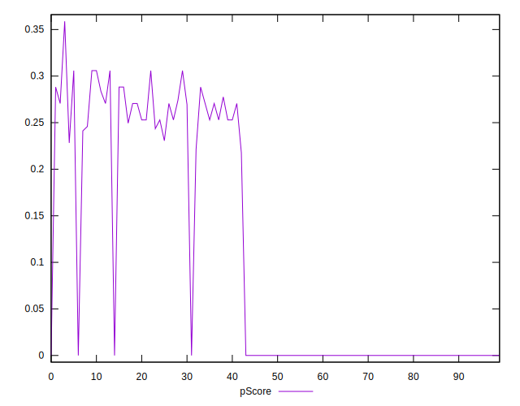

# //uses-text-compression/samples/pages

[→ Parent](../..)


## Raw


```yaml
p90min: 2400
p90max: 9210
p90range: 6810
p90mean: 6142.340425531915
median: 8100
p90stdev: 2701.0240081534075
mad: 465
stdevBySn: 760.2825
lfitCenter: 6430.834895658085
lfitStdev: 3005.3328546557896
mfitCenter: 6430.834895658085
mfitStdev: 3766.62615786899
mfitConfidence: 376.662615786899
p90skewness: -0.44663245364616183
p90eccentricity: 1.0000000000000004
p90discretization: 1.6206896551724137
outlandishness: 0.9934528520344399

```


## Score


```yaml
p90min: 0
p90max: 0.31
p90range: 0.31
p90mean: 0.10148936170212765
median: 0
p90stdev: 0.12969651520777029
mad: 0
stdevBySn: 0
lfitCenter: 0.0848463118191585
lfitStdev: 0.14359049340470775
mfitCenter: 0.0848463118191585
mfitStdev: 0.17996399554931575
mfitConfidence: 0.017996399554931576
p90skewness: 0.5232074981378252
p90eccentricity: 1.0000000000000002
p90discretization: 10.444444444444445
outlandishness: 1.074460458227303

```


## Raw Estimate


## Score Estimate


## P Score


```yaml
p90min: 0
p90max: 0.3058823529411765
p90range: 0.3058823529411765
p90mean: 0.10156445556946182
median: 0
p90stdev: 0.12970502536026413
mad: 0
stdevBySn: 0
lfitCenter: 0.0849397783465385
lfitStdev: 0.1437486724050151
mfitCenter: 0.0849397783465385
mfitStdev: 0.18016224352682686
mfitConfidence: 0.018016224352682686
p90skewness: 0.5186325667050097
p90eccentricity: 0.9999999999999988
p90discretization: 5.529411764705882
outlandishness: 1.072392323382796

```


## Score Difference


```yaml
p90min: 0
p90max: 0
p90range: 0
p90mean: 0
median: 0
p90stdev: 0
mad: 0
stdevBySn: 0
lfitCenter: 0
lfitStdev: 0
mfitCenter: 0
mfitStdev: 0
mfitConfidence: 0
p90skewness: .nan
p90eccentricity: .nan
p90discretization: 94
outlandishness: .nan

```


## P Score Difference


```yaml
p90min: -0.004117647058823504
p90max: 0.002941176470588225
p90range: 0.0070588235294117285
p90mean: -0.000012515644555698589
median: 0
p90stdev: 0.0013511680261912272
mad: 0
stdevBySn: 0
lfitCenter: -0.000005634441647732736
lfitStdev: 0.0006104971469941946
mfitCenter: -0.000005634441647732736
mfitStdev: 0.0007651447058885242
mfitConfidence: 0.00007651447058885242
p90skewness: -0.5164488686148101
p90eccentricity: 0.9999999999999991
p90discretization: 7.230769230769231
outlandishness: 3.5343999999989992

```

