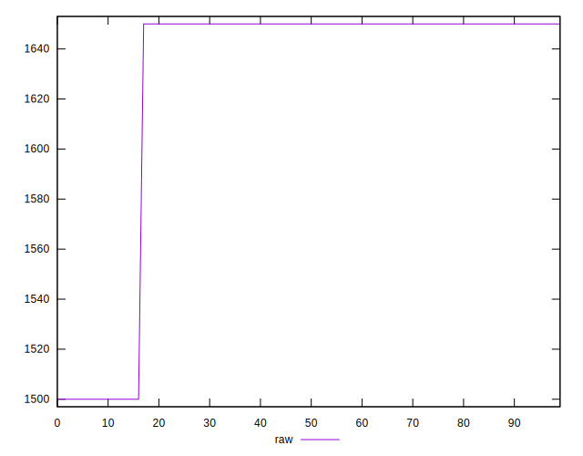
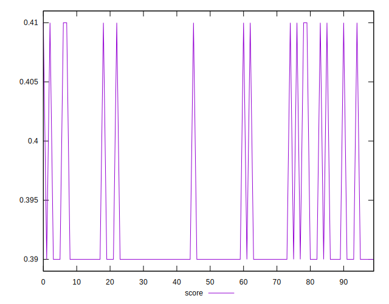
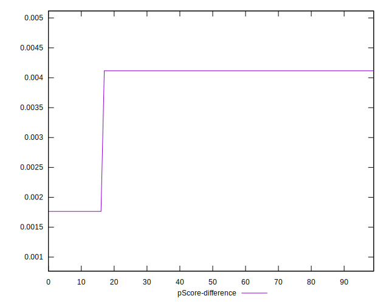

# //uses-webp-images/samples/pages+cached

[→ Parent](../..)


## Raw


```yaml
p90min: 1500
p90max: 1650
p90range: 150
p90mean: 1627.659574468085
median: 1650
p90stdev: 53.40383148089841
mad: 0
stdevBySn: 0
lfitCenter: 1635.1181038017373
lfitStdev: 33.602414786813014
mfitCenter: 1635.1181038017373
mfitStdev: 42.114381542629445
mfitConfidence: 4.211438154262945
p90skewness: -1.9721272054017507
p90eccentricity: 0.9999999999999991
p90discretization: 47
outlandishness: 0.9961214152249135

```


## Score


```yaml
p90min: 0.39
p90max: 0.41
p90range: 0.019999999999999962
p90mean: 0.39297872340425555
median: 0.39
p90stdev: 0.00712051086411978
mad: 0
stdevBySn: 0
lfitCenter: 0.3919842528264351
lfitStdev: 0.004480321971575149
mfitCenter: 0.3919842528264351
mfitStdev: 0.005615250872350693
mfitConfidence: 0.0005615250872350693
p90skewness: 1.9721272054016081
p90eccentricity: 0.9999999999999996
p90discretization: 47
outlandishness: 1.0021451665279655

```


## Raw Estimate


## Score Estimate


## P Score


```yaml
p90min: 0.3941176470588235
p90max: 0.4117647058823529
p90range: 0.017647058823529405
p90mean: 0.39674593241551925
median: 0.3941176470588235
p90stdev: 0.006282803703635115
mad: 0
stdevBySn: 0
lfitCenter: 0.39586845837626633
lfitStdev: 0.00395322526903697
mfitCenter: 0.39586845837626633
mfitStdev: 0.004954633122662469
mfitConfidence: 0.0004954633122662468
p90skewness: 1.972127205401833
p90eccentricity: 0.9999999999999984
p90discretization: 47
outlandishness: 1.0018746948322697

```


## Score Difference


```yaml
p90min: 0
p90max: 5.551115123125783e-17
p90range: 5.551115123125783e-17
p90mean: 8.267618268485208e-18
median: 0
p90stdev: 1.9763387771098395e-17
mad: 0
stdevBySn: 0
lfitCenter: 5.5074079364642626e-18
lfitStdev: 1.2435391526441542e-17
mfitCenter: 5.5074079364642626e-18
mfitStdev: 1.5585452018825308e-17
mfitConfidence: 1.558545201882531e-18
p90skewness: 1.9721272054017533
p90eccentricity: 1.0000000000000004
p90discretization: 47
outlandishness: 1.3028591836734695

```


## P Score Difference


```yaml
p90min: 0.001764705882352946
p90max: 0.004117647058823504
p90range: 0.0023529411764705577
p90mean: 0.003767209011264059
median: 0.004117647058823504
p90stdev: 0.0008377071604846706
mad: 0
stdevBySn: 0
lfitCenter: 0.003884205549831154
lfitStdev: 0.0005270967025382338
mfitCenter: 0.003884205549831154
mfitStdev: 0.000660617749688293
mfitConfidence: 0.00006606177496882929
p90skewness: -1.9721272054017454
p90eccentricity: 0.9999999999999974
p90discretization: 47
outlandishness: 0.9738607918234901

```

