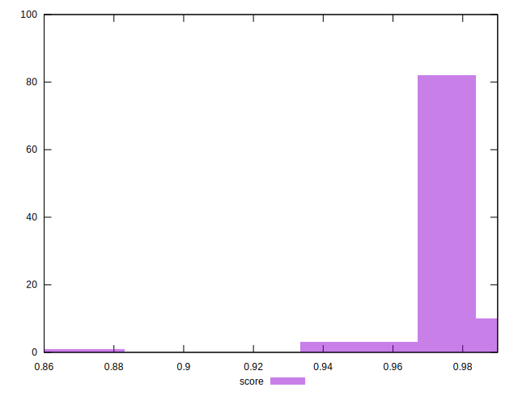

# //bootup-time/samples/pages

[→ Parent](../..)


## Raw


```yaml
p90min: 628.7200000000005
p90max: 963.4600000000003
p90range: 334.7399999999998
p90mean: 696.4922978723406
median: 671.7180000000001
p90stdev: 67.91644661842201
mad: 28.729999999999677
stdevBySn: 38.90022680000006
lfitCenter: 695.2962845827119
lfitStdev: 60.39948736719113
mfitCenter: 695.2962845827119
mfitStdev: 75.69953148008169
mfitConfidence: 7.569953148008169
p90skewness: 1.8988813731967986
p90eccentricity: 0.9999999999999999
p90discretization: 1
outlandishness: 1.046594624381725

```


## Score


```yaml
p90min: 0.95
p90max: 0.99
p90range: 0.040000000000000036
p90mean: 0.9785106382978724
median: 0.98
p90stdev: 0.006835054640088947
mad: 0
stdevBySn: 0
lfitCenter: 0.9780771265463298
lfitStdev: 0.005661484673278599
mfitCenter: 0.9780771265463298
mfitStdev: 0.007095618786355008
mfitConfidence: 0.0007095618786355008
p90skewness: -2.0011915134817495
p90eccentricity: 0.9999999999999974
p90discretization: 18.8
outlandishness: 0.9954867303654366

```


## Raw Estimate


## Score Estimate


## P Score


```yaml
p90min: 0.9501221240441274
p90max: 0.9857632187276792
p90range: 0.03564109468355181
p90mean: 0.9798470007534664
median: 0.9824102842444085
p90stdev: 0.006821233611836423
mad: 0.0023236439665806907
stdevBySn: 0.003113940105851937
lfitCenter: 0.9796514395747815
lfitStdev: 0.00642464378501948
mfitCenter: 0.9796514395747815
mfitStdev: 0.008052096891083441
mfitConfidence: 0.0008052096891083442
p90skewness: -2.3120567674395747
p90eccentricity: 1.0000000000000002
p90discretization: 1
outlandishness: 0.9951319112914773

```


## Score Difference


```yaml
p90min: 0
p90max: 0
p90range: 0
p90mean: 0
median: 0
p90stdev: 0
mad: 0
stdevBySn: 0
lfitCenter: 1.5916911634687915e-18
lfitStdev: 3.932577909407442e-18
mfitCenter: 1.5916911634687915e-18
mfitStdev: 4.928755494914505e-18
mfitConfidence: 4.928755494914504e-19
p90skewness: .nan
p90eccentricity: .nan
p90discretization: 94
outlandishness: .inf

```


## P Score Difference


```yaml
p90min: -0.004956402988281705
p90max: 0.004801511352729437
p90range: 0.009757914341011142
p90mean: 0.001234901646675258
median: 0.002207559456353758
p90stdev: 0.0029106254053980108
mad: 0.0019952759274625698
stdevBySn: 0.002785793132152452
lfitCenter: 0.0014755924789267613
lfitStdev: 0.0025282175957845533
mfitCenter: 0.0014755924789267613
mfitStdev: 0.0031686508581950166
mfitConfidence: 0.0003168650858195017
p90skewness: -0.7342096366246242
p90eccentricity: 0.9999999999999997
p90discretization: 1
outlandishness: 0.8810023906610117

```

