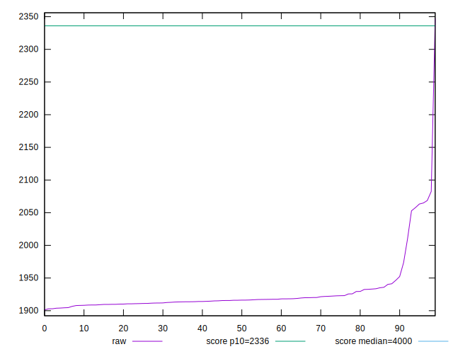
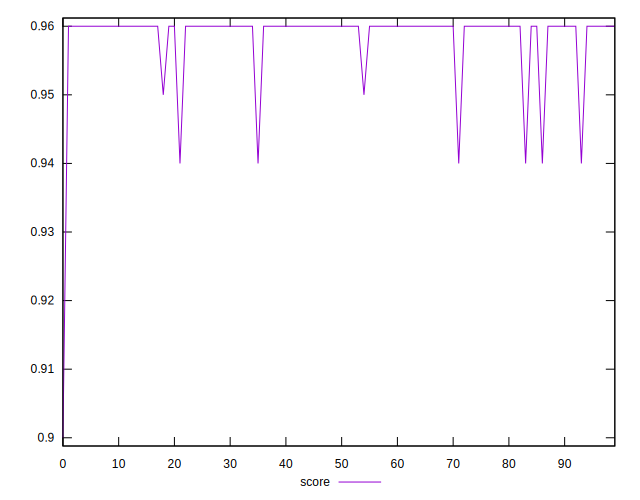
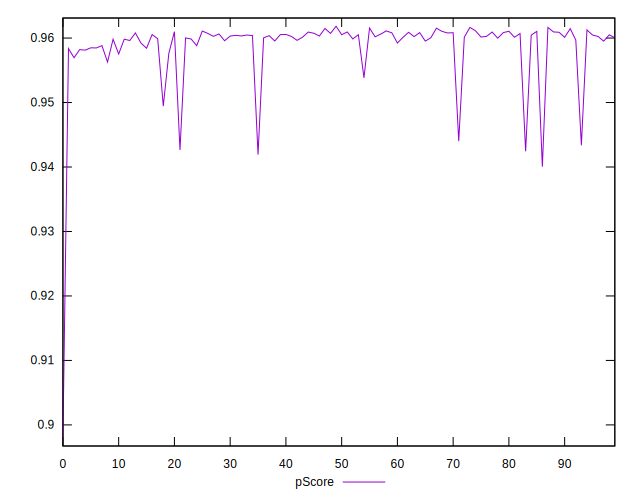
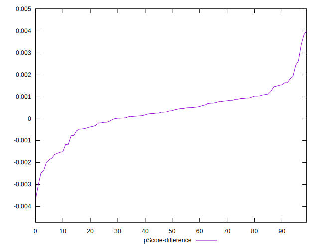

# //first-contentful-paint/samples/pages+cached+noadtech+nomedia

[→ Parent](../..)


## Raw


```yaml
p90min: 1903.8154999999997
p90max: 2064.81205
p90range: 160.9965500000003
p90mean: 1925.0974776595745
median: 1916.0898249999998
p90stdev: 31.792728698374358
mad: 5.648899999999571
stdevBySn: 8.382442527500048
lfitCenter: 1924.2571222934685
lfitStdev: 20.216729615541674
mfitCenter: 1924.2571222934685
mfitStdev: 25.33791306293942
mfitConfidence: 2.533791306293942
p90skewness: 3.4460613806712628
p90eccentricity: 1.0000000000000002
p90discretization: 1
outlandishness: 1.0068124824730829

```


## Score


```yaml
p90min: 0.94
p90max: 0.96
p90range: 0.020000000000000018
p90mean: 0.9589361702127648
median: 0.96
p90stdev: 0.00424466751984256
mad: 0
stdevBySn: 0
lfitCenter: 0.958993388351448
lfitStdev: 0.002405325550347925
mfitCenter: 0.958993388351448
mfitStdev: 0.0030146285201306878
mfitConfidence: 0.0003014628520130688
p90skewness: -3.961927280524129
p90eccentricity: 0.9999999999999976
p90discretization: 31.333333333333332
outlandishness: 0.9980484347770731

```


## Raw Estimate


## Score Estimate


## P Score


```yaml
p90min: 0.9424387019531171
p90max: 0.9615536717924209
p90range: 0.01911496983930383
p90mean: 0.9592013649094656
median: 0.9602585804293479
p90stdev: 0.003751226785394296
mad: 0.0006022402457580567
stdevBySn: 0.0008944513548711766
lfitCenter: 0.9592405676265772
lfitStdev: 0.0024661804492975958
mfitCenter: 0.9592405676265772
mfitStdev: 0.0030908988253859626
mfitConfidence: 0.00030908988253859626
p90skewness: -3.55504687049463
p90eccentricity: 1.0000000000000002
p90discretization: 1
outlandishness: 0.9981224472312072

```


## Score Difference


```yaml
p90min: 0
p90max: 1.1102230246251565e-16
p90range: 1.1102230246251565e-16
p90mean: 5.9054416203465774e-18
median: 0
p90stdev: 2.4915085490873318e-17
mad: 0
stdevBySn: 0
lfitCenter: 4.545807909231485e-18
lfitStdev: 1.0928096704220885e-17
mfitCenter: 4.545807909231485e-18
mfitStdev: 1.3696338107132798e-17
mfitConfidence: 1.3696338107132797e-18
p90skewness: 3.981981890375798
p90eccentricity: 0.9999999999999972
p90discretization: 47
outlandishness: 2.262016

```


## P Score Difference


```yaml
p90min: -0.0023703642878334374
p90max: 0.0026370815747356335
p90range: 0.005007445862569071
p90mean: 0.0002988257877365736
median: 0.0003708726194238121
p90stdev: 0.0009395326120414958
mad: 0.0005350115075987705
stdevBySn: 0.0008656325032590582
lfitCenter: 0.00033397717200736035
lfitStdev: 0.0007326903083696896
mfitCenter: 0.00033397717200736035
mfitStdev: 0.000918291122677809
mfitConfidence: 0.0000918291122677809
p90skewness: -0.5140516535011764
p90eccentricity: 0.9999999999999999
p90discretization: 1
outlandishness: 1.011009527885974

```

