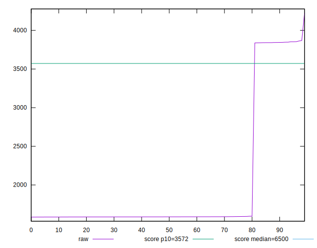

# //first-cpu-idle/samples/pages+cached+noadtech+nomedia+nocss

[→ Parent](../..)


## Raw


```yaml
p90min: 1584.5865
p90max: 3853.8519999999994
p90range: 2269.2654999999995
p90mean: 1971.7866755319142
median: 1587.6600000000003
p90stdev: 848.1010150377158
mad: 1.4571500000004107
stdevBySn: 2.412659615000022
lfitCenter: 1847.6108440570808
lfitStdev: 576.9743548124096
mfitCenter: 1847.6108440570808
mfitStdev: 723.1301164825268
mfitConfidence: 72.31301164825268
p90skewness: 1.755031017136877
p90eccentricity: 1.0000000000000007
p90discretization: 1
outlandishness: 1.0500917803252021

```


## Score


```yaml
p90min: 0.87
p90max: 1
p90range: 0.13
p90mean: 0.9778723404255317
median: 1
p90stdev: 0.04885654947330299
mad: 0
stdevBySn: 0
lfitCenter: 0.9849058437291098
lfitStdev: 0.0335101275801209
mfitCenter: 0.9849058437291098
mfitStdev: 0.041998716681672474
mfitConfidence: 0.004199871668167247
p90skewness: -1.7550294029241607
p90eccentricity: 0.9999999999999968
p90discretization: 47
outlandishness: 0.9937261463216591

```


## Raw Estimate


## Score Estimate


## P Score


```yaml
p90min: 0.8684245939423898
p90max: 0.9987421750916898
p90range: 0.13031758114930003
p90mean: 0.9767375287432418
median: 0.9987248339885153
p90stdev: 0.048546975344834375
mad: 0.000008244323159933842
stdevBySn: 0.000013655943662978577
lfitCenter: 0.9837178865812981
lfitStdev: 0.03331567100796838
mfitCenter: 0.9837178865812981
mfitStdev: 0.041755001510454574
mfitConfidence: 0.004175500151045458
p90skewness: -1.7551288860630663
p90eccentricity: 1.0000000000000002
p90discretization: 1
outlandishness: 0.9936963593568825

```


## Score Difference


```yaml
p90min: 0
p90max: 0
p90range: 0
p90mean: 0
median: 0
p90stdev: 0
mad: 0
stdevBySn: 0
lfitCenter: 5.166535369026208e-19
lfitStdev: 1.2890316797319448e-18
mfitCenter: 5.166535369026208e-19
mfitStdev: 1.6155616292812394e-18
mfitConfidence: 1.6155616292812395e-19
p90skewness: .nan
p90eccentricity: .nan
p90discretization: 94
outlandishness: .inf

```


## P Score Difference


```yaml
p90min: -0.001458718143218296
p90max: 0.00012100138732551446
p90range: 0.0015797195305438105
p90mean: -0.0011644032010415422
median: -0.0012707481688228328
p90stdev: 0.0003302103683789622
mad: 0.000008498919847998998
stdevBySn: 0.000013655943662978577
lfitCenter: -0.0012022725803943585
lfitStdev: 0.00021170481739785416
mfitCenter: -0.0012022725803943585
mfitStdev: 0.0002653326408495161
mfitConfidence: 0.00002653326408495161
p90skewness: 2.7020382379840417
p90eccentricity: 0.9999999999999997
p90discretization: 1
outlandishness: 0.968368383027922

```

