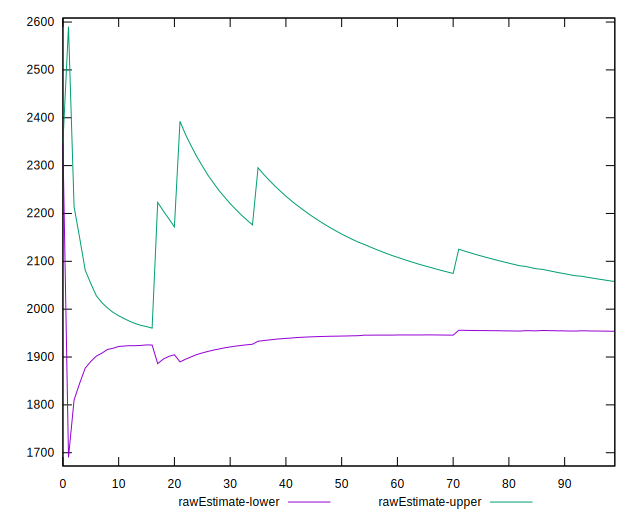
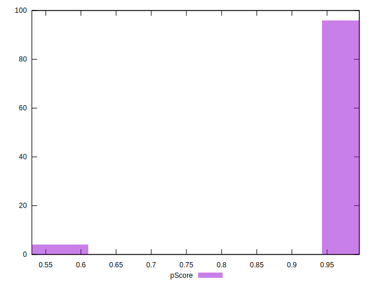

# //first-cpu-idle/samples/pages+cached+noadtech+nomedia

[→ Parent](../..)


## Raw


```yaml
p90min: 1903.8154999999997
p90max: 6086.073
p90range: 4182.257500000001
p90mean: 1972.756905851064
median: 1916.0898249999998
p90stdev: 429.77724374785
mad: 5.846699999999828
stdevBySn: 8.577343182499867
lfitCenter: 2005.7751562527899
lfitStdev: 211.50446249889873
mfitCenter: 2005.7751562527899
mfitStdev: 265.08153322192214
mfitConfidence: 26.508153322192214
p90skewness: 9.331757496763359
p90eccentricity: 1.0000000000000007
p90discretization: 1
outlandishness: 1.1324053361305177

```


## Score


```yaml
p90min: 0.56
p90max: 1
p90range: 0.43999999999999995
p90mean: 0.9945744680851063
median: 1
p90stdev: 0.04513961541746025
mad: 0
stdevBySn: 0
lfitCenter: 0.9906512323699125
lfitStdev: 0.022057096967721065
mfitCenter: 0.9906512323699125
mfitStdev: 0.027644471485600706
mfitConfidence: 0.0027644471485600707
p90skewness: -9.491220525474708
p90eccentricity: 0.9999999999999958
p90discretization: 31.333333333333332
outlandishness: 0.9724925925178014

```


## Raw Estimate


## Score Estimate


## P Score


```yaml
p90min: 0.5560067225367017
p90max: 0.9957128955211216
p90range: 0.43970617298441994
p90mean: 0.9906220844702527
median: 0.995536324630436
p90stdev: 0.04508212387054626
mad: 0.00008533567537605258
stdevBySn: 0.0001253666306859266
lfitCenter: 0.9865530605653575
lfitStdev: 0.02178926226242897
mfitCenter: 0.9865530605653575
mfitStdev: 0.027308790462656617
mfitConfidence: 0.0027308790462656617
p90skewness: -9.530599872114017
p90eccentricity: 1.0000000000000002
p90discretization: 1
outlandishness: 0.9727156513000652

```


## Score Difference


```yaml
p90min: 0
p90max: 0
p90range: 0
p90mean: 0
median: 0
p90stdev: 0
mad: 0
stdevBySn: 0
lfitCenter: 0
lfitStdev: 0
mfitCenter: 0
mfitStdev: 0
mfitConfidence: 0
p90skewness: .nan
p90eccentricity: .nan
p90discretization: 94
outlandishness: .nan

```


## P Score Difference


```yaml
p90min: -0.004758414285025436
p90max: 0.003514881260521463
p90range: 0.0082732955455469
p90mean: -0.004016934832442538
median: -0.004434455729369791
p90stdev: 0.0017009316419468424
mad: 0.00006958624477998443
stdevBySn: 0.0001253666306859266
lfitCenter: -0.004102192347676456
lfitStdev: 0.000835840900822576
mfitCenter: -0.004102192347676456
mfitStdev: 0.001047571218601568
mfitConfidence: 0.0001047571218601568
p90skewness: 3.672883549853559
p90eccentricity: 0.9999999999999997
p90discretization: 1
outlandishness: 0.8881442997341562

```

