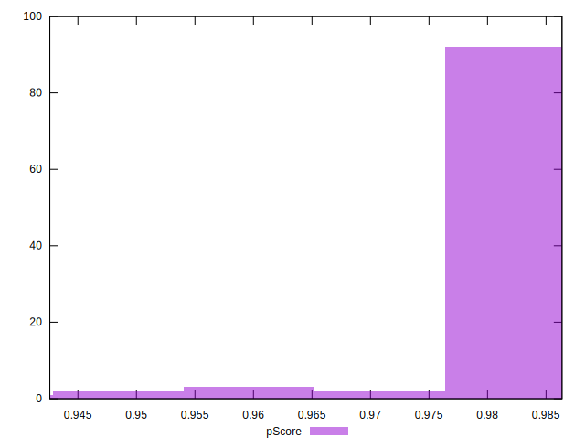

# //first-cpu-idle/samples/pages

[→ Parent](../..)


## Raw


```yaml
p90min: 2327.1110000000003
p90max: 2879.124
p90range: 552.0129999999995
p90mean: 2465.204002659574
median: 2475.09475
p90stdev: 100.64563592291094
mad: 51.260499999999865
stdevBySn: 78.99666121499997
lfitCenter: 2471.2358794853317
lfitStdev: 75.27659430612799
mfitCenter: 2471.2358794853317
mfitStdev: 94.34521994776787
mfitConfidence: 9.434521994776787
p90skewness: 1.4784274566842057
p90eccentricity: 1
p90discretization: 1
outlandishness: 1.0099620804073057

```


## Score


```yaml
p90min: 0.96
p90max: 0.99
p90range: 0.030000000000000027
p90mean: 0.9811702127659573
median: 0.98
p90stdev: 0.0056222171326484344
mad: 0
stdevBySn: 0
lfitCenter: 0.9804613879793577
lfitStdev: 0.0031160577705200213
mfitCenter: 0.9804613879793577
mfitStdev: 0.00390539926041434
mfitConfidence: 0.00039053992604143404
p90skewness: -1.0524717443339486
p90eccentricity: 0.9999999999999984
p90discretization: 23.5
outlandishness: 0.9984306281423431

```


## Raw Estimate


## Score Estimate


## P Score


```yaml
p90min: 0.9593470760799283
p90max: 0.9860544080479459
p90range: 0.026707331968017556
p90mean: 0.980736982250618
median: 0.9806253972217062
p90stdev: 0.004534869152408383
mad: 0.0021641923559666543
stdevBySn: 0.003183168003427161
lfitCenter: 0.9804740396254004
lfitStdev: 0.0032119309400398
mfitCenter: 0.9804740396254004
mfitStdev: 0.004025558459283634
mfitConfidence: 0.0004025558459283634
p90skewness: -2.3740531784532455
p90eccentricity: 0.9999999999999994
p90discretization: 1
outlandishness: 0.998436380999085

```


## Score Difference


```yaml
p90min: 0
p90max: 0
p90range: 0
p90mean: 0
median: 0
p90stdev: 0
mad: 0
stdevBySn: 0
lfitCenter: 1.5916911634687915e-18
lfitStdev: 3.932577909407442e-18
mfitCenter: 1.5916911634687915e-18
mfitStdev: 4.928755494914505e-18
mfitConfidence: 4.928755494914504e-19
p90skewness: .nan
p90eccentricity: .nan
p90discretization: 94
outlandishness: .inf

```


## P Score Difference


```yaml
p90min: -0.004794974817901476
p90max: 0.004786418454618913
p90range: 0.009581393272520389
p90mean: -0.0004579105928889872
median: -0.0005300200791985565
p90stdev: 0.002608694613309381
mad: 0.0015950729442849587
stdevBySn: 0.002778645680172597
lfitCenter: -0.0004460329028854996
lfitStdev: 0.002034265548109463
mfitCenter: -0.0004460329028854996
mfitStdev: 0.0025495737730649444
mfitConfidence: 0.0002549573773064944
p90skewness: 0.10130383052673299
p90eccentricity: 0.9999999999999997
p90discretization: 1
outlandishness: 0.8820866771886722

```

