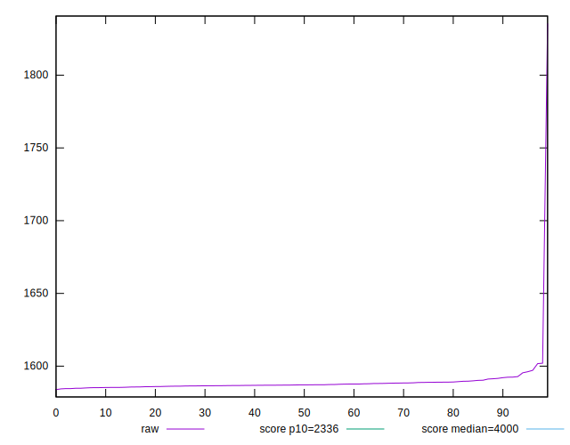
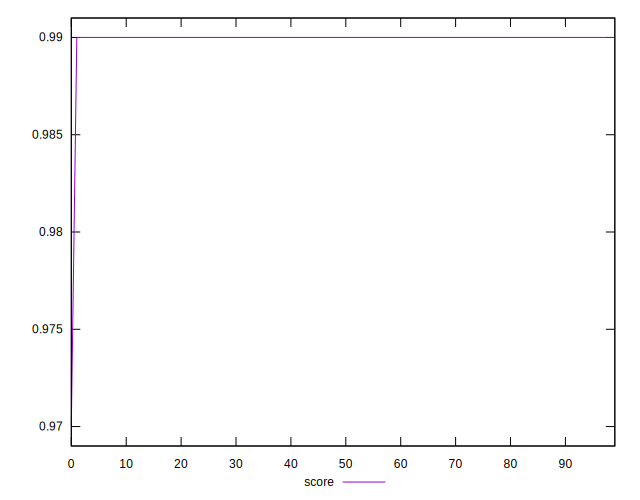
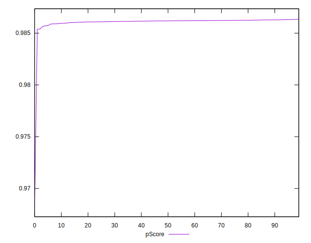

# //first-meaningful-paint/samples/pages+cached+noadtech+nomedia+nocss

[→ Parent](../..)


## Raw


```yaml
p90min: 1584.5865
p90max: 1597.1285
p90range: 12.542000000000144
p90mean: 1587.7772436170208
median: 1587.124275
p90stdev: 2.3802522319658768
mad: 1.2351999999999634
stdevBySn: 1.8363803875000468
lfitCenter: 1588.7943334483814
lfitStdev: 3.949315319532481
mfitCenter: 1588.7943334483814
mfitStdev: 4.949732727667372
mfitConfidence: 0.4949732727667372
p90skewness: 1.6965765202132694
p90eccentricity: 1
p90discretization: 1
outlandishness: 1.0033478937066593

```


## Score


```yaml
p90min: 0.99
p90max: 0.99
p90range: 0
p90mean: 0.9899999999999988
median: 0.99
p90stdev: 1.2212453270876722e-15
mad: 0
stdevBySn: 0
lfitCenter: 0.9899069279729491
lfitStdev: 0.00023221130370027932
mfitCenter: 0.9899069279729491
mfitStdev: 0.0002910337100648737
mfitConfidence: 0.000029103371006487372
p90skewness: 1
p90eccentricity: 1
p90discretization: 94
outlandishness: 0.9995960004081211

```


## Raw Estimate


## Score Estimate


## P Score


```yaml
p90min: 0.9856483572094548
p90max: 0.9863192933584155
p90range: 0.0006709361489607435
p90mean: 0.9861503232445941
median: 0.9861853396002168
p90stdev: 0.00012697313355235551
mad: 0.00006542178538521126
stdevBySn: 0.00009741010929329248
lfitCenter: 0.9860743498279154
lfitStdev: 0.00025778146246935427
mfitCenter: 0.9860743498279154
mfitStdev: 0.0003230811515758047
mfitConfidence: 0.00003230811515758047
p90skewness: -1.720855576063487
p90eccentricity: 1.0000000000000002
p90discretization: 1
outlandishness: 0.9996177079814572

```


## Score Difference


```yaml
p90min: 0
p90max: 0
p90range: 0
p90mean: 0
median: 0
p90stdev: 0
mad: 0
stdevBySn: 0
lfitCenter: 0
lfitStdev: 0
mfitCenter: 0
mfitStdev: 0
mfitConfidence: 0
p90skewness: .nan
p90eccentricity: .nan
p90discretization: 94
outlandishness: .nan

```


## P Score Difference


```yaml
p90min: -0.004298897397307488
p90max: -0.0036804041684581623
p90range: 0.0006184932288493261
p90mean: -0.003842535919001169
median: -0.0038126717981551983
p90stdev: 0.0001170276702875575
mad: 0.00006502329737623214
stdevBySn: 0.00009741010929329248
lfitCenter: -0.0038306488128642432
lfitStdev: 0.00010253807011276856
mfitCenter: -0.0038306488128642432
mfitStdev: 0.00012851241301469547
mfitConfidence: 0.000012851241301469548
p90skewness: -1.5095039872670668
p90eccentricity: 0.9999999999999996
p90discretization: 1
outlandishness: 0.9977410791580275

```

