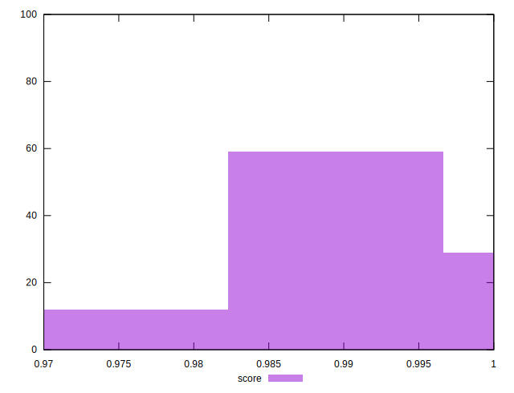

# //max-potential-fid/samples/pages+cached+noadtech+nomedia+nocss

[→ Parent](../..)


## Raw


```yaml
p90min: 66
p90max: 88
p90range: 22
p90mean: 73.08510638297872
median: 72
p90stdev: 5.960257695535763
mad: 5
stdevBySn: 7.155600000000001
lfitCenter: 72.86616280524588
lfitStdev: 5.074874725738832
mfitCenter: 72.86616280524588
mfitStdev: 6.360412245273717
mfitConfidence: 0.6360412245273717
p90skewness: 0.6075077534759545
p90eccentricity: 1.0000000000000007
p90discretization: 4.2727272727272725
outlandishness: 1.0083609261540483

```


## Score


```yaml
p90min: 0.98
p90max: 1
p90range: 0.020000000000000018
p90mean: 0.991808510638297
median: 0.99
p90stdev: 0.005827806776511639
mad: 0
stdevBySn: 0
lfitCenter: 0.9913486093016366
lfitStdev: 0.004435647732442733
mfitCenter: 0.9913486093016366
mfitStdev: 0.005559260016815883
mfitConfidence: 0.0005559260016815882
p90skewness: -0.04715359085933739
p90eccentricity: 1.0000000000000007
p90discretization: 31.333333333333332
outlandishness: 0.9995795786824199

```


## Raw Estimate


## Score Estimate


## P Score


```yaml
p90min: 0.979634315738652
p90max: 0.9954734645055221
p90range: 0.015839148766870093
p90mean: 0.9914859568931236
median: 0.9926466668793034
p90stdev: 0.003906723826342088
mad: 0.0024215101633747738
stdevBySn: 0.003566031787891953
lfitCenter: 0.9917088877110571
lfitStdev: 0.003253622571763225
mfitCenter: 0.9917088877110571
mfitStdev: 0.004077811170782933
mfitConfidence: 0.00040778111707829326
p90skewness: -1.0423725206644512
p90eccentricity: 1.0000000000000009
p90discretization: 4.2727272727272725
outlandishness: 0.9993118786999028

```


## Score Difference


```yaml
p90min: 0
p90max: 0
p90range: 0
p90mean: 0
median: 0
p90stdev: 0
mad: 0
stdevBySn: 0
lfitCenter: 0
lfitStdev: 0
mfitCenter: 0
mfitStdev: 0
mfitConfidence: 0
p90skewness: .nan
p90eccentricity: .nan
p90discretization: 94
outlandishness: .nan

```


## P Score Difference


```yaml
p90min: -0.004931822957321863
p90max: 0.0046375893622611075
p90range: 0.00956941231958297
p90mean: -0.0004752397538123857
median: 0.00019072068583270152
p90stdev: 0.0033935181947433355
mad: 0.0035066473978708768
stdevBySn: 0.004289459750197701
lfitCenter: -0.00039515495633747865
lfitStdev: 0.003362252802974312
mfitCenter: -0.00039515495633747865
mfitStdev: 0.004213958975436637
mfitConfidence: 0.0004213958975436637
p90skewness: -0.09196598319661173
p90eccentricity: 1.0000000000000007
p90discretization: 3.76
outlandishness: 0.9175762585010895

```

