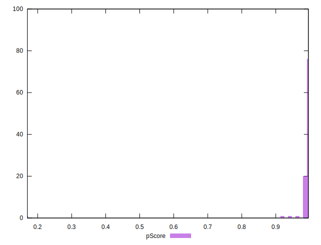

# //max-potential-fid/samples/pages+cached+noadtech+nomedia

[→ Parent](../..)


## Raw


```yaml
p90min: 65
p90max: 100.5
p90range: 35.5
p90mean: 71.34574468085107
median: 69
p90stdev: 6.084522829480693
mad: 3
stdevBySn: 4.7704
lfitCenter: 72.57873997719301
lfitStdev: 7.769666044200226
mfitCenter: 72.57873997719301
mfitStdev: 9.737832305214962
mfitConfidence: 0.9737832305214962
p90skewness: 1.7693167009625534
p90eccentricity: 0.9999999999999988
p90discretization: 4.2727272727272725
outlandishness: 1.117472657356304

```


## Score


```yaml
p90min: 0.96
p90max: 1
p90range: 0.040000000000000036
p90mean: 0.9928723404255313
median: 0.99
p90stdev: 0.006461397718749034
mad: 0
stdevBySn: 0
lfitCenter: 0.9882667359766738
lfitStdev: 0.01163696430128284
mfitCenter: 0.9882667359766738
mfitStdev: 0.014584771888909394
mfitConfidence: 0.0014584771888909395
p90skewness: -1.3031549889368332
p90eccentricity: 0.9999999999999999
p90discretization: 23.5
outlandishness: 0.9816089699442702

```


## Raw Estimate


## Score Estimate


## P Score


```yaml
p90min: 0.9629466270469359
p90max: 0.9958542552567312
p90range: 0.032907628209795314
p90mean: 0.9924345886601972
median: 0.994180911427837
p90stdev: 0.0045004925421595
mad: 0.0012925530776850547
stdevBySn: 0.0019956298503391867
lfitCenter: 0.9886319018467191
lfitStdev: 0.011754665613634592
mfitCenter: 0.9886319018467191
mfitStdev: 0.014732288607808869
mfitConfidence: 0.001473228860780887
p90skewness: -3.5130817523993736
p90eccentricity: 1.0000000000000009
p90discretization: 4.2727272727272725
outlandishness: 0.9812594641191874

```


## Score Difference


```yaml
p90min: 0
p90max: 0
p90range: 0
p90mean: 0
median: 0
p90stdev: 0
mad: 0
stdevBySn: 0
lfitCenter: 5.166535369026208e-19
lfitStdev: 1.2890316797319448e-18
mfitCenter: 5.166535369026208e-19
mfitStdev: 1.6155616292812394e-18
mfitConfidence: 1.6155616292812395e-19
p90skewness: .nan
p90eccentricity: .nan
p90discretization: 94
outlandishness: .inf

```


## P Score Difference


```yaml
p90min: -0.004931822957321863
p90max: 0.0046375893622611075
p90range: 0.00956941231958297
p90mean: -0.0006383517982992601
median: -0.0007312157017196758
p90stdev: 0.003624686314429517
mad: 0.0037953197927582255
stdevBySn: 0.00452629838484346
lfitCenter: -0.0006885805019378219
lfitStdev: 0.0037626239779368176
mfitCenter: -0.0006885805019378219
mfitStdev: 0.004715749829695686
mfitConfidence: 0.00047157498296956864
p90skewness: 0.07734783066104582
p90eccentricity: 0.9999999999999988
p90discretization: 3.9166666666666665
outlandishness: 0.9094694923711045

```

