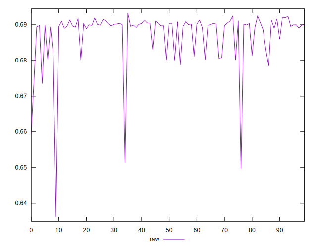
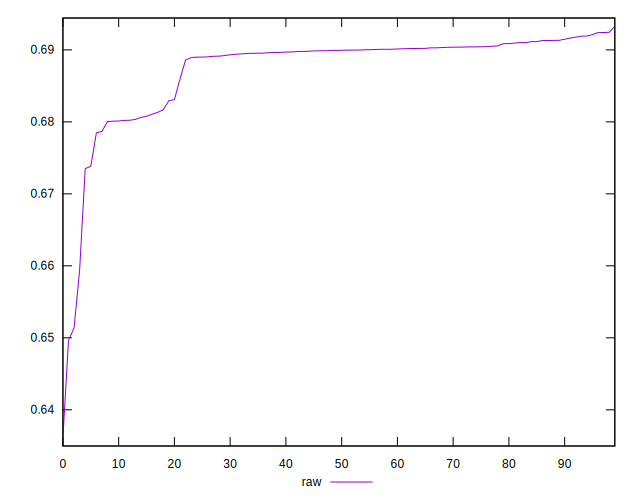

# //meta/pScore/samples/pages+cached+noadtech

[→ Parent](../..)


## Raw


```yaml
p90min: 0.6594331489438882
p90max: 0.6924046150645328
p90range: 0.03297146612064461
p90mean: 0.6879745572597108
median: 0.6899352981805542
p90stdev: 0.005144407454487891
mad: 0.0007654920710700175
stdevBySn: 0.0012687640779255457
lfitCenter: 0.6881821894923646
lfitStdev: 0.004175613691651465
mfitCenter: 0.6881821894923646
mfitStdev: 0.0052333556769809724
mfitConfidence: 0.0005233355676980973
p90skewness: -2.6806666031102835
p90eccentricity: 1
p90discretization: 1
outlandishness: 0.9967297125665874

```

