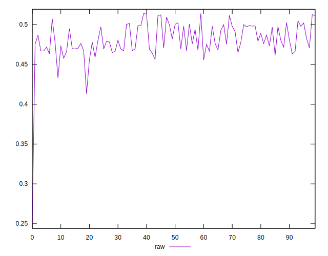
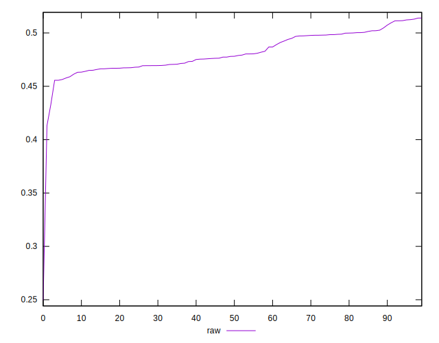
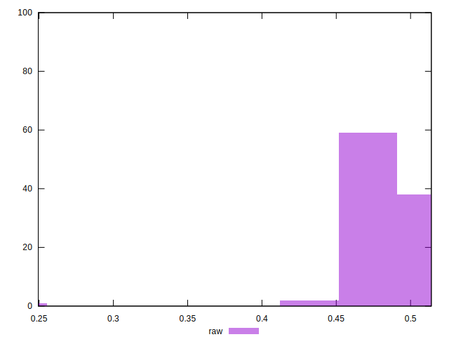

# //meta/pScore/samples/pages+cached

[→ Parent](../..)


## Raw


```yaml
p90min: 0.4556238536970343
p90max: 0.5124272337073933
p90range: 0.056803380010359006
p90mean: 0.4823390684784548
median: 0.4780622730098312
p90stdev: 0.01595683785566277
mad: 0.013099621468901507
stdevBySn: 0.018745263904211117
lfitCenter: 0.4804189099035921
lfitStdev: 0.01632284465280118
mfitCenter: 0.4804189099035921
mfitStdev: 0.0204576519851458
mfitConfidence: 0.00204576519851458
p90skewness: 0.2622673691957423
p90eccentricity: 0.9999999999999999
p90discretization: 1
outlandishness: 0.9893398359988794

```

