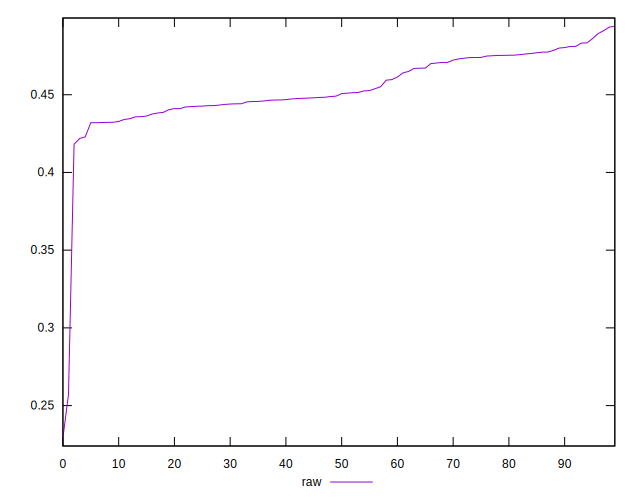
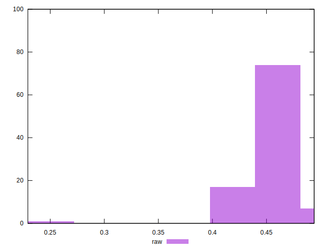

# //meta/pScore/samples/pages

[→ Parent](../..)


## Raw


```yaml
p90min: 0.42185571546608847
p90max: 0.4893359069583764
p90range: 0.06748019149228796
p90mean: 0.4557023888404474
median: 0.4499049426678452
p90stdev: 0.017006471966734132
mad: 0.015215148923596045
stdevBySn: 0.02024282196649678
lfitCenter: 0.4533087694412891
lfitStdev: 0.01807515356159291
mfitCenter: 0.4533087694412891
mfitStdev: 0.022653845515688272
mfitConfidence: 0.002265384551568827
p90skewness: 0.17722233692457495
p90eccentricity: 1.0000000000000007
p90discretization: 1
outlandishness: 0.9846584030630464

```

