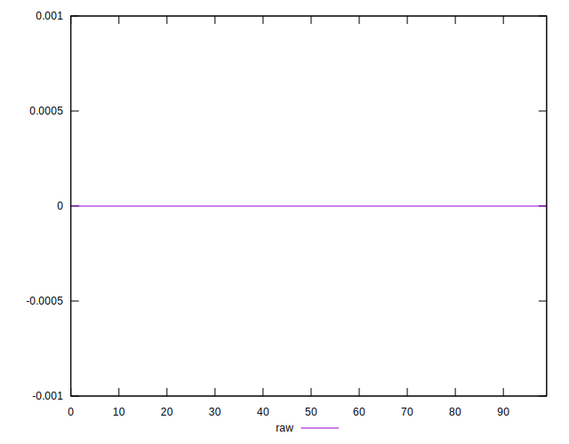

# //meta/score-difference/samples/pages

[→ Parent](../..)


## Raw


```yaml
p90min: 0
p90max: 2.7755575615628914e-17
p90range: 2.7755575615628914e-17
p90mean: 5.31489745831192e-18
median: 0
p90stdev: 9.831097129150173e-18
mad: 0
stdevBySn: 0
lfitCenter: 3.821777313069869e-18
lfitStdev: 7.813870933237184e-18
mfitCenter: 3.821777313069869e-18
mfitStdev: 9.793234917639194e-18
mfitConfidence: 9.793234917639194e-19
p90skewness: 1.5324123094751316
p90eccentricity: 1.0000000000000018
p90discretization: 23.5
outlandishness: 1.3079734444444453

```

